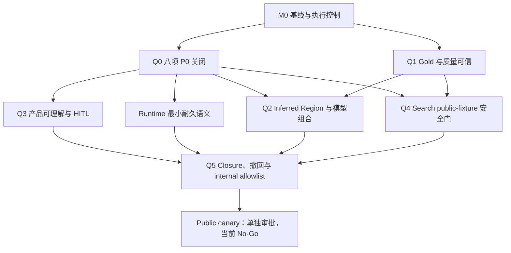

# 思维导图 vNext 完整执行书

- 编制日期：2026-07-30
- 状态：`LOCAL EXECUTION VERIFIED / INDEPENDENT GATES HOLD`
- 执行证据：`docs/MINDMAP_EXECUTION_EVIDENCE_2026-07-30.md`
- 适用范围：ADR-03 至 ADR-12 审批后的工程、评测、产品、安全和发布准备
- 产品审批：`docs/MINDMAP_PRODUCT_APPROVAL_RECORD.md`
- 规范 Workflow：`docs/MINDMAP_WORKFLOW_SPEC.md`
- 系统整改：`docs/MINDMAP_SYSTEM_REDESIGN.md`
- 当前实现矩阵：`docs/VNEXT_IMPLEMENTATION_MATRIX.md`
- 事故基线：公网 v56 “醛和酮”任务
- 参考启动日：2026-08-03；仅用于排期映射，不构成自动启动指令
- 最终边界：本执行书不授权公网流量、私有课件 live web search、公共 API 迁移、
  Postgres/Temporal 直接引入或正式 publication

---

## 0. 执行命令

### 0.1 唯一目标

本项目不是“重写一套更复杂的 Agent 系统”，而是交付以下可观察产品能力：

```text
输入一份真实课件
-> 完整保留源事实和结构信号
-> 只由 top-down Planner 生成结构
-> 独立检查遗漏、split/stop、Claim 和父边
-> 在证据不足时停止并给出可理解诊断
-> 在全部质量和产品门通过时才形成教学 View
```

最终用户不应再看到：

- 正文残片成为 root 或一级主题；
- 容量分桶变成语义分支；
- 错误父边因 root fallback 被重新接回；
- 250 余节点同时挤入首屏；
- 左右两侧使用任意分桶表达课程结构；
- `publish=false` 或 blocked 结果仍被称为“思维导图已生成”；
- 系统用外部网页内容替代课件事实。

### 0.2 产品成功定义

一个候选版本只有同时满足以下条件才算成功：

1. 源文档、结构、Claim、Canonical 和 Projection 五层可分别验收。
2. 八项 P0 假绿灯全部关闭。
3. Gold、指标、阈值和 sealed blind 没有数据泄漏。
4. 错 root/L1、严重 premature STOP、高价值遗漏和伪父边不会进入用户结果。
5. 用户能快速理解课程骨架、进入章节、找到证据并识别未发布状态。
6. 搜索关闭、模型失败、Renderer 失败或取消时，上游已提交事实不被污染。
7. 发布事实来自受信 store 和完整 closure，不来自调用方自报 boolean。
8. 失败时可以撤回或停用，不自动回退到已知质量失败的 v56。

### 0.3 不算成功

- 合同测试通过但没有真实 Gold。
- 输出一棵合法树但教学层级仍错。
- 节点数、coverage 或平均分提高，但困难内容被丢弃。
- Precision 调用更多模型，但 serious error 没有下降。
- Search 提供更多文字，但结构错误和延迟上升。
- UI 更整齐，但用户找不到章节、概念或证据。
- Postgres、Temporal、多签或 canary 工具完成，但没有可发布产品候选。
- 单一“醛和酮”样本通过就宣称生产质量。

### 0.4 冻结基线与当前候选

2026-07-30 启动基线和本轮候选：

| 项目 | 当前事实 |
| --- | --- |
| Git branch | `experiment/new_bone` |
| 执行基线 HEAD | `4b28c75025481509dccdb28fe3459ee33ea27f4d` |
| 工作树 | 用户基线提交保持不变；当前 code-only candidate 为 62 个 changed/untracked files |
| Python | `.venv` 为 Python 3.12.3 |
| Node/corepack | Node.js 22.23.2；pnpm 10.14.0 |
| vNext tests | 启动基线 `168 passed`；当前候选 `182 passed` |
| Backend tests | 启动基线 704 tests、1 skip；当前候选 718 tests、1 skip |
| Schema check | `{"changed": []}` |
| vNext schema | 启动基线 34 contracts；当前候选 36 contracts |
| Pydantic/FastAPI/rfc8785 | `2.13.4 / 0.140.0 / 0.1.4` |
| 运行边界 | source-only、recorded/deterministic、publication disabled、shadow |

启动基线 168 个测试和当前候选 182 个测试都不是产品质量证明。工作树禁止
reset、checkout 覆盖或清理用户改动。

### 0.5 继续有效的 No-Go

下列事项不进入本轮默认实施：

- 修改 legacy 公共 HTTP schema、status enum 或持久化 graph contract；
- 把 vNext 接入公网主路由；
- 私有/受限课件 live web egress；
- inferred Region 进入用户可见结果；
- fixed model、固定 2.5x 成本或未经 calibration 的阈值；
- Postgres、Temporal、Kubernetes 或新控制平面迁移；
- 固定 2-of-3、Cosign 或具体 KMS；
- public canary 或 default rollout；
- 自动 fallback 到 v56。

---

## 1. 组织与责任

### 1.1 交付团队

| 角色 | 责任 | 默认写范围 | 不得自批 |
| --- | --- | --- | --- |
| Product Approver | 用户问题、优先级、Gate、Stop/Go | 文档和审批记录 | 自己提出的例外 |
| Program Orchestrator | 依赖、排期、风险、证据包 | 执行书、issue/里程碑 | 产品质量 Gate |
| Schema Steward | contract major/minor、权限、lineage | `backend/vnext/contracts/` | 自己的 schema 兼容性 |
| Source Fidelity Lead | Source IR、raw manifest、Inventory | `source_ir/`、`source_inventory/` | Source 完整性 |
| Semantic Structure Lead | Region、replan、Claim/Graph 关系 | `regions/`、`canonical_graph/` | 自己的 semantic decision |
| Quality & Gold Lead | Gold、指标、evaluator、sealed blind | `quality/`、Gold tooling | 自己调过的 blind set |
| Runtime & Reliability Lead | commit、cancel、outbox、cost、fault | `orchestration/` control 部分 | 自己的恢复证明 |
| Search & Security Lead | SearchIntent、Gateway、snapshot、安全红队 | `search/`、integration policy | 自己的安全放行 |
| Product/HITL Lead | Projection 产品策略、review、可访问性 | `projection/`、`presentation/`、frontend | 自己的可用性结论 |
| Release Governor Lead | closure、withdraw、simulator、pointer | release/attestation 部分 | 自己的发布候选 |
| Domain SME | 标注、仲裁、严重错误定义 | 外部 Gold store | 自己单人标注的文档 |
| Independent Red Team | 对抗、绕过、失败复现 | 独立 tests/fixtures | 被测工作包 |

### 1.2 多 Agent 工作方式

交付阶段可以使用多 Agent，但必须满足：

1. 每个 Agent 都有独立联网/GitHub 搜索能力，不依赖一个共享搜索摘要作为唯一依据。
2. 每个 work package 开始前由实现 Agent 完成 GitHub-first；Verifier Agent 独立复查。
3. Search & Security Agent 负责设计运行时搜索能力，但不垄断其他角色的研究搜索。
4. 并行 Agent 的写范围必须互斥；`contracts/` 只由 Schema Steward 串行合并。
5. 实现 Agent 不得给自己的 Gate 签 PASS。
6. Red Team 默认只读生产实现，可以新增独立测试和 fixture。
7. Agent 发现范围扩大、公共合同变化或新依赖时立即停止并提交 Change Request。

### 1.3 GitHub-first 证据

每个非平凡 work package 必须附：

```text
search date
current repository queries
upstream repositories
exact symbol/error/version queries
issues / PRs / commits / releases checked
license and maintenance assessment
adopt / adapt / reject decision
reason local implementation remains necessary
```

本机已安装 `gh 2.96.0` 并认证为 `mizy06`。实现前使用 GitHub Web/REST、公开
raw source 和官方上游文档完成 GitHub-first；认证后补跑 `gh search
issues/prs/code`，结果写入 evidence pack。远端执行骨架为总控 issue `#26`，
工作包和 Gate review 为 `#1` 至 `#25`。

### 1.4 RACI

| 决定 | R | A | C | Veto |
| --- | --- | --- | --- | --- |
| Source completeness | Source Lead | Schema Steward | SME、Quality | Red Team |
| Region split/stop | Semantic Lead | Product Approver | Quality、SME | independent verifier |
| Gold/threshold freeze | Quality Lead | Product Approver | SME、Statistics reviewer | sealed-set custodian |
| Search public-fixture | Search Lead | Product Approver | Security、Legal/Privacy | Security |
| Product usability | Product/HITL | Product Approver | SME、Accessibility reviewer | serious UX finding |
| Runtime promotion | Runtime Lead | Program Orchestrator | Quality、Release | integrity failure |
| Internal allowlist | Release Lead | Product Approver | all leads | any Q0-Q5 owner |
| Public canary | 未授权 | 单独审批 | all leads | any hard gate |

---

## 2. 交付控制

### 2.1 Work package 状态

```text
DRAFT
-> READY
-> IMPLEMENTING
-> CODE_REVIEW
-> VERIFYING
-> EVIDENCE_COMPLETE
-> GATE_REVIEW
-> ACCEPTED | REJECTED | HOLD
```

`merged` 不等于 `ACCEPTED`。只有 evidence pack 完整且对应 Gate 通过，work package
才算完成。

### 2.2 Definition of Ready

开始编码前必须同时具备：

- 明确用户问题和失败反例；
- 精确输入、输出和唯一写者；
- 不修改的边界；
- 可执行失败测试或 fixture；
- GitHub-first 记录；
- owner、reviewer 和 red-team owner；
- 依赖 Gate 已通过；
- 预计文件范围和 schema 影响；
- 回滚或禁用方式；
- 资源和时间预算。

缺少任一项，状态保持 `DRAFT/HOLD`。

### 2.3 Work package Definition of Done

- 目标行为已实现，不以 TODO 或假数据代替。
- 原失败测试先红后绿，并覆盖绕过路径。
- focused tests、相关 vNext tests 和静态检查通过。
- schema bundle 无意外漂移；有漂移时附兼容审查。
- 未修改公共 API、legacy schema 或无关文件。
- metrics、logs 和 evidence artifact 可重放。
- failure/abstain/cancel 路径被验证。
- Red Team 没有 open P0/P1。
- 文档和 implementation matrix 更新。
- Product Approver 明确 `ACCEPTED`，不是默认超时通过。

### 2.4 Evidence Pack

每个包至少包含：

```text
work_package_id
problem and user impact
source / code / schema / policy digests
GitHub-first record
before evidence
implementation summary
focused test output
full applicable verification
adversarial results
cost / latency impact
known limitations
rollback or disable procedure
reviewers and independent verdicts
requested next activation scope
```

Evidence 存储规则：

- 可公开的合成 fixture 和 oracle 可以进入 `backend/tests/fixtures/vnext/`。
- 私有课件、原始标注、模型原始响应和敏感报告不得提交仓库。
- 私有 evidence 使用 owner-scoped 外部存储，只在仓库保存 digest、manifest 和
  可公开聚合结果。
- Sealed blind 原文和答案不能由实现 Agent 访问。

### 2.5 变更粒度

- 一个 PR 只解决一个 work package 或一个明确子包。
- Contract 变化先合并 schema PR，再合并 producer/consumer PR。
- 前后端共享合同变化必须在同一 release train 中完成，但保持独立 review。
- 不把 P0 修复、重构、依赖升级和格式化混在同一 PR。
- 新生产依赖必须单独提交 adoption record。

---

## 3. 依赖和里程碑

Q0-Q5 编号继承产品审批中的 Gate 语义，不代表必须按数字顺序施工。产品状态、
Projection 和诊断能力先于 inferred Region 完成，因此执行顺序有意把 Q3 放在 Q2
之前。



P3 产品实现可在 Q0 后开始；Q3 最终 Gate 必须同时使用 Q1 的 Gold 和产品指标证据。

### 3.1 里程碑

| Milestone | 最低完成条件 | 允许的下一步 |
| --- | --- | --- |
| M0 Program Ready | 环境、baseline、issue、evidence、owners 就绪 | 开始 Q0/Q1 |
| M1 Q0 Accepted | 八项 P0 全部关闭，integrated red-team 通过 | 内部产品原型、live-model public fixture |
| M2 Q1 Accepted | Gold、calibration、sealed custody、quality closure 可信 | inferred/model/search 对照 |
| M3 Product Pilot Ready | 状态、Projection、证据、review、a11y 可用 | 形成性用户研究 |
| M4 Semantic Candidate | inferred/Precision 对 baseline 有净提升 | 候选进入 release simulation |
| M5 Search Candidate | public-fixture search 安全且有净提升 | 可纳入 internal candidate |
| M6 Internal Allowlist Ready | Q0-Q5、rollback、closure、API 决策齐全 | 单独申请 internal allowlist |
| M7 Public Candidate | 未定义 | 必须新 StageAuthorization |

### 3.2 关键路径

关键路径是：

```text
M0
-> Q0-01/02/03/06/07/08
-> Q1 Gold/threshold
-> Product Projection/diagnostic
-> inferred/model paired pilot
-> closure/rollback
-> internal allowlist review
```

Search、Postgres/Temporal 和多签均不允许阻塞上述主线。

---

## 4. M0：启动与基线冻结

### M0-01 环境就绪

**Owner：** Program Orchestrator

**时间盒：** 1-2 个工作日

任务：

- 安装/确认 Python 3.12、Node.js 22、pnpm 10.14.0。
- 记录 `.venv`、Node、pnpm、OS、依赖和工具版本。
- 不清理当前 dirty worktree。
- 确认 writable workspace 与禁止路径。
- 确认 `gh` 或 GitHub Web/REST 研究方式。

干净环境使用仓库标准安装命令：

```bash
python3.12 -m venv .venv
.venv/bin/python -m pip install -r backend/requirements.txt
cd frontend
corepack enable
pnpm install --frozen-lockfile
```

当前 `.venv` 已存在，不得为“重新干净安装”覆盖未知用户环境；先检查，再决定是否在
独立环境中重建。

验收：

```bash
.venv/bin/python --version
node --version
corepack pnpm --version
.venv/bin/python -m pip check
```

当前环境版本已满足 AGENTS.md。`gh` 已认证，GitHub issue、PR、code search 和
远端写操作可用；独立 reviewer、Gold custody 和 StageAuthorization 仍须由实际
人员承担，不能因账号可写而自动视为 Gate 通过。

### M0-02 基线清单

**Owner：** Program Orchestrator

**时间盒：** 1 个工作日

输出：

- branch、HEAD、dirty file manifest；
- 现有 public OpenAPI/schema snapshot；
- 启动基线 34 个、当前候选 36 个 vNext schema 和 manifest digest；
- 启动基线 168-test 和当前候选 182-test 报告；
- 当前八项 P0 的代码位置和 reproducer；
- “醛和酮”source hash、oracle digest 和历史失败摘要；
- 当前模型/search/publication lock 状态。

禁止：

- 用 commit 或 reset 抹平 dirty baseline；
- 把本次文档变更误写成生产 baseline；
- 把 runtime/private source 复制进仓库。

### M0-03 Issue 与证据骨架

**Owner：** Program Orchestrator

**时间盒：** 1 个工作日

创建：

- 8 个 Q0 P0 issue；
- 6 个 Q1 Gold/quality issue；
- Product、Runtime、Semantic、Search、Release epic；
- Gate review issue：Q0-Q5；
- 每个 issue 的 owner、reviewer、red-team owner、依赖和 Stop 条件。

### M0-04 冻结测试命令

必须在 T0 保存完整输出：

```bash
.venv/bin/python -m backend.vnext.cli export-schemas --check
.venv/bin/python -m unittest discover -s backend/tests -p 'test_vnext*.py' -v
.venv/bin/python -m unittest discover -s backend/tests -v
cd frontend && pnpm test
cd frontend && pnpm exec tsc -b --pretty false
cd frontend && pnpm build
git diff --check
.venv/bin/python -m compileall -q backend/app backend/vnext backend/tests
```

M0 只冻结事实，不修复失败。任何失败进入独立 issue。

### M0 Gate

Go：

- 环境版本满足 AGENTS.md；
- baseline 可重放；
- owners 和 reviewers 完整；
- 不存在未识别的 public schema/DB 变更；
- Q0 失败测试已定义。

Stop：

- 无法复现 168-test baseline；
- 关键 source/oracle 身份不明确；
- dirty worktree 归属无法区分；
- Node 环境未补齐却计划开始前端验收；
- 实现者同时持有 sealed blind 答案。

---

## 5. Q0：八项 P0 关闭

Q0 是最高优先级。可以并行开发，但必须以 integrated Gate 一次性验收。

### Q0-01 Open Replan 物理阻断

**产品问题：** 系统发现结构错误后仍继续生成图。

**Owner：** Semantic Structure Lead

**Reviewer：** Quality Lead

**主要路径：**

```text
backend/vnext/orchestration/shadow_pipeline.py
backend/vnext/orchestration/durable_pipeline.py
backend/vnext/regions/auditor.py
backend/vnext/contracts/regions.py
backend/vnext/contracts/control.py
```

实施：

- 定义 open/accepted/rejected/resolved replan 的唯一运行判定。
- audit 后增加不可绕过的 replan barrier。
- open replan 立即 quarantine 受影响 subtree。
- 禁止生成 publishable teaching Canonical、teaching Projection、legacy result 和
  publication pointer。
- 允许生成明确标记 stale/quarantined 的 diagnostic artifact。
- Stage reuse 必须绑定 replan closure 和 TreeRevision。
- full replan loop 不在该 P0 中强行完成；先保证 fail closed。

必加测试：

- shadow pipeline 有 replan 时不继续 teaching graph。
- durable pipeline 有 replan 时 quality 不可能 PASS。
- cache/reuse 不能绕过新 replan。
- resolved/rejected replan 需要新 closure 才能继续。
- diagnostic 输出清楚标记受影响 Region。

DoD：

- 任一 open replan 到 publish pointer 的路径为 0。
- 执行状态可以 succeeded，质量必须 blocked/review。
- “发现问题”和“发布问题”不能同时发生。

Stop：

- 为保持现有测试通过而把 replan 自动标 resolved；
- 删除 replan 或 difficult source；
- 用全量重算替代明确 quarantine 和 MRA。

### Q0-02 Quality hard-metric 合取

**产品问题：** attestation 可以同时 PASS 和包含失败 metric。

**Owner：** Quality & Gold Lead

**Reviewer：** Schema Steward

**主要路径：**

```text
backend/vnext/contracts/control.py
backend/vnext/contracts/quality.py
backend/vnext/quality/evaluator.py
backend/vnext/orchestration/durable_pipeline.py
backend/vnext/orchestration/control_store.py
```

实施：

- 建立唯一 `QualityGateEvaluator` 或等价纯函数。
- 最终决定只由适用 hard metric、incomplete item 和 policy 计算。
- producer/caller 不得直接提交 PASS。
- contract validator 校验 decision 与 metrics 一致。
- failed/incomplete/review 的优先顺序冻结。
- attestation 绑定 closure、policy 和 evaluator build；签名可后置。

必加测试：

- 任一 hard metric false -> BLOCK。
- 阈值缺失 -> INCOMPLETE。
- caller 构造 PASS -> schema/store 拒绝。
- Projection status passed 不能覆盖 relation/omission failure。
- deterministic replay 重算得到同一 decision。

DoD：

- PASS 与失败 hard metric 的组合在 contract、store 和 runtime 三层均不可表达。

### Q0-03 独立 Source Inventory 分母

**产品问题：** 主 parser 漏掉对象时，Inventory 也一起漏掉。

**Owner：** Source Fidelity Lead

**Reviewer：** Independent Red Team

**主要路径：**

```text
backend/vnext/source_ir/parser.py
backend/vnext/source_inventory/enumerator.py
backend/vnext/contracts/source.py
backend/vnext/contracts/inventory.py
backend/tests/test_vnext_source_*.py
```

实施：

- 引入独立 raw/native manifest：文件页/slide 数、package entry、outline、shape/object
  count、render count 和 parser observation count。
- PDF 至少对账 native page tree、rendered page 和主 parser。
- PPTX 至少对账 package slide list、shape tree、hidden slide、notes/alt text 和主 parser。
- DOCX/Markdown 对不可判定分页显式 unresolved。
- mismatch 进入 high-importance unresolved，不能从 denominator 删除。
- Inventory 不读取 Claim/Region 输出，也不能只枚举 SourceObservationIR 已有对象。
- 第二 inspector 只建立存在性分母，不猜语义。

必加测试：

- 主 parser 故意漏 page/slide/object 时 Inventory 仍发现 mismatch。
- hidden slide、empty slide、notes、alt text、页外 shape 被计入或显式 policy 排除。
- render/native/parser 三方不一致时 Gate D block。
- raw manifest 与 source hash、parser major 和 artifact lineage 绑定。

DoD：

- page/slide 保留 100% 或明确 source integrity failure。
- parser 漏项不能通过漂亮 coverage 隐藏。

### Q0-04 Owner 由认证 Principal 派生

**产品问题：** 持有全局 token 的调用方可用 header 冒充 owner。

**Owner：** Runtime & Reliability Lead

**Reviewer：** Search & Security Lead

**主要路径：**

```text
backend/vnext/api/app.py
backend/vnext/orchestration/control_store.py
backend/vnext/artifacts/local_store.py
backend/tests/test_vnext_shadow_api_tdd.py
```

实施：

- 抽象受信 `PrincipalContext`，包含 subject、tenant、audience、scopes 和 owner。
- owner 只从已验证 principal 派生。
- 删除或忽略 caller-provided owner authority。
- ingest root、artifact ACL、control store 和 read API 使用同一 owner binding。
- 当前 shadow 可以使用本地静态 principal fixture，但必须模拟真实 audience/scope。
- 不接入 legacy 公共 auth route。

必加测试：

- 同 token 修改 owner header 无法跨 owner。
- token audience/scope 不符拒绝。
- artifact ID 猜测不能跨 owner。
- owner mismatch 产生安全事件，不只返回 404。
- principal 变化使旧 stage reuse 不可见。

DoD：

- owner identity 在 API、artifact 和 control store 三层只有一个受信来源。

### Q0-05 Governor 从受信 Store 重建发布事实

**产品问题：** 调用方可构造 readiness、样本数和阶段推动 pointer。

**Owner：** Release Governor Lead

**Reviewer：** Quality Lead

**主要路径：**

```text
backend/vnext/contracts/release.py
backend/vnext/orchestration/release.py
backend/vnext/orchestration/control_store.py
backend/tests/test_vnext_release_governor_tdd.py
```

实施：

- 外部调用只提交 candidate/release ID 和 expected pointer version。
- Governor 从 store 加载 quality closure、security verdict、API approval、UX evidence、
  canary observation、previous event 和 current pointer。
- 观察数据由受信 aggregator 写入，不能由 activation caller 构造。
- 每次 advance 验证完整前序链、同 candidate digest、窗口和样本去重。
- 当前只做 simulation；public route 保持不存在。

必加测试：

- fake boolean、fake sample count、fake stage 均不能 advance。
- 缺 previous event、candidate digest 变化或样本重复 -> HOLD/BLOCK。
- pointer/event/outbox 仍同事务。
- tampered store/event hash 被检测。

DoD：

- 发布权威只来自 store closure，不来自调用栈中的 Python object。

### Q0-06 Relation Verifier 独立任务

**产品问题：** Canonical builder 给自己的关系生成支持票。

**Owner：** Semantic Structure Lead

**Reviewer：** Model/Quality reviewer

**主要路径：**

```text
backend/vnext/canonical_graph/builder.py
backend/vnext/contracts/graph.py
backend/vnext/model_runtime/router.py
backend/vnext/orchestration/durable_pipeline.py
backend/tests/test_vnext_graph_projection_tdd.py
```

实施：

- 将 relation proposal、assessment 和 canonical assembly 拆成独立 stage。
- explicit outline relation 可以由独立 deterministic verifier 认证
  `topic_contains`，但 producer 不能是 Canonical builder。
- inferred/high-risk relation 需要校准后的模型 verifier。
- assessment 必须比较合法 parent candidates 和 `NONE`。
- builder 只消费已提交 relation ledger，不能补票。
- accepted relation 绑定 edge evidence、authority、directness 和 verifier identity。

必加测试：

- builder 无 ledger/vote 时不能 accept relation。
- producer identity 与 canonicalizer 相同则拒绝。
- outline 不能认证 `is_a`。
- candidate order shuffle 不改变 verdict。
- `NONE` 是合法且可发布为 unresolved 的判断。

DoD：

- accepted relation 的 100% verifier coverage 来自独立 task。

### Q0-07 Projection Parent Policy 排列不变

**产品问题：** `visible[0]` 让输入顺序决定用户看到的树。

**Owner：** Product/HITL Lead

**Reviewer：** Semantic Structure Lead

**主要路径：**

```text
backend/vnext/projection/builder.py
backend/vnext/projection/validation.py
backend/vnext/contracts/projection.py
backend/tests/test_vnext_graph_projection_tdd.py
backend/tests/test_vnext_presentation_tdd.py
```

实施：

- 冻结 `ViewParentPolicy` version 和 purpose。
- 候选排序只能使用已批准的产品语义：directness、view purpose、accepted Region
  containment、source order、明确人类决定和稳定 ID tie-break。
- 禁止使用 relation 输入顺序、模型 confidence 或布局位置作为隐式权威。
- 真正同优先级且影响显著的多父项进入 review。
- 保存 selected/alternate/suppressed 和决策 reason。
- 默认 overview 使用稳定 source order，不按容量自动左右分桶。

必加测试：

- 全排列/随机 shuffle 的 semantic fingerprint 一致。
- 同一 candidate 多次 replay selected parent 一致。
- tie 需要 review，不静默选第一项。
- layout 改变不影响 parent。

DoD：

- 用户看到的树对 relation 输入排列 100% 不敏感。

### Q0-08 Legacy Adapter 不得伪造 PASS

**产品问题：** adapter 硬编码 structural/publish/quality 为 true。

**Owner：** Runtime & Reliability Lead

**Reviewer：** Product Approver

**主要路径：**

```text
backend/vnext/adapters/legacy_result.py
backend/vnext/contracts/control.py
backend/vnext/orchestration/release.py
backend/tests/test_vnext_legacy_adapter_tdd.py
backend/tests/test_vnext_legacy_contract_snapshot_tdd.py
```

实施：

- adapter 入口改为 published pointer target 加有效 quality closure。
- 禁止直接输入任意 draft Projection。
- legacy quality 字段只能来自验证后的 attestation 映射；无法表达时 fail closed。
- hidden accepted、多根、parentless、alternate semantic loss 和 aggregation 继续阻断。
- 不修改 legacy schema。
- 历史结果不重写。

必加测试：

- passed Projection 但无 published pointer -> block。
- pointer 与 attestation closure 不匹配 -> block。
- adapter 不包含硬编码 pass。
- public schema snapshot 不变。

DoD：

- 只有真实 published pointer target 才可能成为 legacy completed result。

### Q0-09 Integrated P0 Red Team

**Owner：** Independent Red Team

**时间盒：** 3-5 个工作日

必须尝试：

- 用 cache/replay 绕过 replan；
- 用 caller PASS 绕过 failed metric；
- 用 parser 双漏隐藏 source；
- 用 owner header、artifact ID、pointer key 跨租户；
- 用 forged relation producer 自签；
- 用 relation shuffle 改树；
- 用 raw Projection 调 adapter；
- 用 forged readiness 跳 canary。

Q0 Gate 要求：

- 八项攻击全部失败；
- 没有 open P0/P1；
- 168-test baseline 加新增 Q0 tests 全绿；
- backend 全量 suite 通过；
- schema diff 经过 Steward 审核；
- public OpenAPI snapshot 无变化。

---

## 6. Q1：Gold 与质量可信

### Q1-01 Gold Contract 与标注指南

**Owner：** Quality & Gold Lead

**Reviewer：** Domain SME + Product Approver

输出：

- `GoldDocument` contract 的正式 candidate；
- source_group 定义；
- Source Inventory、Region、Claim、relation、Projection 和 safety 标注说明；
- must/allowed/forbidden/unresolved 规则；
- serious error taxonomy；
- 多合法结构和允许 parent set；
- 标注分歧与仲裁流程。

DoD：

- 两名独立标注者阅读同一指南后能完成试标；
- 低一致性维度有明确修订，不靠降低门槛解决；
- 标注工具不会向实现 Agent泄漏 sealed blind。

### Q1-02 数据集构建

初始规模：

| Split | 数量 | 用途 |
| --- | ---: | --- |
| development | 12 | 工具、指南和失败模式调试 |
| calibration | 18 | 阈值、路由和预算冻结 |
| sealed blind | 30 | 独立 go/no-go |

覆盖至少包括：

- PDF、PPTX、DOCX、Markdown/TXT；
- 有目录、无目录、错误目录和部分目录；
- 化学、数学/公式、表格、流程、概念型课程；
- 中文为主，包含至少一个多语言 slice；
- 20-60 页和 61-150 页；
- 复杂视觉、隐藏 slide、notes、alt text、跨页表格；
- 同教材派生、翻译和模板复用的 source_group。

规则：

- 同源派生不得跨 split。
- 私有材料不进 git。
- “醛和酮”进入 development/regression，不得独占 calibration 或 sealed blind。
- sealed blind custodian 不参与实现。

### Q1-03 双标与仲裁

每份文档：

- 两名独立标注者；
- root/L1、高风险 parent 和 serious error 由学科专家仲裁；
- 保存原始票，不只保存最终答案；
- 按维度计算 agreement 和分歧原因；
- 标注者看不到模型身份和候选置信度。

Stop：

- 标注者系统性无法理解 Region/Claim/relation 定义；
- 答案依赖模型输出而不是 source；
- sealed blind 被用于 prompt/threshold 调试。

### Q1-04 指标实现

必须实现或验证：

- root/L1 precision/recall；
- split/stop precision/recall；
- boundary 和 pairwise same-region；
- serious-error replan recall 和 MRA accuracy；
- claim precision、must-have recall、published coverage；
- direct parent、ancestor、forbidden path、polyhierarchy；
- fragment-root-free、branch theme clean、granularity；
- worst-document、worst-slice、risk-coverage；
- first-error-mass；
- 五次稳定性；
- product status comprehension 和 evidence trace；
- search trigger/citation/pollution 指标。

规则：

- hard gate 不可由平均分补偿；
- published coverage 与 precision 同时报；
- 指标缺失返回 INCOMPLETE；
- threshold 只在 calibration 冻结。

### Q1-05 Threshold Freeze

流程：

1. 在 development 上调试工具，不冻结产品门。
2. 在 calibration 上预注册 primary metric、non-inferiority、serious error 和 budget。
3. 冻结 policy digest。
4. 锁定 sealed blind access。
5. 运行一次正式 blind evaluation。
6. 结果为 PASS/BLOCK/INCOMPLETE，不做现场改阈值。

候选数字可以来自 Workflow，但不得未经 calibration 直接成为发布权威。

### Q1-06 LLM Judge

首期权限：

- risk ranking；
- shadow dimension score；
- review recall；
- annotator disagreement analysis。

禁止：

- 单独 PASS；
- 覆盖 owner/evidence/omission/acyclicity；
- 读取 proposer identity 或其他票；
- 因模型升级自动沿用旧 calibration。

### Q1 Gate

Go：

- Gold schema/guide 冻结；
- 60 文档 manifest 完整；
- source-group 无泄漏；
- raw votes/仲裁可追溯；
- thresholds 和 policy digest 冻结；
- evaluator 对缺失和失败 fail closed；
- sealed blind 未泄漏。

Gate 通过只允许开始 Q2 对照实验，不授权生产质量声明。

---

## 7. Q3：产品、Projection、HITL 与可访问性

### P3-01 三状态产品语义

实现内部：

```text
execution_status
quality_status
publication_status
```

产品行为：

| 状态 | 用户主界面 | 可用操作 |
| --- | --- | --- |
| blocked_document | 源读取问题和受影响页 | 重新上传、source correction |
| blocked_claim | 遗漏/证据问题和 Region | 查看证据、修正 source |
| blocked_semantic | root/split/parent 诊断 | 局部 review/replan |
| blocked_evidence | lineage/snapshot 问题 | 无正式导出 |
| review_required | 一个可回答问题 | 提交具体 option |
| passed + draft | 完整预览、明确未发布 | 内部验证 |
| published | pointer target | 分享/导出；本轮不启用 |

DoD：

- blocked/review/draft 不显示“已生成”或 completed。
- 状态文案不暴露内部 Agent 术语。
- UI 不能绕过 Gate。

### P3-02 Overview 与 Section Focus

默认策略：

- overview 只展示 root、L1 和少量章节锚点；
- section focus 展示当前 Region 的关键 Claim 和证据；
- mobile 默认 outline + detail；
- source order 稳定；
- 不自动左右分桶；
- 不为节点预算丢弃 Canonical 项；
- aggregation 有精确 member mapping。

节点数量候选只用于 prototype，必须经用户研究校准。

“醛和酮”回归：

- root 为课程共同主题；
- L1 不含 fragment；
- 10.1-10.4 或经证据支持的等价结构可识别；
- 首屏不出现全部 250 余节点；
- 展开到含氮亲核试剂、烯胺、水解等路径稳定；
- 反应和公式可回到 source。

### P3-03 Diagnostic 与 Evidence

每个诊断项显示：

- affected Region/concept；
- ancestor path；
- reason code；
- 最多两段首屏代表证据；
- 页/slide、object、bbox/cell；
- 全部 ledger 可展开；
- 影响范围；
- 推荐下一步；
- external evidence 独立分栏。

### P3-04 ReviewTask 与局部回放

要求：

- 一次一个问题；
- 2-3 个具体选项；
- revision fence；
- client 只提交 option ID 和 rationale；
- append-only decision；
- minimum affected ancestor；
- 保留未受影响 sibling；
- human decision 不被机器静默删除。

review burden 必须测量。若需要大量人工修树，候选应 blocked，而不是把工作转嫁用户。

### P3-05 可访问性和介质

Web：

- 相关 WCAG 2.2 AA；
- keyboard、focus、reflow、contrast、target size；
- Canvas 同步 DOM tree 和长描述；
- 公式/反应有可访问文本。

Mobile：

- 390x844 无裁切、重叠和横向不可控溢出；
- 44px 目标作为候选基线；
- 不显示不可读微缩完整图。

PNG/PDF：

- PNG 随附结构化等价物；
- PDF 若声称可访问则通过批准的 PDF/UA profile；
- 全部介质读取同一冻结 Projection；
- semantic fingerprint 100% 一致。

### P3-06 形成性用户研究

首轮起点：

- 8 名教师；
- 12 名学生；
- desktop/mobile 各半；
- 覆盖键盘、低视力和屏幕阅读器；
- 章节定位、概念理解、证据追溯、review、导出五类任务。

至少两轮。严重可用性问题不再新增后才申请 Q3。

Q3 Gate：

- 用户不会把 blocked/draft 当 published；
- 课程骨架、章节进入和证据追溯可完成；
- review 与专家决定达到校准门；
- desktop/mobile/a11y 无 P0；
- 跨介质语义一致；
- “醛和酮”与至少一个不同领域文档通过产品任务。

---

## 8. Runtime：最小耐久语义

该工作流支持 Q0 和后续 pilot，但不得抢在语义质量前扩张基础设施。

### R1-01 StageCommit v2

范围：

- commit/run/cancel epoch；
- 完整 input/output refs；
- terminal/failure/interaction/cost refs；
- timestamps 和 evaluator/build lineage；
- 独立 vNext store；
- legacy DB 不变。

### R1-02 Heartbeat、Cancel 和 Cost

实现：

- heartbeat fencing；
- cancel epoch；
- stop scheduling；
- safe-point abort；
- append-only reservation/charge/release/refund；
- duplicate charge detection；
- timeout/deadline 和 budget exhaustion 语义。

### R1-03 Fault Matrix

每个边界执行 SIGTERM/SIGKILL：

1. 模型请求前。
2. provider 接受后、interaction 未记录。
3. interaction 记录后。
4. artifact write 前后。
5. DB commit 前后。
6. outbox send/ack 前后。
7. quality 前后。
8. pointer CAS 前后。

还需：

- stale lease；
- cancel/commit race；
- duplicate worker；
- object without commit；
- commit without object；
- digest mismatch；
- poison outbox；
- backup/restore。

### R1-04 Postgres/Durable Engine Decision Pack

只有出现真实失败才创建：

- 当前机制失败证据；
- 用户/发布影响；
- 更小修复方案；
- Postgres/Temporal/其他候选比较；
- 许可、运维、成本、安全；
- migration/dual-read/rollback；
- fault proof。

没有 evidence 时结论保持 `HOLD`。

Runtime Gate：

- duplicate semantic commit 为 0；
- double charge 为 0；
- stale worker 不能提交；
- cancel 与 commit 竞态符合合同；
- deterministic replay digest 100%；
- 不需要 Postgres/Temporal 才能完成受限 shadow。

---

## 9. Q2：Replan、Inferred Region 与模型组合

Q2 只有 Q0/Q1 通过后开始。

### S2-01 真正的 Replan Loop

实现：

- open request -> Scheduler；
- 重新计算 MRA；
- 新 TreeRevision；
- quarantine/supersede descendant；
- affected Claim/Audit/Graph/Projection/Quality 失效；
- 未受影响 sibling reuse；
- proposal fingerprint 和振荡检测；
- finite attempt/replan budget；
- 未收敛返回 unresolved/review。

禁止：

- auditor 直接改结构；
- 局部问题自动重跑 root；
- max depth 转 STOP；
- 重复证据反复 reopen。

### S2-02 Inferred Region v0

阶段：

1. 只用 recorded responses 和 public fixture。
2. development/calibration 上 live model，但 source 必须 PUBLIC/去标识。
3. sealed blind 一次正式对照。
4. 用户可见和私有内容保持 No-Go。

Planner 输入：

- Global Structure Pack；
- exact parent scope；
- ancestor path；
- sibling summary；
- source order；
- on-demand source cards；
- open replan；
- approved external hint，若模式允许。

Planner 输出：

- root/child label proposal；
- split/stop/unresolved；
- source assignment；
- boundary evidence；
- alternatives；
- no stable ID、parent ID、accepted 或 publication 字段。

Gate：

- independent verifier；
- Inventory reconciliation；
- strict subset/progress；
- common parent evidence；
- sibling separation/granularity；
- counterfactual split/stop；
- fail closed。

### S2-03 Model Portfolio

实现：

- exact model revision；
- slot capability；
- prompt/tool policy digest；
- provider/region/privacy；
- cost/latency；
- independence group；
- expiry；
- fallback semantics。

校准：

- same error correlation；
- double-fault；
- position/order bias；
- wording/length bias；
- proposer self-preference；
- domain slice；
- revision drift。

Standard/Precision 只作为内部 profile。没有证据时不提供用户档位。

### S2-04 Paired Pilot

比较：

```text
explicit source-only baseline
vs inferred source-only
vs inferred Precision
```

同文档、同 source-group、同冻结 policy。报告：

- serious errors；
- root/L1；
- split/stop；
- boundary；
- replan；
- Claim/parent；
- worst slice；
- stability；
- cost/latency；
- review burden。

Q2 Gate：

- 目标 slice 有预注册净提升；
- 不增加 promotion-blocking serious error；
- pooled average 不掩盖坏文档；
- Precision 的收益高于成本/延迟；
- 模型独立性真实有效；
- 无目录/错误目录文档得到改善；
- “醛和酮”没有回归。

证据不足返回 HOLD，不推广到全部格式。

---

## 10. Q4：联网搜索

### W4-01 Search Contract 与 Query Compiler

所有认知 Agent 获得：

```text
submit SearchIntent
```

没有 Agent 获得：

```text
direct URL fetch
arbitrary query egress
budget escalation
permission change
```

实现：

- 固定 trigger code；
- purpose 和不能由课件解决的理由；
- local query recompilation；
- DLP/PII/internal identifier removal；
- allow/deny domain；
- consent/classification；
- budget；
- audit-before-egress。

### W4-02 Snapshot 与 Retention

保存：

- canonical URL；
- DNS/IP/redirect；
- request/response metadata；
- raw body digest 和受限 raw response；
- sanitized derivative；
- MIME/magic/parser；
- quote selector；
- sanitizer/injection signals；
- license/retention/deletion。

WARC 可选，不作为硬依赖。

### W4-03 Fetcher 安全

必须：

- HTTPS；
- no credential/nonstandard port；
- every-hop DNS/IP validation；
- private/loopback/link-local/metadata deny；
- pinned IP + hostname TLS；
- byte/time/decompression limits；
- MIME allowlist；
- no JS/macros/attachment execution；
- untrusted-content label；
- injection quarantine。

### W4-04 Public-fixture Live Shadow

前置：

- Q0/Q1；
- threat model；
- DLP/SSRF/injection/redirection tests；
- retention/deletion；
- global kill switch；
- PUBLIC source only。

运行：

- source_only baseline；
- grounded_assist candidate；
- same document paired blind review；
- search failure injection；
- source output digest comparison。

### W4-05 Search 产品价值

只在以下 slice 评估：

- 术语歧义；
- OCR/notation；
- nomenclature；
- current standard conflict；
- relation/taxonomy hint。

报告：

- trigger precision/recall；
- retrieval relevance；
- citation entailment；
- conflict recall；
- external-core pollution；
- latency/cost；
- no-search fallback。

Q4 Gate：

- source_only 网络调用 0；
- sensitive egress、SSRF、cross-owner、permission escalation 0；
- snapshot/replay/selector 完整；
- external evidence 污染 core 0；
- public-fixture blind pilot 有净提升；
- 搜索关闭/失败不改变已提交 source artifact。

私有租户 live egress 即使 Q4 通过也保持 No-Go。

---

## 11. Q5：Closure、撤回和 Internal Allowlist

### G5-01 Quality Closure

Attestation 绑定：

```text
SourceObservationIR
SourceInventory
accepted RegionPlan set
ClaimLedger
Canonical Graph
Projection
Search snapshots
schema bundle
quality policy
evaluator build
```

任一输入变化使旧 attestation 失效。

### G5-02 Release/Withdraw/Revoke

实现：

- append-only release event；
- pointer CAS；
- previous digest；
- withdraw/revoke/supersede；
- signer abstraction；
- key rotation test；
- trusted-store evidence load。

固定 2-of-3、Cosign、KMS 保持 HOLD。

### G5-03 Canary Simulator

模拟：

- sequential stages；
- sticky assignment；
- sample de-duplication；
- look schedule；
- advance/hold/rollback；
- P0 immediate stop；
- candidate digest change；
- last-good vNext；
- feature-off/diagnostic fallback。

百分比、时长和样本数由 release-specific policy 预注册，不使用硬编码通用答案。

### G5-04 Internal Allowlist 申请

必须提交：

- Q0-Q5 全部 evidence；
- exact candidate digests；
- Gold/blind report；
- product study；
- security review；
- runtime fault/backup/restore；
- public API 决定；
- rollback target；
- owner/data-class/tenant scope；
- cost budget；
- expiry。

internal allowlist 仍需单独 StageAuthorization。没有授权时 route 保持 0。

### G5-05 Public Canary

本执行书不安排日期、不创建流量任务。只有 internal allowlist 产生足够独立证据后，
才允许提交新的 public canary 审批。

---

## 12. 测试与验证矩阵

### 12.1 每个 PR

```bash
git diff --check
.venv/bin/python -m compileall -q backend/app backend/vnext backend/tests
.venv/bin/python -m backend.vnext.cli export-schemas --check
```

运行受影响的 focused tests。

### 12.2 Backend/Contract 候选

```bash
.venv/bin/python -m unittest discover \
  -s backend/tests -p 'test_vnext*.py' -v

.venv/bin/python -m unittest discover -s backend/tests -v
.venv/bin/python -m pip check
```

### 12.3 Frontend/Product 候选

```bash
cd frontend
pnpm test
pnpm exec tsc -b --pretty false
pnpm build
pnpm exec playwright test
```

视觉验收至少：

- 1366x768；
- 390x844；
- keyboard only；
- screen reader smoke；
- 200% text resize；
- 320 CSS px reflow；
- nonblank canvas/pixel check；
- no overlap/crop/overflow；
- semantic fingerprint across media。

### 12.4 Runtime/Fault

- 每个 StageCommit 边界 kill；
- lease/cancel/commit race；
- duplicate worker；
- object/DB mismatch；
- outbox poison；
- backup/restore；
- replay no-egress；
- cost duplication；
- pointer/event atomicity。

### 12.5 Search/Security

- private/metadata IP；
- DNS rebinding；
- redirect；
- credential URL；
- MIME mismatch；
- decompression bomb；
- prompt injection；
- sensitive query；
- owner cache collision；
- deletion/revocation；
- kill switch；
- snapshot replay。

### 12.6 Production-readiness

只有相关 ADR 获准后才运行：

```bash
docker build \
  --build-arg GIT_SHA="$(git rev-parse HEAD)-dirty" \
  -t zlb-mindmap-agent .

docker compose -f compose.prod.yml config --quiet
```

Compose 校验所需 token 只能通过安全环境变量占位，不打印真实 secret。

### 12.7 测试声明规则

- 报告命令、日期、环境、通过/失败/skip 和 warning。
- 分组测试不能冒充单次完整 discover。
- mock fault 不能替代真实 process kill。
- synthetic fixture 不能替代真实 Gold。
- Playwright screenshot 必须绑定 candidate digest。
- warning 不自动忽略；明确判断是否阻断。

当前已知 warning：Starlette `TestClient`/`httpx` deprecation，为非阻断；不得为消除
warning 在 Q0 中顺带升级依赖。

---

## 13. Gate 指标

### 13.1 不可补偿硬门

| 指标 | 要求 |
| --- | ---: |
| cross-owner | 0 |
| open replan 进入教学结果 | 0 |
| quality PASS 含 failed hard metric | 0 |
| parser 漏项从 Inventory 消失 | 0 |
| bottom-up 结构写入 | 0 |
| self-signed relation | 0 |
| relation order 改变 Projection | 0 |
| legacy adapter 伪造 PASS | 0 |
| external-only core | 0 |
| high-value omission | 0 |
| root fallback/provisional edge | 0 |
| blocked result 被称为完成 | 0 |
| replay live egress | 0 |
| pointer/event 不一致 | 0 |

### 13.2 Calibration 指标

下列指标必须有定义和分母，但数值通过 calibration 冻结：

- root/L1 precision/recall；
- split/stop precision/recall；
- boundary/same-region；
- Claim precision/recall；
- direct parent/ancestor；
- published coverage；
- stability；
- search trigger/citation；
- task success/time；
- review burden；
- latency/cost。

### 13.3 报告粒度

每次 Gate 同时报告：

- overall；
- per document；
- per source-group；
- domain/format/language/page-count/visual slice；
- worst 10%；
- serious errors；
- risk-coverage；
- five-run minimum/mean；
- cold/cache/reuse cost。

---

## 14. 数据、隐私和安全

### 14.1 数据分类

```text
PUBLIC
INTERNAL
CONFIDENTIAL
RESTRICTED
```

只有 PUBLIC/批准去标识材料可用于 public-fixture live model/search。

### 14.2 Gold Custody

- development/calibration/sealed 分离；
- source-group 防泄漏；
- sealed custodian 独立；
- 原始票和仲裁 append-only；
- access log；
- digest/version；
- deletion/retention；
- 实现 Agent 不能读取 sealed answer。

### 14.3 模型调用

- exact endpoint/model revision；
- provider retention/training policy；
- region；
- prompt/tool digest；
- no secret in snapshot；
- public fixture only，直到私有调用另获批准。

### 14.4 Search

- 所有认知 Agent 有 `SearchIntent` 能力；
- 无 Agent 直接 egress；
- Gateway 默认拒绝；
- query minimization；
- external evidence 永不替代 source entailment；
- raw snapshot 受限访问和删除；
- private live egress No-Go。

---

## 15. 排期与资源

### 15.1 假设

参考排期假设：

- 2026-08-03 启动；
- 6 名全职工程/ML/Product 工程人员；
- 1 名 Product Approver；
- Security、SRE、Accessibility 各 0.5 人；
- 2 名标注者加学科仲裁；
- work package 写范围可并行；
- 没有公共 API、数据库迁移和生产流量任务插入。

### 15.2 参考日历

| 时间 | 主线 | 并行 |
| --- | --- | --- |
| 2026-08-03 至 2026-08-07 | M0 baseline/owners/evidence | Gold 试标准备 |
| 2026-08-10 至 2026-09-04 | Q0 八项 P0 | Q1 guide/dataset acquisition |
| 2026-08-10 至 2026-09-25 | Q1 Gold/calibration | Runtime StageCommit/cancel |
| 2026-09-07 至 2026-10-23 | Q3 Product/Projection/HITL | fault matrix |
| 2026-09-28 至 2026-11-27 | Q2 replan/inferred/model pilot | product iteration |
| 2026-10-19 至 2026-12-04 | Q4 Search public-fixture | security red team |
| 2026-12-07 至 2027-02-05 | Q5 closure/rollback/internal readiness | expanded blind evidence |

这是完整团队下的参考窗口，不是发布日期承诺。任何 Gate HOLD 会顺延下游；public
canary 没有排期。

### 15.3 工程量

| Workstream | 估算 person-weeks |
| --- | ---: |
| M0 + program control | 3-5 |
| Q0 P0 closure | 18-26 |
| Q1 Gold/evaluator | 24-36，含标注工作 |
| Q3 Product/HITL/a11y | 18-28 |
| Runtime semantics | 10-16 |
| Q2 inferred/model | 18-28 |
| Q4 Search/security | 14-22 |
| Q5 closure/internal readiness | 12-20 |

总量约 117-181 person-weeks。团队小于上述假设时不得通过压缩 Gold、Red Team 或
用户研究来保持日期。

### 15.4 优先级

```text
P0:
  Q0-01..08
  Q1 quality truthfulness
  P3 status/projection/diagnostic

P1:
  runtime minimal semantics
  replan loop
  inferred Region
  model independence

P2:
  public-fixture search

P3:
  release simulation
  infrastructure comparison
  multi-signature
  public canary
```

---

## 16. 管理节奏

### 16.1 Daily

15 分钟，只回答：

- 昨日产生了什么可验证 artifact；
- 今日关闭哪个 acceptance item；
- 当前 blocker；
- 是否触发范围/安全/公共合同 Stop。

### 16.2 每周两次 Evidence Review

检查：

- tests 和 before/after；
- Gold/metric denominator；
- worst-case；
- GitHub-first；
- scope drift；
- user impact；
- rollback；
- open red-team finding。

### 16.3 每周 Product Demo

固定使用：

- “醛和酮”；
- 一个无目录文档；
- 一个不同领域复杂文档；
- 一个 blocked/review 场景；
- desktop/mobile；
- evidence trace。

禁止只演示最漂亮的通过样本。

### 16.4 Gate Review

Gate Review 必须输出：

```text
ACCEPT
REJECT
HOLD / INCOMPLETE
```

不得使用“基本可以”“先上线观察”“有问题再调”等模糊结论。

---

## 17. 全局 Stop 条件

任一出现立即停止晋级：

- 错 root/L1 或严重 premature STOP；
- high-value omission；
- bottom-up 直接写结构；
- self-verification 或 veto 复活；
- external-only core；
- cross-owner、敏感数据出站、SSRF、prompt injection 权限提升；
- failed hard metric 仍 PASS；
- blocked/draft 被表示为 completed；
- relation 顺序影响 Projection；
- public API/schema/DB 被未授权修改；
- live search/private model 超出数据许可；
- sealed blind 泄漏；
- 无法回滚或撤回；
- 新依赖没有 GitHub/license/security 记录；
- 为赶日期删除 Gold、Red Team、a11y 或 user study。

Stop 后：

1. 冻结 candidate digest。
2. route/feature 保持关闭。
3. 保存 artifact 和日志。
4. 建立 incident/finding。
5. 识别最小受影响 work package。
6. 新证据和复审后才能恢复。

---

## 18. 首十个工作日

参考启动日为 2026-08-03。

| 工作日 | 必须完成 |
| --- | --- |
| Day 1 | 环境、Node/pnpm、branch/HEAD/dirty manifest、owner 名单 |
| Day 2 | 168-test 和 full-suite baseline、schema/OpenAPI digest、GitHub-first 模板 |
| Day 3 | 八项 P0 reproducer 全部落成 failing tests；不得先改实现 |
| Day 4 | Q0-01 replan、Q0-02 quality、Q0-03 Inventory 开工 |
| Day 5 | Q0-04 owner、Q0-06 relation、Q0-07 Projection 开工 |
| Day 6 | Q0-05 Governor、Q0-08 adapter 开工；Gold 指南试标 |
| Day 7 | 第一轮独立 code review；schema drift 检查 |
| Day 8 | P0 攻击矩阵运行；Product blocked/draft 原型评审 |
| Day 9 | Gold 试标分歧工作坊；修订指南，不改 sealed 数据 |
| Day 10 | M0 完成审查、Q0 中期 Stop/Continue、更新关键路径 |

Day 10 不要求八项 P0 全部完成，但必须能证明每一项都有失败测试、owner、reviewer、
最小修复路径和完成日期。

---

## 19. Program Definition of Done

完整执行书只有达到以下状态才算执行完成：

- Q0 八项 P0 全部 ACCEPTED。
- Q1 Gold、calibration、sealed blind 和 quality closure ACCEPTED。
- Q3 产品任务、HITL、desktop/mobile/a11y ACCEPTED。
- Runtime fault/cancel/replay/cost ACCEPTED。
- Q2 inferred/model candidate 有净提升或被诚实拒绝。
- Q4 search candidate 有净提升且安全，或被诚实拒绝。
- Q5 closure、withdraw、rollback 和 internal readiness evidence 完整。
- 公共 API、Postgres/Temporal、多签和 public canary 未经授权仍保持关闭。
- implementation matrix、Workflow、审批记录和当前进度互相一致。
- 所有 known limitation、未验证外部步骤和剩余风险被明确记录。

产品最终交付可以是：

```text
ACCEPTED internal candidate
```

也可以是：

```text
REJECTED candidate with reproducible evidence
```

不能是：

```text
结构混乱但因为已经投入很多工程而继续发布
```

---

## 20. 执行授权边界

本执行书批准的是任务顺序、验收方法和证据要求。它没有自动执行以下动作：

- 修改代码；
- 创建数据库 migration；
- 改公共 API；
- 安装生产依赖；
- 调用私有数据 live model/search；
- 启动 internal allowlist；
- 开 public canary；
- 发布或切换流量。

收到明确“启动 Workstream A”后，执行从 M0 开始，不从 inferred Region、Search、
Temporal 或 canary 开始。
