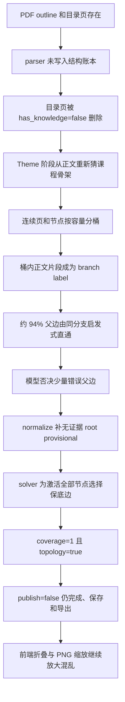
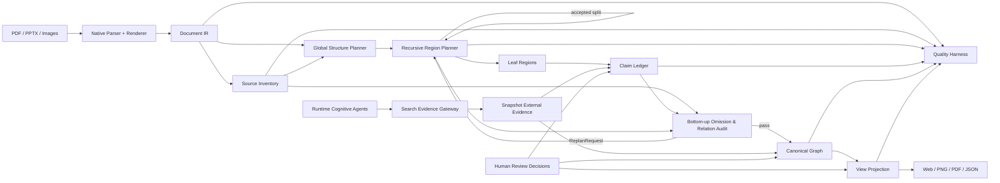
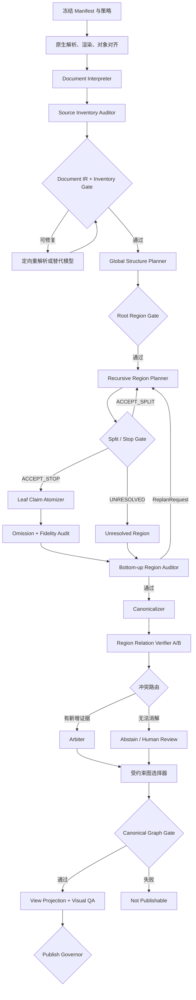

# 思维导图系统级整改方案

- 日期：2026-07-29
- 状态：架构设计，尚未进入生产实现
- ADR-01 状态：已批准，自 2026-07-29 起替代双向结构生长
- ADR-02 状态：已批准，自 2026-07-30 起允许受限
  `source-only + no-egress + recorded/deterministic + publication-disabled +
  shadow-only` 合同与实施范围；尚未启动编码
- 现场基线：公网 v56，`experiment/bone@297da939835dc9b748a33bd80d368702d7de687d-dirty`
- 主反例：`标准5-醛和酮.pdf`
- 设计范围：输入理解、知识声明、图谱构建、联网检索、质量评估、产品呈现和渐进迁移
- 规范性 Workflow：`docs/MINDMAP_WORKFLOW_SPEC.md`，状态为
  `MIXED`；ADR-01、ADR-02 已批准，ADR-03 至 ADR-12 已完成分轴产品审批
- 产品审批记录：`docs/MINDMAP_PRODUCT_APPROVAL_RECORD.md`
- 完整执行书：`docs/MINDMAP_EXECUTION_PLAYBOOK.md`

## 0. 执行结论

本次整改不再把主要赌注放在提示词微调、单页节点数量限制或更换一个更强模型上。
v56 的核心问题是错误的数据合同和控制流：

1. 源文档中的目录、outline、页角色和跨页连续性没有成为稳定事实。
2. 页级抽取直接输出“可发布节点”，源文档被预筛节点反向覆盖。
3. 容量分桶被误用为语义分支，正文残片取得了结构权威。
4. 父边校验没有否决单调性，坏关系可由无证据 provisional 根边重新引入。
5. solver 优化树合法性和节点激活，不优化教学层级正确性。
6. coverage、拓扑合法和平均边分被误读为语义质量。
7. `publish=false` 的图仍作为“已生成”主结果交付，展示层继续放大错误。

整改后的唯一主链为：

```text
Document IR
  + Source Inventory
  -> Top-down Recursive RegionPlan
  -> Claim Ledger
  -> Canonical Graph
  -> View Projection
```

四层是四个独立、版本化、可回放、可分别验收的产品。后层只能引用前层稳定 ID，
不得覆盖或改写前层事实。`Source Inventory` 是 Document IR 的独立审计 sidecar，
负责为完整性建立外部分母，避免 Claim Atomizer 通过漏掉困难内容获得漂亮指标。

所有运行时认知 Agent 都具备提交联网搜索意图的能力，但 Gateway 默认拒绝，
只有租户授权、允许的触发码和最小必要查询同时满足时才执行。网页证据和课件证据
必须分账保存，外部资料不能提高课件 coverage、补写源转录或单独认证核心父子边。

经独立红队审查，ADR-02 已于 2026-07-30 批准以下受限 shadow 合同与实施边界；
本次只记录批准，尚未收到“启动 ADR-02”的编码指令：

```text
SourceObservationIR v1
+ Source Inventory
+ top-down RegionPlan v0
+ Claim Ledger omission audit
+ explicit-only Canonical v0
+ diagnostic View Projection
```

非显式 recursive Region、全量运行时 Agent 联网、控制面迁移和公网 canary 必须
由后续金标、隐私安全红队和故障注入结果逐项解锁。

### 0.1 ADR-01：结构单向生长

原 C+ 的“双向建图”正式废止，替换为：

> **结构只向下生长，证据从下向上验收。**

- Global Structure Planner 是根和一级 RegionPlan 的唯一生成入口。
- Recursive Region Planner 只能在已接受的父 Region 内提出子 Region。
- Claim Atomizer 在叶 Region 内提取声明，不得生成祖先、父节点或根。
- Omission/Relation Auditor 可以否决、标记遗漏并提交 `ReplanRequest`，但不得
  直接补建父节点、升根或改写祖先结构。
- 祖先结构只有对应的 Region Planner 可以通过新版本计划修改。
- Bottom-up 信息流保留；bottom-up structure growth 被禁止。

这不是“模型一次生成整棵树”。模型递归提出分区，代码和独立审计决定每次
split/stop 是否被接受。

## 1. 冻结事故基线

### 1.1 现场数据

| 项目 | Standard | Precision |
| --- | ---: | ---: |
| task | `6f21ecec21b2` | `39d8037b4734` |
| 页级结果 | 52/53 页，242 nodes | 53/53 页，248 nodes |
| 最终树 | 250 nodes / 249 edges | 260 nodes / 259 edges |
| 独立模型参与的最终边 | 17 | 15 |
| 仅确定性校验的最终边 | 232，93.2% | 244，94.2% |
| provisional 根边 | 1 | 2 |
| solver | `OPTIMAL` | `OPTIMAL` |
| publish gate | false | false |

源 PDF 自带 55 个 outline 条目，第 1 页还明确列出 `10.1-10.4` 和
`10.3.1-10.3.5`。当前 parser 没有消费 PDF outline；页级模型又正确识别目录后
返回 `has_knowledge=false, nodes=[]`。下游只遍历 nodes，于是课程骨架被准确识别
后准确删除。

两次运行的页级节点名 Jaccard 为 `0.8030`，最终节点名为 `0.7789`，但 branch
label Jaccard 只有 `0.3462`，最终“父名 -> 子名”Jaccard 仅 `0.2360`。这说明
主要不稳定性发生在层级组织，而不是单纯发生在文字抽取。

### 1.2 确定性故障链



典型伪分支包括 `well-established`、`Another proton is removed`、
`（中性条件）`、`确定醛的母体` 和 `级醇选择性氧化`。它们不是共同上位概念，
只是容量桶内被算法挑中的正文片段。

### 1.3 当前指标为什么失真

- `evidence_coverage=1` 只表示节点带有某个 unit ID，不表示证据蕴含节点声明。
- `weighted_content_coverage=1` 只表示 unit 被某个结构 topic 声明覆盖。
- `abstraction_support_rate=1` 只要求抽象节点有多个 support ID，不验证共同概念。
- `direct_parent_confidence` 是所选边 score 的平均值，不是直接父边准确率。
- `topology_valid=true` 只证明唯一根、单父、无环和可达。
- `OPTIMAL` 只证明 solver 对当前目标函数求得最优解。

这些指标都不能测量课程目录一致性、分支纯度、兄弟粒度、共同上位概念、
直接父边正确性和教学顺序。

### 1.4 证据位置

- 源 PDF：`runtime/rerun-input/20260724-test-courseware/documents/标准5-醛和酮.pdf`
- Precision JSON：`39d8037b4734.json`
- Precision PNG：`39d8037b4734.png`
- Standard JSON：`6f21ecec21b2.json`
- 当前输入合同：`backend/app/schemas.py`
- 当前 C+ 合同：`backend/app/architecture_schemas.py`
- 当前候选与校验：`backend/app/agents.py`
- 当前 normalize：`backend/app/mindmap_engine/normalize.py`
- 当前 solver：`backend/app/mindmap_engine/topology.py`
- 当前质量门：`backend/app/cplus_pipeline.py`

## 2. 设计团队

本次采用十个角色，不按模块数量机械分工，而按相互制衡的决策责任分工。

| 角色 | 责任 | 必须交付 |
| --- | --- | --- |
| A1 事实与根因审计 | 冻结事故事实，区分模型波动和确定性算法问题 | 可复现因果链、证据索引、不可放松约束 |
| A2 文档理解 | 设计源文档的高保真表示 | Document IR、页面角色、对象级 provenance、连续性 |
| A3 图谱与层级推理 | 从声明构建规范图，不把调度桶当语义 | Canonical Graph、父边证据、拒绝与未决策略 |
| A4 联网能力 | 设计所有 Agent 的受控搜索基础设施 | Search Evidence Gateway、安全、预算、评估 |
| A5 Agent 与模型策略 | 设计运行时团队、编排、模型独立性和仲裁 | Agent DAG、上下文合同、成本和失败语义 |
| A6 质量与评测 | 替换伪健康指标，建立金标和发布门 | 指标、阈值、数据集、校准和持续回归 |
| A7 系统与迁移 | 设计版本化 artifact、shadow、canary 和回放 | 分阶段迁移、SLA、观测、回滚和兼容策略 |
| A8 产品与呈现 | 分离规范图和用户视图，定义失败体验 | View Projection、复核、布局和导出硬门 |
| A9 独立红队 | 从反例、成本、安全和可运营性攻击总方案 | 阻断项、反例集、修正建议 |
| A10 总架构师 | 解决角色冲突，冻结 ADR 和实施顺序 | 本文、决策记录、阶段性 stop/go 门 |

每个角色必须独立进行 GitHub 和互联网检索，不能只继承其他角色的搜索摘要。
所有采用结论要记录版本、许可、维护状态、适配范围和拒绝原因。

## 3. 不可放松的系统不变量

### 3.1 数据不变量

1. 每个源 page/slide 必须保留，具有稳定 `page_id`。
2. 原生解析、OCR、VLM 转录是并列 source layer，不能互相静默覆盖。
3. `structural_role` 和 `content_role` 正交；目录可以没有可发布 claim，但仍有结构价值。
4. node selection、摘要和发布资格不得反向覆盖 Document IR。
5. 表格、公式、化学反应和视觉区域不得被不可逆扁平化为单段文本。
6. 每个 claim 必须指向 block、字符 span、cell、formula、reaction 或 bbox。
7. 外部网页证据使用独立命名空间和独立 coverage，不能冒充课件来源。
8. source observation、模型推断和人工确认必须分状态保存，不能混成“文档事实”。
9. Source Inventory 必须独立于 Claim Atomizer 生成，作为 omission audit 分母。

### 3.2 推理不变量

1. 页连续性和容量只能用于调度，不能决定语义父子关系。
2. branch label 必须被其子项共同蕴含为上位概念。
3. 父边是需要证据和校验的声明，不是 solver 的便利变量。
4. verifier 否决必须单调生效；没有新证据不得被后续阶段升级。
5. 没有合法父边的节点必须允许 `abstained`、`rejected` 或进入非树附录。
6. provisional 边不能满足正式发布门。
7. Canonical Graph 可以是 DAG；教学树只是一个 View Projection。
8. 整个 build 只有自顶向下 Region Planner 拥有结构生成权。
9. bottom-up Agent 只能提交 evidence、veto、omission 和 `ReplanRequest`。
10. Replan 必须回到受影响的最小祖先 Region，不能由叶节点直接越级改树。

### 3.3 产品不变量

1. `publish=false` 不得对外表达为“思维导图已生成”。
2. 前端折叠、分页和导出不得改变规范父子关系。
3. 默认视图不能通过整体缩小把正文降到不可读字号。
4. 任何外部扩展内容必须可一键隐藏，并清楚标注不是课件原文。
5. 用户修正必须回写为版本化 decision，不直接改写历史事实。

## 4. 目标架构



### 4.1 四层产品边界

| 层 | 回答的问题 | 不允许做的事 |
| --- | --- | --- |
| Document IR | 源文件观察到了什么；哪些角色和连续性只是推断 | 决定最终节点、父边和是否发布 |
| Claim Ledger | 源材料提出了哪些原子声明、例子、公式、指令和结构事实 | 强迫所有声明进入一棵树 |
| Canonical Graph | 哪些概念和关系在课件范围内可以被规范化、验证和保留 | 为布局便利伪造父边 |
| View Projection | 针对具体用户任务显示什么、展开多少、如何布局 | 改写 Canonical Graph 的语义 |

Source Inventory 不增加第五个语义产品层。它是从 Document IR 独立生成的审计
artifact，列出每页对象、表格 cell、公式/反应区域、视觉区域和人工 must-have，
用于发现 Claim Ledger 的遗漏。

`RegionPlan` 同样不是第五个最终产品层，而是 Document IR 到 Claim Ledger 之间的
版本化控制 artifact。它负责保存主题、源区域归属、split/stop 决定和重规划历史。

### 4.2 全局可访问，不是原文堆叠

Global Structure Planner 获取的是结构化全局包：

```text
文档标题
+ 原生 TOC / PDF outline
+ 全部页面标题
+ 页面角色 hypothesis
+ 页面摘要和缩略图
+ Source Inventory
+ 公式、表格、反应和视觉区域索引
+ 可按需回读的原始页
```

“把整个 PPT/PDF 给模型”在本设计中表示模型可以寻址完整文档，而不是把全部原始
文字、图片和 OCR 结果一次性拼成一个无结构的大 prompt。

## 5. Document IR

### 5.1 最低合同

```text
SourceObservationIR
  schema_version
  document_id
  source_hash
  parser_manifest
  pages[]
  outline_entries[]
  interpretation_hypotheses[]
  unresolved_regions[]
```

```text
PageIR
  page_id
  physical_index
  logical_number
  dimensions
  blocks[]
  native_objects[]
  observed_order_signals[]
  reading_order_hypotheses[]
  role_hypotheses[]
  render_ref
```

```text
BlockIR
  block_id
  page_id
  kind
  text
  bbox
  native_order_hint
  native_object_id
  parent_group_id
  source_layer
  source_confidence
  char_spans
  observation_status
  producer
  evidence_refs[]
```

所有推断对象统一增加：

```text
interpretation_status:
  observed | inferred | contested | human_confirmed | rejected

producer
evidence_refs[]
supersedes
```

### 5.2 页面角色

最低角色集合：

`cover | toc | section_divider | content | example | research_aside | review |
exercise | answer | appendix | decoration | unknown`

允许多标签和分别置信度，但页面角色属于 `RoleHypothesis`，不是源文件观察事实。
角色不确定时降级为 `unknown`，不能降级为删除，也不能直接过滤 Claim。

### 5.3 结构事实

- PDF outline、bookmark、PPTX title placeholder、编号标题和目录项全部进入
  `outline_entries`。
- 每个目录项保存观察到的层级、文本和目标页；匹配标题、预计区间、实际区间作为
  独立 interpretation hypothesis 保存。
- source-declared hierarchy 是高权重结构证据，但不是不可质疑的绝对真理。
- 若目录和正文冲突，两者均保留，由结构对齐阶段产生显式 conflict。

### 5.4 复杂对象

- Table 保留 row、cell、header、rowspan、colspan、caption、bbox 和表头依赖。
- Math Formula 保留原图、display text、LaTeX、可选 AST 和符号级置信度。
- Chemical Reaction 单独建模 reactants、products、reagents、conditions、arrow、
  direction、step 和各字段 provenance。
- 无法可靠解析时保留区域与逐字转录并标 `unresolved`，不得自然语言猜补。

### 5.5 连续性

连续性作为可审计 hypothesis 保存：

`same_section | continued_from | continued_to | aside_of | returns_to | review_of |
repetition_of`

醛和酮夹具必须能提出并由标注者裁决以下候选，而不是把它写死为 parser 事实：

```text
p9 主线 -> p10-p12 research_aside -> p13 returns_to p9 主线
```

### 5.6 Source Inventory

```text
SourceInventory
  inventory_id
  document_ir_ref
  page_entries[]
  block_entries[]
  table_cell_entries[]
  formula_region_entries[]
  reaction_region_entries[]
  visual_region_entries[]
  outline_entries[]
  unresolved_entries[]
  human_must_have_refs[]
  inventory_policy_version
```

Source Inventory 由确定性枚举器和独立 Source Inventory Auditor 生成，不能读取 Claim
Atomizer 的输出决定分母。它只回答“哪些源对象需要被解释或明确跳过”，不决定
对象是否成为知识点。

稳定 ID 的保证范围必须显式记录：

- 同一源 hash、同一 parser major 内必须稳定。
- parser major 升级可以产生新 ID，但必须保存 `supersedes` 映射。
- 源文件增页或人工 source correction 产生新 document revision。
- 任何人工修订不得重写旧 revision。

### 5.7 Recursive RegionPlan

```text
RegionPlan
  region_id
  plan_version
  parent_region_id
  ancestor_path[]
  theme_label
  theme_definition
  primary_source_memberships[]
  secondary_source_memberships[]
  explicitly_excluded_source_ids[]
  unresolved_source_ids[]
  boundary_context_refs[]
  child_region_ids[]
  split_proposal
  stop_proposal
  evidence_refs[]
  planner_attempt
  status
  supersedes
```

Region 不是容量 bucket，也不要求是连续页区间。一个主题可以引用多个不连续
page/slide interval；跨主题对象使用 secondary membership，不能通过复制 Claim
伪装成两个不同知识点。

每个 Source Inventory entry 必须处于以下一种可审计状态：

```text
primary_region
secondary_cross_cutting
explicitly_nonclaim
unresolved
```

任何 entry 都不能因为模型没有提到而消失。

### 5.8 自顶向下递归

```text
root_plan = GlobalStructurePlanner(global_document_pack)
accept(root_plan) only if RootRegionGate passes

queue = accepted(root_plan.children)
while queue:
    region = queue.pop()
    proposal = RecursiveRegionPlanner(
        region_source,
        ancestor_path,
        sibling_summaries,
        boundary_context,
    )

    decision = RegionDecisionGate(proposal, SourceInventory)
    if decision == ACCEPT_SPLIT:
        queue.extend(proposal.children)
    elif decision == ACCEPT_STOP:
        emit_leaf_region(region)
    else:
        emit_unresolved_region(region)
```

兄弟 Region 只有在父 split 被接受后才并行执行。每个子 Agent 必须读取 ancestor
path、兄弟摘要和边界上下文，防止局部命名漂移和重复分区。

### 5.9 Split Gate

每次 split 必须生成 `RegionSplitCertificate`：

```text
parent_region_id
parent_common_concept
child_region_ids[]
child_labels[]
source_assignment_map
boundary_evidence[]
sibling_separation
within_region_cohesion
residual_source_ids[]
cross_cutting_source_ids[]
decision
```

接受 split 的最低条件：

- parent label 可以概括全部主要 child，而不是正文首句、评价词或残片。
- 每个 child label 自足且有独立 source support。
- sibling 粒度可比较，主题边界具有可解释差异。
- Source Inventory 已被分配、明确排除或标 unresolved。
- split 不依赖节点数、token 数和页面容量来证明语义。
- 目录是高权重 prior，不是不可质疑的命令。

### 5.10 Stop Gate

模型只能提出：

```text
SPLIT | STOP | UNRESOLVED
```

`STOP` 只有在以下条件同时成立时才能被接受：

- Region 只有一个清晰教学意图。
- 没有尚未处理的稳定子标题或显著独立主题。
- 叶内 Claim 能保持相近教学粒度。
- Source Inventory 已全部对账。
- 继续拆分只会产生残句、无共同概念的 singleton 或重复节点。
- 不存在高重要度遗漏和 mixed-theme 证据。

最大深度、token budget 和最小页面数只是运行安全条件，不是语义停止证据。达到
最大深度但 Region 仍混杂时必须输出 `UNRESOLVED`。

### 5.11 ReplanRequest

```text
ReplanRequest
  request_id
  affected_region_id
  minimum_replan_ancestor_id
  omitted_source_ids[]
  mixed_theme_evidence[]
  boundary_errors[]
  duplicate_memberships[]
  invalid_parent_relations[]
  requested_action
  evidence_refs[]
  requester
  status
```

Bottom-up Auditor 可以请求：

`RESPLIT | MERGE_SIBLINGS | MOVE_BOUNDARY | RENAME_REGION | MARK_UNRESOLVED`

它不能直接执行这些操作。只有 `minimum_replan_ancestor_id` 对应的 Region Planner
可以提交新 RegionPlan，并通过完整 split/stop gate。

## 6. Claim Ledger

Claim Ledger 是“完整抽取”和“允许发布”之间的防火墙。

### 6.1 ClaimRecord

```text
ClaimRecord
  claim_id
  claim_type
  normalized_text
  source_text
  subject_mentions[]
  predicate
  object_mentions[]
  qualifiers[]
  instructional_role
  novelty
  scope
  source_evidence_refs[]
  external_evidence_refs[]
  extraction_confidence
  extraction_status
  source_entailment_status
  external_validity_status
  publication_status
  duplicate_of
  review_of
  decision_history[]
```

`claim_type` 最低包括：

`definition | property | mechanism | reaction | condition | comparison | example |
exception | procedure | warning | summary | instruction | structural_fact`

### 6.2 三种独立状态

- `extraction_status`：是否从源材料完整恢复。
- `source_entailment_status`：课件证据是否蕴含、部分支持、冲突或不足。
- `external_validity_status`：外部资料是否支持、反驳或无法判断课件声明。
- `publication_status`：是否适合进入某个用户视图。

这些状态不得合并成一个 `has_knowledge`。系统负责忠实表示“课件如何陈述”，
不能把 source entailment 冒充现实世界真伪。

### 6.3 Omission Audit

Claim Ledger 的完整性不能由 Claim Atomizer 自己证明：

```text
OmissionAudit
  source_inventory_ref
  claim_ledger_ref
  accounted_source_ids[]
  omitted_source_ids[]
  explicitly_nonclaim_source_ids[]
  unresolved_source_ids[]
  must_have_recall
  omission_reasons[]
  auditor_attempts[]
```

- 每个 Source Inventory entry 必须被 claim、结构事实、明确 non-claim 决定或
  unresolved 决定覆盖。
- `explicitly_nonclaim` 必须有对象角色和证据，不能只是模型说“没有知识”。
- 人工 must-have 集是外部分母，不能由当前模型生成。
- Omission Auditor 与 Claim Atomizer 使用不同 prompt、上下文切片和角色。
- 只要高价值源对象未解释，Claim Gate 不得通过。

### 6.4 外部证据分账

课件声明可以被外部资料：

`supports | contradicts | disambiguates | normalizes | extends | unresolved`

但必须遵守：

- 外部证据不能提高 source coverage。
- 外部证据不能把课件未出现的知识变成 core claim。
- 外部证据不能单独认证 core parent edge。
- 扩展知识只进入 `enriched_overlay`。
- 每条外部证据必须有快照、抓取时间、URL、内容 hash、引用 span 和许可信息。
- 外部标准名称不能静默覆盖课件显示名；规范名和 source label 同时保留。

## 7. Search Evidence Gateway

### 7.1 原则

所有认知 Agent 都具备提交 `SearchIntent` 的能力，但 Gateway 默认拒绝，不代表
每个角色默认获准联网。统一入口负责最小权限授权、安全、预算、快照、去重、
来源质量、冲突、隐私和可回放。

### 7.2 核心合同

```text
SearchIntent
  intent_id
  run_id
  agent_role
  question
  query_candidates[]
  allowed_domains[]
  blocked_domains[]
  evidence_purpose
  trigger_code
  tenant_consent_ref
  data_classification
  redaction_policy
  max_queries
  max_fetches
  freshness_requirement
  source_priority
```

```text
EvidenceBundle
  bundle_id
  intent_id
  query_log[]
  results[]
  fetch_snapshots[]
  conflicts[]
  unresolved_questions[]
  budget_usage
  gateway_policy_version
```

```text
ExternalEvidenceRef
  external_ref_id
  snapshot_id
  canonical_url
  publisher
  title
  published_at
  fetched_at
  content_hash
  quote_span
  relation_to_claim
  trust_tier
  license_note
```

### 7.3 运行模式

| 模式 | 用途 | 外部内容能否进入用户图 |
| --- | --- | --- |
| `source_only` | 严格复原课件 | 不能 |
| `grounded_assist` | 消歧、术语规范化、冲突检查 | 不能进入 core，只能影响置信和复核 |
| `enriched_overlay` | 用户明确要求扩展学习 | 可以，必须独立样式和一键隐藏 |

`source_only` 是完整可用的默认路径。私有课件、受限租户和 recorded replay 默认
`no_egress`。开启 `grounded_assist` 或 `enriched_overlay` 必须有租户级 opt-in。

### 7.4 初始预算

| 档位 | queries | fetches | 下载量 | 搜索附加延迟 P95 |
| --- | ---: | ---: | ---: | ---: |
| Standard | 12 | 24 | 25 MB | 30 秒 |
| Precision | 36 | 72 | 100 MB | 120 秒 |

预算是 run 级上限，再按 Agent 角色分配。缓存命中不重复计费，但必须记录复用。

### 7.5 安全硬门

- Fetcher 运行在隔离网络区，只允许 HTTP/HTTPS。
- DNS 解析后检查目标 IP，连接时绑定已验证 IP；每一跳重定向重新解析并检查，
  阻断 loopback、link-local、RFC1918、metadata、保留地址和 DNS rebinding。
- 搜索结果和网页正文永远作为不可信数据，不得改变 system prompt、工具权限、
  查询预算或工作流。
- 源课件中的白字、notes、alt text、图片、链接和 metadata 同样按不可信输入处理，
  不能改变 Agent 权限和工作流。
- HTML、PDF 和附件经过 MIME、大小、解压比、脚本和主动内容过滤。
- 凭据仅存在于 connector，认知 Agent 不接触搜索 API key。
- owner、run 和 snapshot 命名空间隔离，禁止跨用户缓存泄漏。
- 每次使用外部证据都能从最终 decision 回放到具体快照。
- 查询经过数据分类、最小化和脱敏；默认禁止发送私有课件的逐字长片段。
- Gateway 记录 provider 数据驻留、保留期和删除策略；不满足租户政策时拒绝。
- Document Interpreter 不得用网页正文补写 source transcription、bbox 或原生对象。
- sanitizer 只能降低风险，不能把网页标记为“可信指令”。

### 7.6 禁止项

- Agent 绕过 Gateway 直接联网。
- 搜索结果驱动工具授权或 prompt 修改。
- 外部证据 ID 与课件 evidence ID 共用命名空间。
- 无预算上限、无快照或无法重放。
- 通过搜索补齐 coverage 或为错误父边“找理由”。
- 未经租户 opt-in 发送私有课件内容。
- 用不同 query 重复搜索来绕过已否决边。

### 7.7 证据新颖性

重新审理 vetoed hypothesis 必须满足全部条件：

- 创建新 hypothesis ID，并通过 `supersedes` 指向旧对象。
- 新 evidence 的内容 hash 未出现在旧审理中。
- 新 evidence 的来源类别或 courseware span 对原关系提供实质新增信息。
- 仅更换 query、搜索排序、摘要措辞或重复镜像不算新证据。
- external-only 新证据永远不能把 core edge 升为 accepted。
- 每个对象的 reopen 次数受预算约束，超过上限转人工。

## 8. Canonical Graph 的最低语义合同

Canonical Graph 允许保留多关系和不确定性，不要求所有内容立即成为一棵树。

```text
CanonicalConcept
  concept_id
  canonical_name
  aliases[]
  concept_type
  scope
  source_claim_ids[]
  external_ref_ids[]
  status
  confidence_components
  decision_history[]
```

```text
CanonicalRelation
  relation_id
  source_id
  target_id
  semantic_relation
  hierarchy_directness
  evidence_authority
  source_claim_ids[]
  edge_evidence_refs[]
  verifier_decisions[]
  status
  rejection_reasons[]
```

关系的四个维度必须分开：

- `semantic_relation`：`topic_contains | is_a | part_of | stage_of | example_of |
  prerequisite | causes | precedes | contrasts | reacts_with | review_of`
- `hierarchy_directness`：`direct | ancestor_only | non_hierarchical | uncertain`
- `evidence_authority`：`courseware_direct | outline_structural |
  courseware_aggregate | external_only | retrieval_only`
- `status`：`candidate | accepted | conflicted | abstained | rejected | superseded`

父边必须具有关系级证据；“父节点和子节点各自有证据”不能替代关系证据。

### 8.1 节点和边状态

`candidate | accepted | conflicted | abstained | rejected | superseded`

没有合法父边的节点进入 `abstained` 或附录，不允许自动升根。被否决的父边只有在
出现新证据、生成新的 relation candidate 并重新验证后，才能恢复候选资格。

### 8.2 图构建合同

```text
StructureAnchor
  id
  kind
  label
  parent_anchor_id
  level
  order
  page_range
  source_refs[]
  extraction_confidence
  status
```

```text
ConceptHypothesis
  hypothesis_id
  preferred_label
  aliases[]
  semantic_kind
  pedagogical_role
  granularity
  member_claim_ids[]
  anchor_memberships[]
  origin
  status
```

```text
EdgeHypothesis
  hypothesis_id
  parent_id
  child_id
  semantic_relation
  hierarchy_directness
  evidence_authority
  courseware_evidence[]
  outline_evidence[]
  abstraction_evidence[]
  external_evidence[]
  retrieval_signals[]
  verifier_votes[]
  vetoes[]
  status
  supersedes
```

```text
CanonicalGraphVersion
  accepted_nodes[]
  hierarchy_dag[]
  semantic_edges[]
  unresolved_items[]
  rejected_items[]
  decision_log[]
  build_manifest
```

节点使用三个正交维度，不能再用一个 `role` 同时表达实体类型、教学用途和来源：

- `semantic_kind`：`topic | concept | reaction_family | reaction | mechanism |
  method | property | condition | result | formula | example | exception`
- `pedagogical_role`：`definition | principle | procedure | comparison |
  application | exercise`
- `origin`：`explicit | outline_anchor | planner_induced_region | external_reference`

层级边限定为：

`topic_contains | is_a | part_of | stage_of | example_of`

因果、条件、用途、机理和反应转化属于非层级 semantic edge：

`depends_on | causes | precedes | contrasts_with | used_for | condition_for |
mechanism_of | transforms_to`

### 8.3 图构建算法

```text
root_region = plan_global_structure(DocumentIR, SourceInventory)
region_tree = recursively_partition_top_down(root_region)

leaf_claims = extract_claims_from_leaf_regions(region_tree)
ledger = verify_source_entailment_and_omissions(leaf_claims)

audit = bottom_up_region_audit(region_tree, ledger, SourceInventory)
while audit.has_replan_requests:
    region_tree = replan_minimum_affected_ancestors(audit.requests)
    leaf_claims = reextract_affected_leaf_regions(region_tree)
    ledger = reverify_affected_claims(leaf_claims)
    audit = bottom_up_region_audit(region_tree, ledger, SourceInventory)

concepts = conservative_entity_resolution(ledger)
hierarchy_edges = verify_region_parent_relations(region_tree, concepts)
semantic_links = verify_non_hierarchy_relations(concepts)
canonical_dag = assemble_without_inventing_parents(
    concepts,
    hierarchy_edges,
    semantic_links,
)
projection = project_view(canonical_dag, profile, node_budget)
```

结构父候选来自已接受的 RegionPlan，不再由底层 concept cluster 全局补建。聚类、
embedding、页邻近和字符相似度只可用于：

- 为 Region Planner 提供 split 提示。
- 发现遗漏、边界错误、重复和 cross-cutting membership。
- 生成 `ReplanRequest`。

它们不能直接产生正式 branch、父节点或 hierarchy edge。

### 8.4 TOC 和 outline

- 源 PDF 的 55 个 outline 项必须全部进入 `StructureAnchor`。
- 目录页没有内容 claim 时，`content_disposition=none`，但
  `structure_disposition=retained`。
- 每个 claim 根据目标页、标题路径和 section interval 产生一个或多个
  `anchor_membership` 假设。
- TOC 可直接认证 `topic_contains`，不能直接认证 `is_a`。
- 目录项只有在覆盖有效概念、标签语义完整并通过层级验证后，才晋升为
  Canonical Node。
- 未晋升的目录项仍永久保留在 Structure Ledger。
- 目录和正文冲突时保留双方，不得盲从目录或静默改写正文。

### 8.5 Region 层级接受

每个非叶 Region 都必须携带 5.9 定义的 `RegionSplitCertificate`。其中：

1. parent common concept 必须在拆分前由父 Region Planner 提出。
2. child label 必须在父 Region 的 source scope 内得到支持。
3. 每条 parent-child 关系分别通过 direct-parent 验证。
4. parent 比 child 更抽象，但不能退化为“课程内容”“其他主题”或文档根。
5. 归纳失败的 source item 允许 unresolved 或 secondary membership，不得为
   coverage 强塞。
6. split 最终少于两个有效 child 时，split 自动拒绝并回到父 Region 重规划。

非显式中层主题仍然允许，但只能由自顶向下 Region Planner 在当前父 scope 内提出，
不能在 leaf Claim 抽取后由 bottom-up cluster 直接补建。

Leiden、HDBSCAN、embedding 和递归摘要只能向 Region Planner 提供 split hint，
不能直接证明 taxonomy。

受限 shadow 的 `Canonical v0` 只接纳显式目录、显式标题和 courseware-direct
关系。非显式递归 Region 在 Source Inventory、Claim omission audit、split/stop
质量稳定后单独解锁。

### 8.6 去重和粒度

相似节点先分类：

```text
equivalent | alias | broader | narrower | overlap | homonym | distinct | uncertain
```

- 只有 `equivalent/alias` 且类型、公式、定义和关键限定兼容时才能合并。
- `broader/narrower` 若已存在于 RegionPlan，则进入关系验证；若意味着当前分区
  错误，只能生成 `ReplanRequest`，不能由 Canonicalizer 直接补父。
- `overlap/uncertain` 保持分离。
- 摘要页、复习页和正文重复只合并 claim membership，不覆盖原始证据。
- 同一概念可以拥有多个 anchor membership，不再由 `branch_id` 定义身份。

### 8.7 边证据

| 证据层 | 用途 | 能否独立认证核心父边 |
| --- | --- | --- |
| `courseware_direct` | 原文明确给出类别、组成、步骤或实例关系 | 可以 |
| `outline_structural` | TOC 路径、章节标题、目标页范围 | 只可认证 `topic_contains` |
| `courseware_aggregate` | 多个 child claim 支持 RegionPlan 已提出的 parent concept | 需逐 child 验证 |
| `external` | 网页、教材和外部本体的消歧、佐证 | 不可以 |
| `retrieval_signal` | embedding、聚类、相邻页、模型分数 | 不是证据 |

父子引用同一 unit 只代表可召回，不能生成关系证明。

### 8.8 验证、否决和仲裁

父边验证采用 Region-centered verification。每个 child 一次看到：

- RegionPlan 提出的直接父。
- 合法祖先。
- 有 source evidence 的 secondary Region membership。
- `NONE`。

先逐对判断，再比较最近直接父。Verifier 不得从全局任意搜索一个新父节点；发现
当前 Region 放错位置时只能输出 `ReplanRequest`。

输出必须包含：

```text
typed relation
direct | ancestor_only | sibling | semantic_link | unrelated | insufficient
courseware evidence refs
outline evidence refs
decision reasons
```

状态机：

```text
PROPOSED
  -> EVIDENCE_BOUND
      -> VERIFIED_SUPPORT
          -> ACCEPTED
      -> VETOED
      -> CONTESTED
      -> ABSTAINED
```

`VETOED`、`CONTESTED` 和 `ABSTAINED` 在同一 build 中都不能进入求解器。新增
证据或人工决定只能创建带 `supersedes` 的新 EdgeHypothesis，不能原地复活旧边。
两个父节点都合法时 Canonical Graph 可以保留多父，View Projection 再选择一个
展示主父。

“新增证据”必须符合 7.7 的新颖性合同。外部资料只能改变消歧和冲突状态，不能
单独改变 core hierarchy acceptance。

Precision 发布要求：

- 100% 层级边经过显式关系验证。
- 启发式直通率为 0。
- 推断型父边由两个经金标校准的低相关 verifier 盲审。
- 仲裁失败即 abstain，不用 root fallback。

不同厂商或模型家族不自动等于独立判断。`independence_group` 只有在校准集上满足
错误相关性、位置偏差、措辞偏差和自偏好测试后才有效；否则第二票只算重复采样。

### 8.9 求解器权限

OR-Tools CP-SAT 只处理 `VERIFIED_SUPPORT`：

- veto、contested、abstained、无核心证据、external-only 边固定 `x_edge=0`。
- 节点可以没有父节点，使用 `unresolved_node` 记账。
- Canonical Graph 允许多个合法直接父，但必须无环。
- planner-induced Region 激活时至少有 2 个已选子边。
- merge/split、等价和直接性冲突作为互斥约束。
- 节点预算、fanout、深度、左右布局和画布尺寸不得进入 Canonical Graph 求解。
- 不允许 solver 为 child 召回、补建或发明 RegionPlan 中不存在的新结构父节点。

使用词典序目标：

1. 最大化高价值 claim 的合法归属。
2. 最小化高价值未决 claim。
3. 最大化已验证直接边与共同父内聚度。
4. 最小化重复和无必要抽象。

“高价值”由独立 salience policy、Source Inventory 和人工 must-have 共同确定，
不能由 graph proposer 或同一模型自报 importance 决定。

求解无解时隔离冲突集合并转未决，不运行“直接接根”的贪心兜底。
`OPTIMAL/FEASIBLE` 只作为数学求解状态报告。

### 8.10 Canonical Graph 专项门

| 指标 | Precision 候选门 |
| --- | ---: |
| Outline 保留 | `55/55`，结构丢失为 `0` |
| Source Inventory Region 对账 | `100%` 或显式 unresolved/non-claim |
| 一级 Region precision / recall | calibration 后冻结；严重错误 `0` |
| Split decision precision / recall | calibration 后冻结 |
| Stop decision serious-error rate | `0` |
| Region boundary precision / recall | calibration 后冻结 |
| Replan serious-error recall | `>= 0.95` |
| bottom-up 直接结构写入 | `0` |
| 机械或片段型 branch | `0` |
| 非显式 Region split certificate | `100%` |
| 发布父边验证覆盖 | `100%`，启发式直通 `0` |
| 发布父边核心关系证据 | `100%` |
| Secondary membership candidate recall | `>= 0.95` |
| 错误合并率 | `<= 1%` |
| veto 原地复活、root provisional | `0` |
| external-only 核心认证 | `0` |
| 高价值未决 claim | `<= 5%`；超过则只能发布 partial |
| Cross-link precision | `>= 0.90`，证据覆盖 `100%` |
| 五次 node Jaccard | `>= 0.90` |
| 五次 hierarchy-edge Jaccard | `>= 0.85` |

## 9. 质量系统

### 9.1 金标集

首轮建立 60 份完整文档，定位为工程 pilot，不具备单独授权公网发布的统计效力：

| 分区 | 数量 | 用途 |
| --- | ---: | --- |
| Development | 12 | 规则、prompt 和 schema 开发 |
| Calibration | 18 | 阈值、Judge 和预算校准 |
| Sealed Blind | 30 | Pilot 盲测，禁止开发期查看答案 |

必须覆盖不同学科、语言、页数、版式、公式、表格、图像、复习页、习题和研究插页。
醛和酮作为冻结事故夹具进入 Development，但不能成为唯一优化目标。

标注和切分要求：

- 每份文档至少两名标注者，争议由学科专家仲裁。
- 允许记录多个合法 Canonical DAG 和多个合法 Projection，不强迫单一答案。
- 同一课程、同一教师、同一课件模板和派生版本必须按 source group 切分，避免泄漏。
- 联网 Agent 的评测环境必须阻断原课件、答案页和标注结果被搜索命中。
- 阈值按学科、语言、文档长度和对象类型分层报告，不能只看 pooled average。
- 公网发布前根据置信区间和最差分层结果扩充独立 blind set。

### 9.2 独立指标

| 维度 | 指标 | 首轮候选硬门 |
| --- | --- | ---: |
| Claim | Claim precision | `>= 0.92` |
| Evidence | Evidence entailment/alignment | `>= 0.95` |
| Recall | Must-have weighted recall | `>= 0.95` |
| Region | Source-to-region accounting | `1.00` 或显式 unresolved/non-claim |
| Region | Root/一级 Region P/R | calibration 后冻结，严重错误 `0` |
| Region | Split/Stop decision P/R | calibration 后冻结，严重错误 `0` |
| Region | Boundary P/R | calibration 后冻结 |
| Region | Replan serious-error recall | `>= 0.95` |
| Authority | Bottom-up direct structure writes | `0` |
| Parent | Direct-parent P/R/F1 | `>= 0.90 / 0.85 / 0.87` |
| Ancestor | Ancestor F1 | `>= 0.93` |
| Outline IR | 显式目录保留率 | `1.00` |
| Outline Graph | Canonical 采纳 P/R/F1 | calibration 后冻结 |
| Order | 部分序/并列感知的 source-order score | `>= 0.80` |
| Branch | branch purity | `>= 0.85` |
| Branch | mixed-theme branches | `<= 5%` |
| Branch | fragment/singleton/general-parent rate | calibration 后冻结 |
| Granularity | sibling granularity error | `<= 10%` |
| Noise | fragment root topics | `0` |
| View | 实际渲染字号 | 按 Web/PNG/PDF 分介质门 |

所有阈值先作为 calibration 假设，只有在多标注者金标集上稳定后才能成为生产门。

### 9.3 防止“小而完美”

Precision、purity 和 parent F1 不能单独发布。必须同时满足：

- 每文档而非仅全局聚合的 must-have recall。
- 一级主题、根边和高重要度父边严重错误数为 0。
- published-claim coverage 和 high-value abstain 上限。
- Source Inventory omission rate 和 unresolved source rate。
- parent candidate recall。
- 风险覆盖曲线与 selective-risk 曲线。
- 最差 10% 文档、最差学科分层和最差对象类型门。
- 分支最小规模、singleton/fragment rate 和通用父节点率。

如果系统通过 abstain 隐藏所有困难 claim，只留下少量简单节点，即使 precision
为 1.0 也不得发布完整导图，只能标记 partial 或 diagnostic。

### 9.4 分层质量门

```text
Gate D: Document IR fidelity
Gate C: Claim correctness and completeness
Gate G: Canonical graph semantics
Gate V: View usability and export fidelity
Gate P: Product publish
```

后层失败不能抹掉前层成功。例如 View 失败时可以保留 Canonical Graph artifact，
但不能向用户宣称导图已完成。

### 9.5 LLM Judge

LLM Judge 仅作为 shadow 指标，达到以下条件前不得成为唯一发布裁判：

- 与人工总体一致率 `>= 85%`
- Cohen's kappa `>= 0.70`
- 严重错误召回 `>= 90%`
- 在 sealed blind 集上通过模型版本漂移测试

## 10. 醛和酮验收夹具

### 10.1 Document IR oracle

- p1 保留全部目录项，并匹配后续 section 标题。
- p10-p12 产生 `research_aside` 候选及证据，由标注者裁决，不写死为观察事实。
- p13 产生“返回 p9 主线”的 continuity 候选及证据，由标注者裁决。
- p50 产生 `review` 和 `review_of` 候选，并引用可能被复习的原 claim。
- p53 产生 `exercise/instruction` 候选；无论角色裁决如何，都不得把
  “完成以下转化”直接当课程事实。
- p27、p34 的反应式保留反应物、产物、条件、箭头和区域 provenance。

### 10.2 Claim 与 Graph oracle

- `well-established`、`few reports`、`Another proton is removed`、
  `（中性条件）` 不得成为根级或一级 branch。
- 目录中的 `10.1-10.4` 必须作为首要结构候选参与图谱构建，但是否晋升
  Canonical 节点由 adoption precision 决定。
- 催化剂和 ee 数据保留完整 claim 和页面角色 hypothesis；只有结构关系经验证后
  才决定是否进入课程主线。
- 表格行依赖表头，不得拆成无上下文的独立节点。
- verifier 否决的父边不得由 provisional 根边复活。
- 无法确定上位概念的 claim 进入未决区，不强行挂根。

### 10.3 View oracle

- 首屏展示课程根、`10.1-10.4` 和必要的二级结构，不展示 260 个全量节点。
- 用户可从目录分支渐进展开到反应、机理、例子和证据。
- 经确认的 research-aside、review、exercise 使用不同的教学角色呈现。
- 外部资料默认关闭；开启后仍与课件节点明显区分。
- Web、PNG 和 PDF 使用同一 Projection；字号分别按 16.5 的介质门验收。

### 10.4 目标递归路径

允许的高层方案可以有多个，但应呈现类似的递归结构：

```text
醛和酮
├── 结构、性质与命名
├── 制备
├── 亲核加成
│   ├── 通则与机理
│   ├── 含氧亲核试剂
│   ├── 含氮亲核试剂
│   │   ├── 亚胺
│   │   ├── 肟与腙
│   │   ├── 腙的还原
│   │   ├── 烯胺
│   │   └── 水解
│   ├── 含硫亲核试剂
│   ├── 负氢亲核试剂
│   └── 含碳亲核试剂
├── 氧化
└── 复习与练习资源
```

这只是允许的教学结构示例，不是强制唯一金标。实际 Root/Region Plan 必须与源
TOC、标题、页面内容和多标注者合法结构对齐。

`well-established` 无法形成自足 Region，也不能覆盖一组共同下位主题，应在
Split Gate 前被拒绝。“羰基与二级胺形成烯胺”应成为“烯胺”叶 Region 内的
reaction claim，而不是一级结构主题。

## 11. 迁移总原则

1. 不直接替换现有公网主链，先写入独立 shadow artifacts。
2. 不修改现有公共 HTTP schema 和历史 graph contract，先通过 adapter 输出旧
   `MindMapResult`。
3. 每层 artifact 都带 schema version、input hash、producer version、
   prompt/model/search policy version 和 dependency manifest。
4. 新旧流水线对同一输入并行运行，比较语义金标，不比较节点数是否相近。
5. 只有 sealed blind 指标、成本和延迟同时过门，才允许 canary。
6. v56 只作为 shadow control，不作为质量失败时的自动产品回退。
7. vNext 不通过门时停止发布并返回诊断；只有用户显式选择 legacy opt-in 才查看
   旧结果。
8. canary 失败只回退发布指针或新主链路由，不删除可审计 artifact，也不自动
   向用户交付已知坏图。

## 12. Stop / Go 产品决定

### 12.1 立即停止

- 继续以 `has_knowledge` 同时表达结构价值、抽取结果和发布资格。
- 用容量分桶命名 branch。
- 用无 evidence root edge 修复孤儿。
- 强制所有非 optional 节点激活。
- 把 coverage、topology 或 solver optimal 当语义正确率。
- 允许 bottom-up 节点簇直接补父、升根或改写祖先 Region。
- publish gate 失败后仍显示“思维导图已生成”。

### 12.2 ADR-02 已批准范围（待明确启动）

- 冻结不覆盖现有类型的 `SourceObservationIR v1` JSON Schema。
- 把 PDF outline、PPTX native object、候选阅读顺序和角色 hypothesis 写入
  shadow artifact。
- 建立独立 Source Inventory、双轴 source accounting、Claim Ledger 和
  Omission Audit。
- 建立 top-down `RegionPlan v0`：Global Planner 生成一级 Region，Recursive
  Planner 仅沿显式 TOC/title 递归，Bottom-up Auditor 只能发 `ReplanRequest`。
- Canonical v0 只接纳已接受 RegionPlan 和 courseware-direct 关系，未决内容不强挂。
- 建立 diagnostic View Projection，不替换公网结果、不开放正式导出。
- 使用 owner-scoped ArtifactEnvelope 和权限矩阵。
- 运行范围固定为 `source-only + no-egress + recorded/deterministic +
  publication-disabled + shadow-only`。
- 为醛和酮建立逐层 oracle 和 adversarial variants，而不是只保存最终 PNG。

### 12.3 ADR-03 至 ADR-12 审批后的精确边界

**允许进入实施排期：**

- Gold/quality、hard metric 合取、sealed evaluation 和 `INCOMPLETE`。
- 内部执行/质量/发布三状态与 fail-closed legacy adapter。
- independent relation task、排列不变 Projection 和 LossManifest。
- blocked/review/draft/published 产品 UX、HITL 和可访问性原型。
- 独立 vNext shadow 内的 StageCommit v2、cancel、heartbeat、cost 和 fault semantics。
- Search Gateway、Query Compiler、recorded replay 和 public-fixture 安全夹具。
- 模型槽、盲审和 independence calibration。
- canary policy simulator、撤回和 rollback drill。

**满足产品门后才可进入受限实验：**

- inferred Region：Q0/Q1 后只做 public-fixture shadow。
- public-fixture live grounded-assist：Q0/Q1/Q4 后单独授权。
- Standard/Precision live pilot：Q1 后使用冻结的同文档对照。
- internal allowlist：Q0-Q5 全部通过后单独 StageAuthorization。

**继续保持 No-Go / Hold：**

- bottom-up abstraction induction 和任何底层直接补父。
- 私有/受限课件 live web egress。
- 未版本化公共 API 变化和正式 publication。
- public canary、default rollout 和自动 legacy fallback。
- 无真实触发证据的 Postgres/Temporal/Kubernetes 扩张。
- 固定 2-of-3 签名、未经校准的阈值/模型/预算/canary 百分比。
- 将 60 文档 pilot 或单一“醛和酮”结果解释为生产发布充分证据。

## 13. 外部研究记录

GitHub-first 检索已覆盖当前仓库本地历史以及相关上游。当前环境没有 `gh`，
匿名 GitHub API 无法访问私仓，因此私仓问题、PR 和 discussion 只能依赖本地
refs/history；没有发现可以直接覆盖整条故障链的上游实现。

可复用或作为设计依据：

- pypdf 已提供 outline API，当前仓库未消费：
  <https://pypdf.readthedocs.io/en/stable/modules/PdfReader.html>
- Docling 的层级、provenance、bbox 和 content layer 可作为 Document IR 参考：
  <https://docling-project.github.io/docling/concepts/docling_document/>
- Docling PR #3688 将 PDF bookmark/ToC 作为高优先级 heading signal：
  <https://github.com/docling-project/docling/pull/3688>
- Microsoft GraphRAG 提供邻近的社区层级与摘要架构，但不能直接替代课程直接父边：
  <https://microsoft.github.io/graphrag/index/architecture/>
- W3C PROV-O 可作为 artifact、Agent、证据和 decision provenance 的语义参考：
  <https://www.w3.org/TR/prov-o/>
- W3C SKOS 将直接 broader/narrower 与传递闭包分开，可参考层级直接性建模：
  <https://www.w3.org/TR/skos-reference/>
- W3C SHACL 可参考声明式 no-go shape，但首阶段不要求迁移为 RDF：
  <https://www.w3.org/TR/shacl/>
- JSON Schema 2020-12 用作长期 artifact 合同：
  <https://json-schema.org/draft/2020-12>
- RFC 8785 用于 canonical JSON payload digest：
  <https://www.rfc-editor.org/rfc/rfc8785>
- OR-Tools CP-SAT 只作为已验证候选的组合选择器：
  <https://developers.google.com/optimization/cp/cp_solver>
- RAPTOR 的递归聚类/摘要可用于 split hint 和多粒度检索，不可直接当 taxonomy：
  <https://arxiv.org/abs/2401.18059>
- Lost in the Middle 说明长上下文可用不等于模型会均匀利用所有位置，因此全局
  规划采用结构化 document pack 和按需回读：
  <https://arxiv.org/abs/2307.03172>
- BookSum 提供长文档多粒度摘要的邻近证据：
  <https://arxiv.org/abs/2105.08209>
- LangGraph durable execution 要求副作用幂等、可重放并通过 task 隔离：
  <https://docs.langchain.com/oss/python/langgraph/durable-execution>
- Temporal 可作为多 worker 长任务的条件式外层控制面：
  <https://docs.temporal.io/workflows>
- SQLite WAL 的并发边界用于约束单机 shadow 承诺：
  <https://www.sqlite.org/wal.html>
- OWASP Prompt Injection 防护：
  <https://cheatsheetseries.owasp.org/cheatsheets/LLM_Prompt_Injection_Prevention_Cheat_Sheet.html>
- OWASP SSRF 防护：
  <https://cheatsheetseries.owasp.org/cheatsheets/Server_Side_Request_Forgery_Prevention_Cheat_Sheet.html>
- W3C WCAG 2.2 Reflow：
  <https://www.w3.org/WAI/WCAG22/Understanding/reflow.html>
- W3C WCAG 2.2 Resize Text：
  <https://www.w3.org/WAI/WCAG22/Understanding/resize-text.html>
- OpenTelemetry Generative AI semantic conventions：
  <https://opentelemetry.io/docs/specs/semconv/gen-ai/>
- NIST Generative AI Profile：
  <https://www.nist.gov/publications/artificial-intelligence-risk-management-framework-generative-artificial-intelligence>

暂不直接采用：

- Docling：先做 schema 参考和 PPTX shadow adapter，不立即全量替换生产 parser。
- MinerU：适合离线 benchmark；依赖、运营和许可条件需要单独审查。
- Unstructured：可做轻量文本 fallback，不足以承担高保真对象级 IR。
- Marker：可做 PDF/OCR 对照，不适合作为原生 PPTX 理解层。
- GraphRAG：其 community hierarchy 是邻近方法，不是课程目录约束下的直接父子树。

## 14. 运行时 Agent 团队

运行时不采用自由对话式 Agent 群，而采用受约束、可回放的专家工作流。每个
Agent 只有一个决策责任和一个允许写入的 artifact 类型。

本节描述目标态角色库，不代表 S0-S3 会一次性启用全部角色。受限 shadow 只启用
Run Governor、Document Interpreter、Inventory/Omission Auditor、Global/Recursive
Region Planner、Region Decision Verifier、Claim Atomizer、Fidelity Verifier、
Bottom-up Region Auditor、explicit-only Canonicalizer、Quality Auditor 和
Projection Planner。

| 角色 | 只读输入 | 唯一允许输出 | 明确禁止 |
| --- | --- | --- | --- |
| Run Governor | manifest、状态、预算 | 调度、lease、checkpoint、状态转换 | 做知识判断或补语义边 |
| Document Interpreter | 原生对象、渲染页、Document IR | 页面角色、阅读顺序、section、continuity 候选 | 删除页面、生成知识节点 |
| Source Inventory Auditor | 冻结 SourceObservationIR | 独立源对象清单、must-inspect 和 unresolved 项 | 读取 Claim 结果来缩小分母 |
| Global Structure Planner | 全局结构包、Source Inventory | 根候选、一级 RegionPlan 和 source assignment | 提取叶 Claim、直接发布结构 |
| Recursive Region Planner | 当前 Region、祖先路径、兄弟摘要、边界上下文 | 子 RegionPlan 或 STOP/UNRESOLVED 提案 | 越过父 Region 改写其他分支 |
| Region Decision Verifier | split/stop 提案和 source evidence | ACCEPT_SPLIT/ACCEPT_STOP/UNRESOLVED | 自己创建替代父节点 |
| Claim Atomizer | 冻结的 Document IR 切片 | 原子 claim、公式、反应、例题、指令和 provenance | 规划分支或父边 |
| Omission Auditor | Source Inventory、Claim Ledger | accounted/omitted/non-claim/unresolved 对账 | 自己补 claim 让覆盖通过 |
| Bottom-up Region Auditor | RegionPlan、Ledger、Inventory | `ReplanRequest` 或 pass | 直接补父、升根或修改 RegionPlan |
| Claim Fidelity Verifier | claim 与原始证据 | `entailed/partial/contradicted/insufficient` | 改写证据迁就 claim |
| Domain Resolver | 歧义项、受控外部证据 | 别名、术语消歧、标准名称、冲突提示 | 将外部知识伪装成课件事实 |
| Canonicalizer | 已验证 Ledger、已接受 RegionPlan | 同义簇、概念身份、粒度和重复关系 | 发明 RegionPlan 之外的结构父节点 |
| Relation Verifier A/B | child、Region parent、合法祖先、secondary memberships、精确证据 | 关系分类和 abstain | 新造父节点、查看另一验证票 |
| Arbiter | 盲化冲突项和新增证据 | 接受、拒绝、abstain、转人工 | 无新证据推翻双重拒绝 |
| Quality Auditor | 冻结 artifact 和指标 | gate 报告、风险样本、发布建议 | 修改图让指标通过 |
| Projection Planner | Canonical Graph、视图策略 | View Projection | 改写 canonical 语义 |

### 14.1 编排 DAG



### 14.2 状态与失败语义

执行、质量、发布三种状态正交：

```text
execution_status:
  queued | running | waiting_retry | waiting_review | succeeded | failed | cancelled

quality_status:
  unassessed | blocked_document | blocked_claim | blocked_semantic |
  blocked_evidence | review_required | passed

publication_status:
  draft | release_candidate | published | superseded | withdrawn
```

`succeeded` 只表示工作流结束，绝不等于“思维导图已生成”。模型不可用、搜索失败、
预算耗尽和 verifier 拒绝都不能转换成正式启发式结果。

重试规则：

- 网络超时、429、5xx 最多重试两次，遵循 `Retry-After` 和 full-jitter。
- 401、403、余额不足、模型不存在立即熔断。
- Schema 错误只允许一次携带校验差异的定向 repair。
- 语义错误只有在证据或上下文发生变化时才能重试。
- 两名 verifier 都拒绝时，没有新 source evidence 或外部消歧证据不得重审。

### 14.3 模型组合

建立 `ModelPortfolioManifest`，按能力槽而不是按一个用户选择的模型分配：

```text
vlm_reader
claim_extractor
global_structure_planner
recursive_region_planner
region_decision_verifier
verifier_a
verifier_b
arbiter
tool_researcher
```

每个槽记录精确模型 revision、provider、模型家族、候选 `independence_group`、
上下文限制、结构化输出能力、地区、单价、延迟和内部金标成绩。

Standard：

- 每个发布 claim 必须经过非抽取者的 Fidelity Verifier。
- 每个 split/stop 必须经过非 planner 的 Region Decision Verifier。
- 每条 Region parent edge 必须经过非 planner 的 Relation Verifier。
- 根边、一级边、抽象父节点、跨 section 边、OCR/公式/反应边需要第二票。

Precision：

- 根和高风险 Region split 由 Planner A/B 独立提案。
- 所有推断型父边由两个通过错误相关性校准的 verifier 盲审。
- 两票冲突才进入第三模型或人工仲裁。
- 无法获得第二个低相关 verifier 时，不得标记为 precision publishable。

相同模型的多次采样只计为稳定性信号，不计为独立票。验证器看不到 proposer
身份、启发式分数、候选原排序和其他验证票。

模型家族、供应商和 endpoint 不自动构成独立性。只有在 calibration 集上完成
错误相关性、位置偏差、表述风格偏差和自偏好测试后，`independence_group`
才获得有效状态。

### 14.4 上下文和黑板

Agent 只接收局部 `TaskEnvelope`：

```text
artifact_version
source_ids
role_policy
budget_slice
output_schema
expected_artifact_version
idempotency_key
```

- Document Agent 读取页面对象和相邻页。
- Inventory Auditor 只读取 SourceObservationIR，不读取 Claim Ledger。
- Global Planner 读取全局结构包，不读取 leaf extraction 结果来反向造父节点。
- Region Planner 只读取当前 source scope、ancestor path、sibling summaries 和
  boundary context。
- Claim Agent 读取一个 section interval 及连续页。
- Omission Auditor 同时读取 Inventory 和 Ledger，但不能写 Claim。
- Bottom-up Region Auditor 读取 RegionPlan、Inventory 和 Claim cards，只能写
  `ReplanRequest`。
- Verifier 读取一个 child、Region parent、合法祖先、secondary memberships、
  精确证据和局部兄弟。
- Arbiter 读取重新排序的证据、结构化票和理由。

共享黑板改为不可变 artifact 加 append-only decision event。过期写入通过 CAS
拒绝，任何派生层不得覆盖 Document IR。

### 14.5 初始运行预算

| 档位 | VLM/Text/Search 并发 | 20-60 页 P95 | 61-150 页 P95 | 成本上限 |
| --- | --- | ---: | ---: | ---: |
| Standard | 4 / 6 / 2 | 10 分钟 | 18 分钟 | 基准 1.0x |
| Precision | 6 / 8 / 3 | 20 分钟 | 35 分钟 | Standard 2.5x |

这是 calibration 预算，不是当前生产承诺。成本必须分别报告 cold run、同 owner
缓存命中和跨阶段复用，不能使用复用过 Standard checkpoint 的 Precision 事故任务
冒充完整冷启动成本。父边校验按一个 child 同时比较全部
Top-k parent，再按 4-8 个 child 批处理，调用量应接近 `O(N/batch)`。

## 15. Artifact 与控制面

### 15.1 ArtifactEnvelope

```text
ArtifactEnvelope
  artifact_id
  artifact_type
  schema_id
  schema_version
  owner_id
  payload_digest
  canonicalization_profile
  producer
  input_refs[]
  external_snapshot_refs[]
  created_at
```

- `artifact_id` 使用 owner-scoped opaque ID，不暴露跨租户相同内容是否存在。
- `payload_digest` 使用 RFC 8785 JSON Canonicalization Scheme 后计算 SHA-256。
- Quality Attestation 单向引用 artifact；artifact envelope 不反向包含 `quality_ref`，
  避免内容寻址循环。
- major 表示不兼容变化；minor 只能增加可选字段；patch 不改变语义。
- JSON Schema 2020-12 是存档合同，Pydantic 是当前语言绑定。
- schema 文件本身进入镜像并记录 digest。

```text
QualityAttestation
  attestation_id
  owner_id
  artifact_ref
  evaluator
  policy_digest
  metrics
  gate_decision
  created_at
  supersedes
```

`StageCommit` 只保存有合同的字段：

```text
stage_key
input_digest
policy_digest
output_ref
attempt
lease_epoch
status
metrics
```

幂等键包括：

```text
owner
+ stage contract major
+ ordered input digests
+ model/prompt/tool/config/search-policy digests
```

同一幂等键可以有多个 attempt，但只能通过 CAS 接受一个 output。
对象写入和 metadata commit 不是天然原子事务：必须使用 pending object、
stage commit/outbox、最终指针 CAS 和 orphan reconciliation，不能依赖 S3 条件写
假装获得跨存储事务。

### 15.2 RunManifest

Manifest 分为 declared 和 observed：

- source hash、owner、运行模式和预算
- 四层 schema 和 artifact digest
- 代码、镜像、依赖和 worker deployment
- parser、renderer、prompt、tool 和 search policy
- 精确模型 revision、解码参数和随机种子
- 搜索 query、snapshot 和 sanitizer 版本
- 阶段指标、成本、质量决定和发布决定

### 15.3 回放

1. `recorded_response_replay`：读取规范化请求、原始响应、tool result、provider
   metadata、解析器版本和搜索快照，不联网、不调用模型。
2. `deterministic_replay`：从指定 artifact 重跑确定性转换与质量计算。
3. `migration_replay`：通过纯函数 upcaster 读取旧 major，不反写旧 artifact。
4. `full_recompute`：创建新 run，允许新模型和实时网络，不能冒充历史回放。

### 15.4 编排技术 ADR

两个设计角色对 Temporal 的引入时点存在分歧。2026-07-30 产品审批后的最终决定：

- P0/P1 不引入新的分布式控制平面。先用现有 LangGraph 骨架完成四层语义合同、
  不可变 artifact、幂等 stage 和真实 resume/kill 测试。
- LangGraph 只负责 Agent 内部认知 DAG，不拥有最终发布指针。
- 当 shadow 出现多 worker、跨进程 child workflow、worker rollout、长任务取消/
  恢复或现有 checkpointer 无法通过故障注入时，只触发比较性 durable-engine ADR，
  不自动授权 Temporal。
- Temporal 是候选，不是指定答案；比较必须覆盖更小的现有机制增强、其他成熟引擎、
  运维成本、许可、迁移和回滚。
- 即使后续采用 Temporal，Activity 仍按 at-least-once 设计，不能假设 exactly-once。

这避免基础设施改造抢在语义整改之前，同时为长任务耐久执行保留明确升级门。

### 15.5 目标存储

- 第一阶段：现有 SQLite 继续作为旧 API 权威；新 artifact 独立双写。
- Shadow 阶段：对象存储保存不可变 artifact，SQLite 保存指针和兼容索引。
- Canary 前：若单机并发、owner 隔离或写入争用不达标，提交 Postgres 与替代方案
  的比较性 ADR；只有获批后才迁移 metadata。历史 SQLite 永远只读保留。
- 对象存储保持 S3 兼容，第一阶段可以是同机 MinIO。

SQLite/MinIO 只用于单机 shadow，不承诺公网多 worker、RPO 0 或 99.9%。这些 SLO
只有在真实并发、writer contention、备份恢复和故障注入通过后才可生效。

## 16. View Projection 与产品合同

### 16.1 四个对象

| 对象 | 职责 | 硬约束 |
| --- | --- | --- |
| `CanonicalGraphSnapshot` | 源文件结构、声明、证据和质量状态 | 布局、折叠和外部资料不得修改 |
| `ViewProjection` | 为总览、聚焦、搜索、复核和导出选择节点、展示主父与布局 | 主父只能从 accepted canonical edges 中选择 |
| `ExternalOverlay` | 外部补充、支持、反驳和解释 | 默认关闭；不得成为结构父边或计入 coverage |
| `SourceCorrectionPatch` | OCR、bbox、对象、目录匹配和页面角色修正 | 创建新 source revision |
| `SemanticDecisionPatch` | claim、标签、父边、合并和拒绝决定 | 创建新 Canonical 版本 |
| `ViewPreference` | 展开、排序、聚焦和个人布局偏好 | 不改变 Canonical |

虚拟聚合节点使用 `view:*` 命名空间，外部节点使用 `ext:*`。Projection 保存：

```text
projection_id
canonical_hash
purpose
included_ids
hidden_ids
aggregation_map
projection_parent_edge_ids
suppressed_canonical_edge_ids
alternate_parent_edge_ids
view_contains_edges
expansion_state
filters
overlay_state
layout_profile
projection_hash
```

Canonical 多父到单父 View 是明确的有损投影。每个被展示节点必须记录所选
`projection_parent_edge_id`、未展示但仍有效的 alternate parents 和被当前 profile
抑制的 canonical edges。Projection 不得制造新的 semantic parent；纯展示聚合使用
独立 `view_contains`。

### 16.2 默认教学视图

- `blocked_semantic` 不生成伪教学总览，只显示失败原因和受影响范围。
- `publishable` 默认显示根、5-9 个源顺序章节及每章最多 3 个锚点。
- 总览不超过 32 个节点；章节聚焦不超过 48 个；移动图形模式不超过 18 个。
- 超预算内容使用有精确映射的类型聚合，如“反应机理 6”“例题 9”。
- 默认采用源顺序单侧布局，不再重新左右分桶。
- 展开只影响当前分支，选中节点屏幕位移不超过 24px。
- 语义缩放分为章节、概念、声明摘要和证据预览四级。
- 搜索结果生成局部 Projection，显示根路径、有限兄弟、直接子项和来源页。

### 16.3 四类视觉语义

| 层 | 呈现 | 关系 |
| --- | --- | --- |
| 结构 | 章节、概念、分类；实线；固定源顺序 | `contains`、`is_a` |
| 声明 | 定义、原理、反应、公式、例子 | `states`、`transforms`、`explains` |
| 证据 | 页码、原文、缩略图和 bbox 高亮 | `evidenced_by` |
| 外部资料 | 点线边和“外部”标识，显示出版者和抓取时间 | `supports`、`contradicts`、`related_to` |

反应节点显示“反应物 -> 产物”，条件位于箭头附近；公式使用数学排版并提供纯文本
替代；例子作为教学角色附着，不与核心概念平级。

### 16.4 复核

- `uncertain` 显示具体不确定原因，不只显示百分比。
- `conflict` 显示当前父节点和最多 3 个候选的局部结构对比。
- `pending_review` 在章节导航汇总，不得静默隐藏。
- `rejected` 从教学视图移除，但保留在审计视图。
- 每个复核任务只问一个问题，最多两段代表证据和三个选项。
- 禁止模糊的“保留”，改为“确认当前父节点”“改为 X”“无合适父节点”
  和“拒绝为知识点”。

复核顺序：

```text
课程骨架
-> 高影响父边
-> 标签和粒度
-> 重复合并
-> 低影响项
```

反馈流：

```text
ReviewDecision
-> SourceCorrectionPatch | SemanticDecisionPatch | ViewPreference
-> Validated New Source or Canonical Version
-> Rerun Affected Gates
-> Rebuild Projection
```

### 16.5 Web、PNG、PDF、JSON

| 介质 | 合同 |
| --- | --- |
| Web | 渲染指定 `projection_id`；DOM 大纲与 Canvas 同步；普通节点实际字号 >=14px |
| PNG | 只导出总览、章节或分页瓦片；需要整体缩小时转 PDF/分页；实际像素字号 >=16px |
| PDF | 首页总览、后续按章节分页，含书签、来源链接和复核附录；节点实际字号 >=10.5pt |
| JSON | 同时导出 Canonical、Projection、Overlay、质量报告和审计记录 |

四种介质的 canonical ID、标签、父边、章节顺序、状态、隐藏映射和 overlay 开关
必须 100% 一致，只有几何可以按桌面、移动和打印 profile 变化。

### 16.6 可读性与无障碍

- Web 正文 16px、普通节点至少 14px、章节至少 18px，行高至少 1.4。
- 文字对比度至少 4.5:1，非文字焦点和图形至少 3:1。
- 支持 200% 文字放大和 320 CSS px reflow。
- 控件满足 WCAG 24x24px 最低目标，触屏产品目标 44x44px。
- 1366x768 首屏必须看到全部一级章节名称，无节点重叠、边交叉和边穿节点。
- Canvas 必须提供同步 DOM tree、键盘导航和结构化长描述。
- 390x844 移动端默认显示章节大纲与节点详情，不显示微缩完整地图。

### 16.7 产品验收

| 验收项 | 阈值 |
| --- | ---: |
| 一级主题 gold precision / recall | 均 `>= 0.95` |
| 片段型、重复一级主题 | `0` |
| 高重要度父边专家 precision | `>= 0.97` |
| 未解决高风险冲突 | `0` |
| 10 秒内识别“尚未发布” | `>= 95%`，误认发布为 `0` |
| 章节/概念任务成功率 | `>= 90%`，中位 `<= 20 秒` |
| 来源追溯成功率 | `>= 95%`，中位 `<= 15 秒` |
| 正确页和 bbox 技术命中率 | `100%` |
| 复核与专家一致性 | `kappa >= 0.85` |
| 复核中位时间 | `<= 45 秒` |
| Projection 跨介质一致率 | `100%` |
| SUS | `>= 80` |

发布测试至少覆盖 8 名教师、12 名学生，桌面和移动端各半。
该规模只用于形成性可用性测试，不能单独证明 95% 级生产结论；生产门需根据目标
置信区间扩样。

## 17. 迁移波次

| 波次 | 范围 | Go 证据 | 回滚 |
| --- | --- | --- | --- |
| W0 基线冻结 | 固定历史 API、SQLite、v56 和 60 文档 pilot | 历史版本可读；故障可重复定位 | 无运行变化 |
| W1 Artifact 双写 | 单体写 SQLite 和不可变 artifact | digest 100%；旧 API snapshot 零差异 | 关闭双写 |
| W2 Document IR Shadow | 只生成 IR，不改用户结果 | A2 输入硬门全部通过 | 保留诊断，关闭 shadow |
| W3 Top-down Region Shadow | 显式 RegionPlan、Leaf Ledger、Replan Audit、Canonical v0 | split/stop、omission 和 explicit-edge 门通过 | 不发布新图 |
| W4 Search Contract | 只做 recorded replay/source-only，再评估 grounded-assist | 隐私、SSRF、注入、预算、快照、冲突全过 | 保持 no-egress |
| W5 Durable Control Plane | 故障注入决定是否引入 Postgres/Temporal | kill/restart、resume、CAS、回放全过 | 流量旗标归零 |
| W6 Public Canary | 候选 allowlist -> 1% -> 5% -> 20% -> 50% | 扩充 blind set、API 升级和每档 hard gate；比例/时长须预注册 | 停止 vNext 发布；legacy 仅显式 opt-in |
| W7 Default | vNext 100%，旧路径只读 180 天 | sealed blind、灾备、成本和回滚演练通过 | 发布指针和路由回滚 |

公开 canary 的累计 50、100、200、300 个任务只作为早期估算，不是已批准门槛。
正式样本量必须按独立 `source_group_id`、目标严重事件上界和预注册统计方法确定。

### 17.1 兼容策略

- `LegacyResultAdapter` 将 Canonical Graph + View Projection 有损下转换为当前
  `MindMapResult`；禁止把下转换结果回读成 Canonical，也不能宣称 round-trip 无损。
- 历史 SQLite 只读保留，不修改原 graph payload。
- 历史任务的旧 `status` 保持原值；`legacy_unpublished` 只能是新增质量标记，
  不能写入现有 status enum。
- 新增 `execution_status`、`quality_status`、`publication_status`、
  `artifact_versions` 或诊断接口可先在 vNext 内部实现；进入公共合同前必须按
  ADR-08 完成客户端清点、版本化方案和 release-specific 审批。
- 未完成 API/客户端升级前，vNext 只能 shadow，不能进入公开 canary。

逐状态兼容表：

| 内部状态 | 旧 `status` | 旧 `stage` | 用户可见结果 |
| --- | --- | --- | --- |
| queued | `queued` | `queued` | 无 |
| running / waiting_retry | `running` | 当前阶段 | 进度 |
| cancelled | `cancelled` | `cancelled` | 无 |
| execution failed | `failed` | `failed` | 错误和诊断引用 |
| succeeded + published | `completed` | `complete` | 正式 Projection |
| succeeded + quality failed | `failed` | `quality_failed` | 只允许诊断 artifact |
| succeeded + review required | `failed` | `review_required` | 诊断和复核入口 |

`waiting_review` 不直接写入旧 status enum。新客户端通过版本化质量字段表达；
旧客户端只看到合法旧终态。历史 `completed + publish=false` 继续保持历史值，
新客户端可以显示 `quality_status=legacy_unpublished`，但不得改写历史记录。

### 17.2 Pilot SLO

| 项目 | 目标 |
| --- | --- |
| API 可用性 | 月度 99.9%，非上传请求 P95 < 300ms |
| stage 状态可见性 | commit 后 5 秒内 |
| 53 页 Standard | P95 <= 20 分钟 |
| 53 页 Precision | P95 <= 35 分钟 |
| committed stage RPO | 0 |
| worker RTO | 5 分钟 |
| 主机恢复 | 30 分钟 |
| gate 绕过、跨 owner 读取、无快照回放 | 0 |
| Shadow 成本 | Standard <= v56 1.5x；Precision <= 2x |

模型、搜索、Evaluator、Renderer 和 API 是独立故障域。搜索故障不得破坏已提交
的 Document IR；Renderer 失败不得使 Canonical Graph 失效；Evaluator 不可用
时必须停止发布。

这些是进入 canary 前的目标，不是 SQLite/单机 shadow 的现状承诺。若 writer
contention、kill/retry、CAS、备份恢复和多 worker 测试不通过，必须先升级控制面，
不能以架构文档中的数字宣称已达到 99.9% 或 RPO 0。

## 18. 红队阻断项处置

| 红队 P0 | 最终处置 |
| --- | --- |
| 双向结构权威互相污染 | 单一 top-down RegionPlan 写权限；bottom-up 只能审计和 replan |
| Claim 自定义分母 | 增加独立 Source Inventory 和 Omission Auditor |
| 观察与推断混用 | SourceObservationIR 与 interpretation hypothesis 分离 |
| 关系枚举混合 | 拆分 semantic relation、directness、authority、status |
| “新证据”绕过 veto | 内容 hash、来源类别、supersedes 和 reopen budget |
| DAG 到单父 View 矛盾 | 明确有损投影，记录 selected/suppressed/alternate edges |
| 旧 API 状态不可表达 | 保持历史 enum，冻结逐状态表；升级未批准前只 shadow |
| Artifact 身份泄漏和循环引用 | owner-scoped opaque ID、RFC 8785 digest、独立 attestation |
| 搜索数据外泄 | 默认拒绝、租户 opt-in、query minimization、no-egress |
| “小而完美”坏图 | Source Inventory 分母、published coverage、abstain 和 worst-case 门 |
| 回滚到已知坏 v56 | v56 仅 control；失败停止发布，legacy 仅显式 opt-in |

红队结论已被采纳：当前方案不授权完整生产实现。ADR-02 受限 shadow 已批准；
ADR-03 至 ADR-12 已于 2026-07-30 完成产品审批，但只允许
`docs/MINDMAP_PRODUCT_APPROVAL_RECORD.md` 明列的实施和实验范围。公网、私有内容
live search、公共 API、Postgres/Temporal 直接迁移和 public canary 继续保持 No-Go。

## 19. 对抗夹具

### 19.1 文档和结构

- 过期、错误、重复、自动生成、无目标页和故意误导的 TOC/outline。
- 没有 TOC、目录只覆盖部分章节、目录顺序与正文冲突。
- 隐藏 slide、notes、alt text、SmartArt、组对象和页外 shape。
- 双栏、重叠、z-order、多阅读顺序候选和跨页表格。
- 总结页与正文冲突、练习页包含真实陈述、答案页复述题目。

### 19.2 Claim 和图谱

- 根 Region 一开始划错，导致后续所有叶子内部看似正确。
- 模型过早 STOP、无限 SPLIT、达到最大深度后错误宣称完成。
- 两个兄弟 Region 边界重叠、源对象无人认领和 non-contiguous topic 被强切断。
- Bottom-up Auditor 发现混合主题后试图直接补父或越级改根。
- 一个概念有两个合法父节点。
- 真实父在初始候选 Top-8 之外。
- 通用共同父、只有两个合法子项的显式父和循环 prerequisite。
- 全部困难 claim abstain 后留下的“完美小图”。
- 大量纯净 singleton 分支骗取 branch purity。
- 同名异义、跨章节同一概念、broader/narrower 被错误合并。
- 公式或反应只有局部可读，要求 selective coverage 和 unresolved。

### 19.3 搜索和安全

- 课件白字、notes、alt text、图片和 metadata 中的 prompt injection。
- 网页 prompt injection、SEO 污染和矛盾权威来源。
- 恶意重定向、DNS rebinding、私网地址、metadata IP 和压缩炸弹。
- 私有课件长句被逐字发送到搜索引擎。
- 跨 owner 同 payload、缓存碰撞和 snapshot 泄漏。

### 19.4 运行和兼容

- 模型 alias 漂移、缺失 snapshot、provider 返回格式变化。
- Activity 重复、CAS 竞争、对象写成功但 metadata commit 失败。
- worker kill、服务重启、取消和 timeout 后重复副作用。
- 只接受旧状态 enum 的客户端。
- Canonical DAG 下转换旧树后再回读的有损 round-trip。

## 20. 最小可行实施边界

### S0 合同冻结

范围：

- `SourceObservationIR v1`
- `SourceInventory v1`
- `RegionPlan v1`
- `RegionSplitCertificate v1`
- `ReplanRequest v1`
- `ClaimLedger v1`
- `OmissionAudit v1`
- `CanonicalExplicitGraph v0`
- `DiagnosticProjection v0`
- owner-scoped `ArtifactEnvelope v1`

若获批后的阶段完成门：

- JSON Schema、ID/supersedes、状态机和 evidence namespace 评审通过。
- 单一结构写权限、split/stop gate 和 bottom-up replan 权限通过架构测试。
- 醛和酮及全部 P0 adversarial fixtures 有可执行 oracle。
- 不修改现有公共 HTTP 和 persisted graph contract。

粗略工程量：1-2 周，主要是 schema、fixture 和评测合同。

### S1 Source Shadow

范围：

- PDF 页、outline、block、对象、候选阅读顺序和渲染引用。
- PPTX 对象级 synthetic fixtures。
- Observation 与 interpretation hypothesis 分账。

若获批后的阶段完成门：

- 页和稳定 ID 100%。
- outline IR 保留率 100%。
- 表格、公式和反应区域正确或显式 unresolved。
- 任何派生结果不能覆盖 SourceObservationIR。

粗略工程量：3-4 周。

### S2 Claim 和遗漏审计

范围：

- source-only Claim Atomizer。
- 独立 Source Inventory 和 Omission Auditor。
- source entailment、external validity、publication 三状态分离。

若获批后的阶段完成门：

- Claim precision、evidence alignment 和 must-have recall 达到 calibration 门。
- 高价值 source omission 为 0。
- 例题、总结和指令不会因角色判断直接消失。

粗略工程量：3-4 周。

### S3 Top-down Region、显式图和诊断 Projection

范围：

- Global Planner 生成根和一级 RegionPlan。
- Recursive Planner 只依据 outline/title 和 courseware-direct structure 继续拆分。
- Region Decision Verifier 决定 SPLIT/STOP/UNRESOLVED。
- Bottom-up Auditor 只能提交 `ReplanRequest`。
- 不启用非显式 Region abstraction，不启用 live search。
- parentless claim 进入 unresolved。
- 多父到单父 Projection 的 selected/alternate/suppressed 合同。
- 发布指针和质量失败诊断状态。

若获批后的阶段完成门：

- veto 复活、root provisional、external-only edge 均为 0。
- bottom-up 直接结构写入为 0。
- Source Inventory Region 对账为 100% 或显式 unresolved/non-claim。
- 严重 split/stop 错误为 0。
- explicit-edge relation evidence 100%。
- 旧 API snapshot 不受影响。
- 不替换公网结果，不开放正式 PNG/PDF 分享。

粗略工程量：3-5 周。

### S4 Pilot 评测

范围：

- 60 文档 pilot、多标注者和 source-group 隔离。
- 每文档、最差分层、risk-coverage 和五次稳定性评估。
- 形成性教师/学生可用性测试。

若获批后的阶段完成门：

- Pilot 证明是否值得解锁非显式 recursive Region、live search 和控制面迁移。
- Pilot 本身不能授权公网发布。

粗略工程量：2-4 周，可与 S2/S3 后半段部分并行。

### 后续解锁项

| 能力 | 解锁前置 |
| --- | --- |
| 非显式递归 Region | 显式 Region 指标、split/stop、replan recall 和证书门通过 |
| Live grounded-assist | 租户隐私、注入、SSRF、retention 和 replay 红队通过 |
| 全量多 Agent precision | verifier 错误相关性和成本/延迟校准通过 |
| Postgres/Temporal | SQLite/现有 checkpointer 无法通过并发或故障注入门 |
| Public canary | 扩展 blind set、公共 API 审批、诊断 UX 和回滚演练通过 |

受限 shadow 的串行粗略范围为 10-15 周；具体日历取决于标注专家、模型端点和
PPTX 真实样本是否及时可用。这不是对生产上线日期的承诺。

## 21. 已批准范围与下一产品门

**ADR-02 已批准，但尚未启动：**

- SourceObservationIR、Source Inventory、top-down RegionPlan、Claim omission audit、
  explicit graph 和 diagnostic Projection。
- 双轴 source accounting、ArtifactEnvelope 和权限矩阵。
- `source-only + no-egress + recorded/deterministic + publication-disabled +
  shadow-only`。

**ADR-03 至 ADR-12 已完成产品审批：**

- ADR-06、ADR-08、ADR-09、ADR-11 及八项 P0 关闭进入第一实施优先级。
- ADR-03 inferred Region 只在 Q0/Q1 后进入 public-fixture shadow。
- ADR-04 先实施 Gateway/recorded；私有课件 live egress 不批准。
- ADR-05 只批准模型组合和独立性校准，不冻结具体模型或 2.5x 成本。
- ADR-07 只批准 vNext shadow 的 StageCommit/cancel/cost；Postgres/Temporal 延后。
- ADR-10 只批准 closure/provenance/withdraw；固定 2-of-3 签名延后。
- ADR-12 只批准 policy/simulator/drill；public canary 仍为 No-Go。

**继续保持 No-Go：**

- 直接启动完整多 Agent 生产重写。
- 让所有 Agent 默认 live 联网。
- 恢复双向结构生长或允许 bottom-up Agent 直接补父。
- 非显式 recursive Region 尚未校准就替换 v56。
- 使用 v56 作为质量失败自动回退。
- 未审批公共 API 变化就进入 canary。
- 用 60 文档 pilot 或单一“醛和酮”结果宣称系统已达到生产质量。

截至 2026-07-30，ADR-01 与 ADR-02 已获明确批准，ADR-03 至 ADR-12 的方向、
实施和启用边界也已逐项决定。下一产品 checkpoint 不是继续盖 ADR，而是提交
Q0 P0 关闭证据和 ADR-06 Gold/quality evidence pack。具体工作包和顺序见
`docs/MINDMAP_EXECUTION_PLAYBOOK.md`。任何审批都不自动启动编码。
私有内容 live search、公共 API、正式发布和 public canary 仍未授权。

整改方案的核心不是让系统更积极地产生树，而是让它有能力准确保留源事实、
发现遗漏、拒绝错误关系、承认未决，并只在证据和产品门同时通过时发布。
