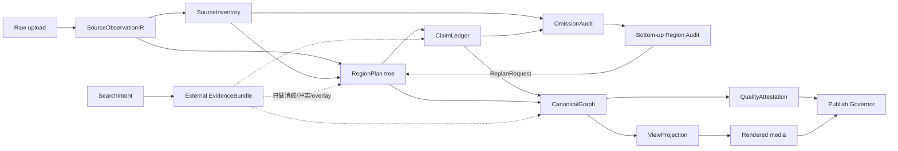
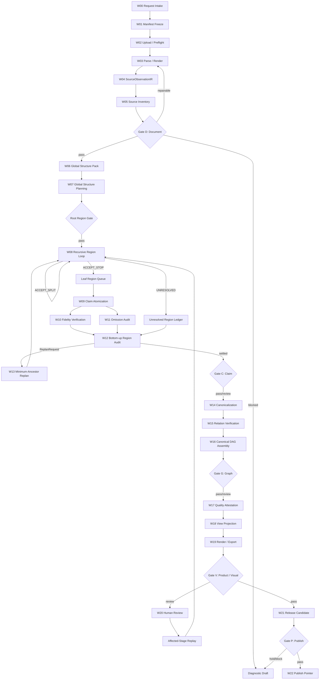

# 思维导图 vNext 端到端 Workflow 规范

- 日期：2026-07-29
- 最近决策更新：2026-07-30
- 当前 profile：`STUDENT COMPETITION`
- 状态：核心 Workflow 已实现并通过自动验证；生产扩展门归档为未来参考
- 文档性质：已批准决策记录与后续提案；不是上线批准或生产质量声明
- 已批准架构决策：ADR-01“结构只向下生长，证据从下向上验收”；
  ADR-02“合同基础与受限 no-egress shadow”
- 产品审批记录：`docs/MINDMAP_PRODUCT_APPROVAL_RECORD.md`
- 完整执行书：`docs/MINDMAP_EXECUTION_PLAYBOOK.md`
- 事故基线：公网 v56 的“醛和酮”任务
- 设计背景：`docs/MINDMAP_SYSTEM_REDESIGN.md`
- 历史规格：`docs/superpowers/specs/2026-07-17-mind-map-agent-framework-design.md`
- 实验实现清点：`docs/VNEXT_IMPLEMENTATION_MATRIX.md`

---

## 0. 文档权威与授权边界

### 0.0 竞赛 Profile

当前学生竞赛 Profile 保留下列软件不变量：

- top-down 结构写入、bottom-up 只提交 replan；
- Source Inventory 独立分母和 omission fail-closed；
- proposal、assessment、canonical assembly 分阶段；
- owner、quality、release 事实不能由调用方伪造；
- blocked/review/draft 与 published 状态分离；
- no-secret、no-unauthorized-egress 和可回退。

本 Profile 不要求独立人类团队、60 份 Gold、sealed blind、20 人研究、生产灾备、
internal allowlist、canary 或多方签名。文中“独立 verifier”继续表示软件中的独立
stage/producer identity，不要求学生团队必须由多个自然人组成。

竞赛演示可以运行现有本地或隔离应用和导出流程；`publication_enabled=false`
仅表示 vNext 不是生产发布权威，不阻止在受控环境展示结果。

### 0.1 规范词

本文使用以下规范词：

- **必须 / MUST**：违反即为合同错误、质量阻断或安全阻断。
- **禁止 / MUST NOT**：任何档位、预算或降级策略均不可绕过。
- **应该 / SHOULD**：默认执行；偏离时必须记录理由、影响和审批人。
- **可以 / MAY**：允许能力，不构成默认启用或发布资格。
- **待校准 / CALIBRATION REQUIRED**：只有指标定义，阈值尚未获得真实数据支持。

### 0.2 决策状态

| ID | 决策 | 状态 | 本文如何处理 |
| --- | --- | --- | --- |
| ADR-01 | 结构只自顶向下生长；证据自底向上验收 | **APPROVED 2026-07-29** | 作为所有阶段和权限设计的硬约束 |
| ADR-02 | 合同基础与受限 no-egress shadow：分层 artifact、独立 Inventory、双轴 source accounting、权限矩阵；`source-only + no-egress + recorded/deterministic + publication-disabled + shadow-only` | **APPROVED 2026-07-30** | 允许在该精确边界内进入实施；仍需用户明确“启动”才开始编码 |
| ADR-03 | explicit-only 到 inferred Region 的边界和解锁门 | **SCOPED APPROVAL 2026-07-30** | 方向批准；先完成 Gold 和 Q0，随后只允许 public-fixture shadow；用户可见仍 No-Go |
| ADR-04 | Search 三模式、privacy、raw snapshot 和 retention | **SCOPED APPROVAL 2026-07-30** | Gateway/recorded 可实施；WARC 不强制；私有内容 live egress 仍 No-Go |
| ADR-05 | Standard/Precision、模型槽和 independence calibration | **SCOPED APPROVAL 2026-07-30** | 校准框架可实施；具体模型、2.5x 成本和用户档位未批准 |
| ADR-06 | Gold contract、指标、阈值、CI 和 Judge 权限 | **APPROVED FOR IMPLEMENTATION 2026-07-30** | P0 优先；候选数字须经 calibration，Judge 不得独自发布 |
| ADR-07 | StageCommit v2、Postgres、Temporal 和 durable cancel | **SPLIT DECISION 2026-07-30** | StageCommit/cancel/cost 可在 vNext shadow 实施；Postgres/Temporal 延后 |
| ADR-08 | 新执行/质量/发布状态与 legacy API 映射 | **SPLIT DECISION 2026-07-30** | 内部三状态和 fail-closed adapter 可实施；公共 API 迁移未批准 |
| ADR-09 | Canonical/Projection 1.0 合同 | **SCOPED APPROVAL 2026-07-30** | candidate 与 P0 修复可实施；正式 1.0 freeze 和公开介质未批准 |
| ADR-10 | Quality/Release/Security 签名和 revocation | **SPLIT DECISION 2026-07-30** | closure/provenance/withdraw 可实施；固定 2-of-3/Cosign 延后 |
| ADR-11 | Product UX、人工复核和可访问性门 | **APPROVED FOR IMPLEMENTATION 2026-07-30** | 内部形成性研究可条件启动；公网仍 No-Go |
| ADR-12 | Canary policy、样本量、sticky assignment 和 rollback | **SCOPED APPROVAL 2026-07-30** | policy/simulator/drill 可实施；internal allowlist 有条件，public canary No-Go |
| EXP-01 | `backend/vnext/` clean-room shadow 实现 | **EXPERIMENTAL** | 可证明部分合同可执行，不等于规范已批准 |

### 0.3 当前硬性 No-Go

以下事项在获得后续书面批准前均为 `NO-GO`：

1. 修改现有公共 HTTP schema、状态枚举或历史持久化图合同。
2. 用 vNext 替换公网 v56，或向任何公网比例自动导流。
3. 启用非显式语义 Region 作为用户可见或正式发布结构；public-fixture shadow
   只能按 ADR-03 的 Q0/Q1 门解锁。
4. 对私有/受限课件启用 live web search；public-fixture live transport 只能按
   ADR-04 的 Q0/Q1/Q4 门解锁。
5. 让 bottom-up Agent 创建父节点、提升根或直接修改祖先。
6. 让模型直接写 `accepted`、`published`、稳定 ID、权限或预算字段。
7. 在质量失败时输出“思维导图已生成”。
8. 把自动测试通过解释为生产级真实模型质量已过门。
9. 未经触发证据直接迁移 Postgres/Temporal、冻结 2-of-3 签名或修改公共 API。
10. 用调用方构造的 readiness、quality PASS、owner 或 canary observation 推动发布。

### 0.4 设计验收标准

本规范只有同时满足下列条件才算完整：

- 每个阶段都明确输入、唯一写者、输出、Gate、失败状态和 checkpoint。
- 每个源对象都有且只有一个 structural owner，并有独立的 Claim disposition；
  secondary membership 另行记录。
- 每次 `SPLIT/STOP` 都由非 Planner 的独立判断和确定性 Gate 验收。
- 每个 accepted Claim 和 Relation 都能回到精确课件证据。
- 每个 bottom-up 结构问题只能生成 `ReplanRequest`。
- 执行成功、质量通过和产品发布是三个正交状态。
- 搜索内容永远被视为不可信外部输入，且不与课件证据混账。
- 任一预算、超时、模型失败或搜索失败都不会被转换成“语义完成”。
- 任一人工修正都形成新版本和局部失效计划，不改写历史。
- 任一发布都可追溯、可停止、可回滚，且不会删除审计 artifact。

### 0.5 独立评审团队

下表是生产 Profile 的职责参考。竞赛 Profile 不要求实际配置这些自然人角色；
现有自动攻击测试和项目所有者验收即可完成竞赛候选。

| 角色 | 主要审查 | 纳入的关键结论 |
| --- | --- | --- |
| Runtime Orchestration | Agent DAG、TaskEnvelope、模型路由、retry/replay | proposal 与 Gate 分离、exactly-once semantic commit |
| Quality & Governance | gold、指标、CI、Judge、授权 | 不可补偿 hard gates、多合法图、StageAuthorization |
| Persistence & Migration | CAS、lease、outbox、cancel、release | checkpoint 定义、故障竞态、shadow/canary 边界 |
| Recursive Workflow | split/stop、MRA、收敛、终止 | 双轴 source accounting、TreeRevision、终止证明 |
| Search Security | privacy、SSRF、injection、snapshot | Agent 无直接 egress、Query Compiler、raw+derivative |
| Product/HITL | DAG-to-tree、review、media、accessibility | LossManifest、冻结 Projection、局部 replay、PDF/UA |
| Independent Red Team | 假绿灯、权限、发布、实现差距 | open replan 阻断、quality 合取、adapter fail-closed |

本地总架构审查还核对了当前 vNext 源码和 168 个专项测试，明确区分“代码中已有
实验原语”和“规范已批准/质量已证明”。

---

## 1. 问题定义

### 1.1 要解决的不是“节点不够好看”

公网 v56 的主要故障不是单个模型偶尔输出差，而是控制流允许错误结构变成
成品：

```text
源目录和结构信号丢失
-> 正文重新猜高层主题
-> 容量分桶取得语义权威
-> 正文残片被提升为分支
-> 大量父边未经独立验证
-> 无父项被保底接根
-> 合法树和 coverage 被误读为语义正确
-> publish=false 仍作为完成结果交付
```

因此，Workflow 的第一目标不是“总能生成一棵树”，而是：

> 在证据不足时准确停止、保留未决并阻止错误结构发布。

### 1.2 产品目标

1. 保真读取 PDF、PPTX、DOCX、Markdown 和文本中的结构与知识。
2. 从全局到局部递归规划教学结构，避免容量分桶或正文碎片成为主题。
3. 对 Claim、父边、遗漏和边界进行相互独立的验证。
4. 允许受控联网帮助消歧、标准化和冲突发现，但不污染课件事实。
5. 产生可审计 Canonical Graph，再投影为可读的 Web、PNG、PDF 和 JSON。
6. 任何质量失败都以诊断或复核任务表达，不伪装成成功导图。

### 1.3 非目标

- 不追求唯一“标准树”；允许多个专家认可的合法结构。
- 不让一个大模型一次性生成整棵树并直接发布。
- 不用外部百科补齐课件没有讲授的核心内容。
- 不用图优化器发明上位概念或保底父边。
- 不把更多 Agent、更多调用或更长上下文本身当作质量方案。
- 不在本设计阶段承诺成本、延迟、上线日期或生产 SLO。

---

## 2. 术语、层次与不变量

### 2.1 核心对象

| 对象 | 含义 | 不包含 |
| --- | --- | --- |
| `SourceObservationIR` | 原生解析、渲染、OCR/VLM 观察、outline、对象、位置、候选阅读顺序 | 选中的教学树、发布节点 |
| `SourceInventory` | 独立枚举的页面、对象、表格单元、公式、反应、视觉区和高重要度项 | Claim 抽取器自定义分母 |
| `RegionPlan` | 一个受约束 source scope 的教学主题、边界和 `SPLIT/STOP/UNRESOLVED` 状态 | 叶 Claim、任意全局父边 |
| `RegionSplitCertificate` | 对一次 split 的共同上位概念、子项、边界、source assignment 和 verifier 决定 | 新增 Region 的写权限 |
| `ClaimLedger` | 叶 Region 内的原子声明及提取、蕴含、外部有效性和发布状态 | Canonical 合并和父边 |
| `OmissionAudit` | Inventory 与 Ledger 的独立对账 | 自动补 Claim |
| `ReplanRequest` | bottom-up 对遗漏、混杂、边界、重复归属或无效父关系的结构申诉 | 直接修改 RegionPlan |
| `CanonicalGraph` | 已验证概念和关系的规范 DAG | 布局、折叠、单父显示偏好 |
| `ViewProjection` | 面向总览、章节、搜索、复核或导出的有损展示 | 新的语义父边 |
| `QualityAttestation` | 对指定 artifact 和 policy 的不可变质量决定 | 对 artifact 的原地修改 |
| `RunManifest` | 冻结运行策略、模型、预算、版本和观察到的副作用 | 隐式运行配置 |

### 2.2 四层权威

```text
Source layer       课件观察与人工源修正
Structure layer    已接受的 top-down RegionPlan
Knowledge layer    Claim Ledger 与 Canonical Graph
Product layer      View Projection、介质和发布指针
```

后层只能引用前层稳定 ID。后层不得：

- 删除或覆盖 SourceObservation；
- 缩小 Source Inventory 分母；
- 把外部网页改写为课件观察；
- 把 Projection 中的虚拟聚合写回 Canonical；
- 把发布状态写回语义 artifact。

### 2.3 证据命名空间

| Namespace | 内容 | 可以认证 |
| --- | --- | --- |
| `courseware` | 原始页、对象、span、cell、formula、reaction、bbox | 课件 Claim、结构锚点、课件关系 |
| `human` | 人工确认、纠错和仲裁 | 对源或语义的版本化修正 |
| `external` | 网页、标准、论文等快照 | 消歧、规范化、冲突、外部扩展 |
| `system` | 模型请求/响应、工具结果、日志和 replay snapshot | 可回放性，不认证课程事实 |

硬规则：

- `external` 不得计入课件 coverage。
- `external-only` 不得认证 core Claim 或核心父边。
- `system` 记录模型说了什么，不证明模型说的是对的。
- `human` 可以形成新决定，但仍必须通过 owner、无环和证据完整性等技术硬门。

### 2.4 数据不变量

1. 每个 page/slide 必须保留稳定 `page_id`，包括空页、隐藏页和无 Claim 页。
2. 原生解析、OCR 和 VLM 转录并列保存，不静默覆盖。
3. 目录页可以没有 Claim，但必须保留结构价值。
4. 表格、公式、化学反应和视觉区域不得不可逆扁平化。
5. Inventory 必须在 Claim 抽取前冻结，且不能读取 Claim 结果来缩小分母。
6. Inventory 不能只与同一个 parser 的输出自洽；Gate D 必须与原始 PDF/PPTX
   package manifest、render surface 和独立 parser/inspector 对账。
7. artifact 使用 owner-scoped opaque ID；跨 owner 不共享可观察 ID 或缓存命中。
8. 所有语义对象保留 `supersedes` 或 decision history，禁止原地改写历史。

### 2.5 推理不变量

1. 只有 Global/Recursive Region Planner 能提出结构。
2. 只有确定性 Gate 能接受 `SPLIT/STOP`。
3. bottom-up 只能审计、否决和请求重规划。
4. 容量、token 数、页数和并发分片只能调度，不能作为语义 split 证据。
5. verifier 的拒绝或未决具有单调性；没有新证据和新版本不得复活。
6. 无合法父节点是允许结果，禁止 provisional root fallback。
7. Canonical 可多父；Projection 选择单一展示父时必须记录 alternate/suppressed。
8. 搜索失败、模型失败和预算耗尽都不能转成 accepted 语义。

### 2.6 产品不变量

1. `execution=succeeded` 不等于 `quality=passed`，更不等于 `published`。
2. blocked artifact 只能生成诊断视图，不能生成可分享的正式教学图。
3. Web、PNG、PDF 和 JSON 的 Canonical ID、标签和关系必须一致。
4. 布局不得通过改变父子关系、隐藏失败项或缩到不可读来“修复”质量。
5. 外部扩展默认关闭、可一键隐藏，并明确标记来源。

---

## 3. Agent 团队与权限

### 3.1 团队原则

运行时采用受约束 workflow，不采用自由聊天式群体：

- 一个 Agent 只有一个主要认知责任。
- 一个 artifact 类型只有明确写者。
- Agent 读取最小必要上下文，不扫描全局可变黑板。
- 模型只输出 proposal/assessment；稳定 ID、状态、版本和权限由代码组装。
- 所有认知 Agent 都拥有提交 `SearchIntent` 的能力；提交不等于执行。
- 认知 Agent 进程没有网络 socket、搜索凭据、通用浏览器或任意 URL fetch 工具。
- 初始唯一候选执行角色是隔离的 Domain Resolver / Search Evidence Gateway。
- 确定性 Gate、Run Governor、Renderer 和 Publish Governor 不执行知识搜索。

### 3.2 读写权限矩阵

| 角色 | 只读范围 | 唯一允许写入 | 搜索能力 | 明确禁止 |
| --- | --- | --- | --- | --- |
| Run Governor | Manifest、StageCommit、预算、lease、attestation | Manifest revision、lease、commit、outbox | 无 | 做知识判断 |
| Document Interpreter | 原件、render、native object、相邻页、outline | Source observation hypothesis/shard | 可提交 OCR/符号消歧 intent | 删除页面、生成知识节点 |
| Source Inventory Auditor | 冻结 SourceObservationIR | SourceInventory | 可提交对象类型异常 intent；默认拒绝 | 读取 Claim 来删分母 |
| Global Structure Planner | 全局结构包、Inventory、按需 source cards | 根和一级 `RegionPlan(PROPOSED)` | 可提交术语、taxonomy hint intent | 提取叶 Claim、直接接受结构 |
| Recursive Region Planner | 当前 Region scope、祖先路径、兄弟摘要、边界 | 当前父内的子 `RegionPlan(PROPOSED)` | 可提交术语、边界、关系消歧 intent | 越过父 scope 修改其他分支 |
| Region Decision Verifier | proposal、精确证据、assignment、局部上下文 | Region assessment / split certificate proposal | 可提交冲突与关系消歧 intent | 创建替代父或 accepted 状态 |
| Claim Atomizer | accepted STOP Region 的 source objects | Claim proposal / ClaimLedger candidate | 可提交术语、命名、符号 intent | 规划 Region 或父边 |
| Omission Auditor | Inventory、Region assignment、Ledger | OmissionAudit | 可提交“是否为非 Claim 对象”intent；默认拒绝 | 自己补 Claim |
| Claim Fidelity Verifier | Claim、精确 source span、局部上下文 | entailment assessment | 可提交冲突、术语、时效标准 intent | 改写 Claim 迁就证据 |
| Bottom-up Region Auditor | RegionPlan、Inventory、Claim cards、audits | `ReplanRequest` | 可提交 taxonomy/关系 hint intent | 写 RegionPlan、父节点或根 |
| Domain Resolver | 经批准的 SearchIntent、外部快照 | EvidenceBundle、外部有效性 assessment | 负责执行受控研究 | 把外部证据伪装成课件事实 |
| Canonicalizer | accepted Region、verified Ledger、decision events | concept/relation candidate、Canonical candidate | 可提交命名和同义消歧 intent | 发明 Region 之外结构父 |
| Relation Verifier A/B | child、合法 parent、精确边证据 | relation assessment | 可提交关系冲突 intent | 看另一张票或新增父候选 |
| Arbiter | 盲化冲突票、新增证据 | 仲裁 assessment | 仅可对已批准的新证据 intent | 无新证据推翻双重否决 |
| Quality Auditor | 冻结 artifact、gold、metric policy | QualityAttestation | 可研究评测标准，不可检索待评文档答案 | 修改结果让指标通过 |
| Projection Planner | Canonical、view policy、medium | ViewProjection | 无 | 改写 Canonical |
| Publish Governor | 全部 hard-gate attestation、release policy | publication revision、pointer、ReleaseEvent | 无 | 绕过质量门 |
| Human Reviewer | ReviewTask、最多两段证据和局部结构 | ReviewDecision | 产品外部行为，不走 Agent Gateway | 原地改写历史 artifact |

### 3.3 模型输出边界

模型输出 schema **不得包含**：

- 稳定 `region_id/claim_id/concept_id/relation_id`；
- `accepted/published/passed` 最终状态；
- owner、权限、预算、lease、checkpoint 或 artifact version；
- 未在 TaskEnvelope 中出现的 source、Region 或 parent；
- 搜索 connector、目标网络地址或任意工具权限。

模型可以输出：

- 有限枚举 proposal；
- source assignment 候选；
- 对 gate checklist 的逐项 assessment；
- 引用精确 source card 的理由；
- `ABSTAIN/UNRESOLVED` 和结构化 reason code。

---

## 4. Artifact 与 Lineage

### 4.1 主链与 sidecar



### 4.2 ArtifactEnvelope 最低字段

每个 artifact 必须绑定：

```text
artifact_id
artifact_type
schema_id
payload_schema_version
owner_id
payload_digest
canonicalization_profile
producer(role, exact version, prompt digest)
ordered input_refs
external_snapshot_refs
created_at
supersedes
```

规则：

- payload 使用 RFC 8785 canonical JSON 后计算 SHA-256。
- `artifact_id` 不是内容哈希，避免跨租户相同内容泄漏。
- `supersedes` 只能指向同 owner、同 artifact type 的旧版本。
- QualityAttestation 单向引用 artifact，防止内容寻址循环。
- major 版本不兼容；minor 只增加可选字段；patch 不改变语义。
- schema 本身必须随镜像归档并记录 digest。

### 4.3 Stable ID

Source ID 必须由冻结源哈希、对象路径和稳定位置规则生成。Region/Claim/Concept ID
由代码基于已提交输入生成，模型不得决定。

重解析导致观察变化时：

- 创建新的 SourceObservationIR；
- 通过映射表记录旧新 source ID；
- 失效受影响的 Inventory、Region、Claim、Graph 和 Projection；
- 未受影响 artifact 可以按 digest 复用；
- 不修改旧 artifact。

### 4.4 Lineage 完整性

任一正式 Projection 必须可追溯：

```text
Projection node
-> Canonical concept/relation
-> Claim or accepted RegionPlan
-> courseware EvidenceRef
-> exact page/object/span/cell/formula/reaction/bbox
-> raw source hash
```

任一路径断裂均为 `blocked_evidence`。

---

## 5. 控制面与运行状态

### 5.1 RunManifest

Manifest 在运行开始时冻结 `declared`：

- source hash、owner、profile、evidence mode、no-egress；
- code/image/dependency revision；
- parser、renderer、prompt、tool、search 和 schema policy digest；
- 精确 model revision、model family、independence attestation；
- wall/call/token/search/fetch/cost/concurrency 预算；
- random/ordering seed；
- replay mode。

`owner_id` 必须由认证 principal 在服务端派生，并绑定 token audience、tenant ACL 和
ingest root。禁止使用“全局 service token + 调用方自报 owner header”作为公网身份。

运行过程中只追加 `observed`：

- stage artifact refs 和 reuse；
- model/search 调用与成本；
- retry、repair、fallback 和 degraded component；
- external snapshot refs；
- gate、review 和 release decision。

### 5.2 三个正交状态

```text
execution_status:
  queued | running | waiting_retry | waiting_review |
  succeeded | failed | cancelled

quality_status:
  unassessed | blocked_document | blocked_claim |
  blocked_semantic | blocked_evidence |
  review_required | passed

publication_status:
  draft | release_candidate | published |
  superseded | withdrawn
```

约束：

- `release_candidate/published` 必须同时满足
  `execution=succeeded` 和 `quality=passed`。
- `succeeded + blocked_*` 是合法终态，表示工作流成功识别出不可发布结果。
- `ABSTAINED/UNRESOLVED` 是语义结果，不是基础设施失败。
- 合同损坏、权限越界、持久化失败和永久运行错误才进入 `execution=failed`。

### 5.3 TaskEnvelope

每个可执行 task 必须携带：

```text
task_id, run_id, owner_id, parent_task_id, stage_key
profile, replay_mode
ordered input artifact refs and digests
read scope: source_ids / region_ids / claim_ids / relation_ids
role policy
single output schema and artifact type
model route and independence attestation
allowed search trigger codes and budget slice
wall/call/token/cost limits
transport retry, schema repair, semantic reopen limits
lease epoch, deadline
expected manifest/artifact revision
ordering seed
idempotency key
recording and retention policy
```

Task 只能读取 envelope 明列的 ID。任何越界读取或写入立即失败并记录安全事件。

### 5.4 Stage attempt 状态

```text
CREATED
-> LEASED
-> RUNNING
-> ARTIFACT_WRITTEN
-> COMMITTED

RUNNING <-> WAITING_RETRY
RUNNING -> REPAIRING -> RUNNING
ARTIFACT_WRITTEN -> ORPHANED -> REATTACHED | REPLAYED -> COMMITTED
committed cache hit -> REUSED
```

禁止：

- `FAILED/ABSTAINED/CANCELLED` 原地变为 `COMMITTED`；
- 使用过期 lease epoch 提交；
- 同一幂等键接受两个不同输出；
- replay 移动发布指针。

### 5.5 幂等、CAS 与 outbox

Stage 幂等键至少包含：

```text
owner_scope
+ stage contract major
+ ordered input digests
+ schema/policy/prompt/tool/search digests
+ exact model revisions
+ external snapshot digests
+ profile
+ ordering seed
```

执行顺序：

```text
acquire lease
-> lookup committed stage
-> record interaction attempt
-> call model/search if required
-> write immutable pending artifact
-> run deterministic gate
-> CAS StageCommit
-> append outbox event
-> atomically expose pointer/index
```

对象写入成功但 metadata commit 失败时，artifact 是 orphan，不是已提交结果。
Reconciler 必须按 owner、digest、stage attempt 和 retention policy 重新挂接或隔离。

### 5.6 Replay

| 模式 | 允许行为 | 禁止行为 |
| --- | --- | --- |
| `recorded_response_replay` | 重放 initial、retry、repair、fallback、tool result 完整序列 | 调用 live 模型或网络 |
| `deterministic_replay` | 从已提交语义 artifact 重跑纯 Gate、Projection 和指标 | 改变模型决定 |
| `migration_replay` | 通过纯 upcaster 生成新 major artifact | 反写旧 payload |
| `full_recompute` | 新 run 使用新模型、新策略和可选 live search | 冒充历史 replay |

模型和搜索 transport 可能重复计费，系统不承诺网络 exactly-once。系统承诺的是：

- 同一 owner-scoped 幂等键只有一个语义输出被接受；
- 用户可见发布指针通过 CAS 和 append-only ReleaseEvent 原子改变。

RecordedInteraction 和 SearchSnapshot 在持久化前必须做递归 secret scrub，并使用
信封加密、独立 retention 和 deletion policy。只检查少数字段名或只过滤顶层
metadata 不充分。

### 5.7 重试与 repair

- timeout、连接错误、429 和可重试 5xx：最多两次，遵循 `Retry-After` 和
  full-jitter。
- 401、403、余额不足、硬 quota、模型不存在：立即熔断。
- Schema 错误：最多一次定向 repair，只携带校验差异。
- 语义错误：只有 source、context、policy 或 evidence 发生变化时才可新版本重试。
- verifier 双重拒绝：没有内容哈希新增的证据不得重开。
- CAS 冲突：reload 最新版本后最多重新评估一次，不盲重放副作用。

---

## 6. 完整端到端阶段

### 6.1 总流程



### 6.2 阶段合同总表

| 阶段 | 冻结输入 | 唯一写者与输出 | Gate / 成功条件 | 失败语义 | Checkpoint |
| --- | --- | --- | --- | --- | --- |
| W00 Request Intake | 请求、owner、文件 metadata、用户 profile/consent | API/Run Governor -> intake record | owner/auth、格式、大小、重复请求 | 拒绝请求，不创建语义 run | request id |
| W01 Manifest Freeze | intake、部署与 policy registry | Run Governor -> RunManifest r1 | 所有版本和预算可解析；source_only 必须 no-egress | `failed` 或等待配置 | manifest CAS |
| W02 Upload/Preflight | 原始 bytes、声明类型 | Upload Validator -> immutable raw object | hash、MIME、扩展名、病毒/压缩/页数/密码门 | `blocked_document` 或拒绝 | raw object digest |
| W03 Parse/Render | raw object、parser/renderer policy | Parser/Renderer -> page/object shards、render refs | 每页可寻址；解析失败显式记录 | 定向 fallback 或 unresolved page | page/slide shard |
| W04 Source Observation | 全部 shards、outline、native object | Document Interpreter -> SourceObservationIR | 页数、对象、坐标、候选顺序、hypothesis 分账 | Gate D 阻断或局部重读 | document IR |
| W05 Source Inventory | 冻结 IR、raw package manifest、render manifest | Inventory Auditor -> SourceInventory | 独立枚举、importance、inspection status 完整 | Gate D 阻断 | inventory |
| Gate D | raw package、render、IR、Inventory、第二 inspector/source oracle | deterministic gate + Quality Auditor | page/object retention、outline、跨表示对账、unresolved 可解释 | `blocked_document` | attestation |
| W06 Global Structure Pack | IR、Inventory | deterministic packer -> compact global pack | 全局 outline、标题、页角色、连续性、按需 source index 完整 | 回到 W04/W05 | pack digest |
| W07 Global Structure Plan | global pack、source cards、允许的 EvidenceBundle | Global Planner -> root/L1 proposed RegionPlan | 唯一 root、一级 source accounting、无碎片标签 | Root Gate unresolved | root proposal |
| Root Region Gate | proposal、精确证据、blind verifier | Region Gate -> accepted split/stop 或 unresolved | ADR-01、共同概念、边界、Inventory、独立 verifier | `blocked_semantic/review_required` | certificate + plan version |
| W08 Recursive Region Loop | accepted parent、scope、ancestor、siblings、boundary | Recursive Planner -> child proposal | 每次通过 Split/Stop Gate；子项不越界 | unresolved 或 Replan | 每个 Region version |
| W09 Claim Atomization | accepted STOP Region、source objects | Claim Atomizer -> Claim proposal/Ledger candidate | 每个 source 有 claim、nonclaim 或 unresolved disposition | `blocked_claim` 或继续审计 | leaf/batch |
| W10 Fidelity Verification | Claim、精确 evidence | Fidelity Verifier -> entailment assessment | 拟发布 Claim 非自证、证据蕴含 | withheld/rejected/review | claim batch |
| W11 Omission Audit | Inventory、Region assignment、Ledger | Omission Auditor -> OmissionAudit | 分区完备；高重要度 omission 为 0 | Replan 或 blocked_claim | leaf + document fan-in |
| W12 Bottom-up Region Audit | Region tree、Claim cards、fidelity、omission | Region Auditor -> pass/ReplanRequest | 只读结构、最小祖先、可审计证据 | replan/review/unresolved | affected Region |
| W13 Replan | accepted ReplanRequest、最新 Region versions | Governor + 对应 Planner -> 新 Region subtree | 旧后代 superseded、未受影响兄弟复用、循环受限 | unresolved/review | minimum ancestor |
| Gate C | Ledger、Omission、Fidelity、Region accounting、Replan ledger | deterministic gate + Quality Auditor | Claim 正确性、完整性、source partition；open ReplanRequest 为 0 | `blocked_claim/evidence/semantic` | attestation |
| W14 Canonicalization | verified Ledger、accepted Regions、human decisions | Canonicalizer -> candidate concepts/relations | 同义/重复/粒度决策有记录；不发明 Region parent | 不确定保持分离 | cluster shard |
| W15 Relation Verification | child、合法 parent 集、精确边证据 | Verifier A/B/Arbiter -> relation assessments | blind、可 abstain、veto 单调 | rejected/conflicted/abstained | child relation set |
| W16 DAG Assembly | accepted concepts、relation decisions | deterministic graph builder -> CanonicalGraph | 无环、accepted endpoint、关系证据、权限完整 | `blocked_semantic/evidence` | graph artifact |
| Gate G | Canonical、gold/policy | deterministic gate + Quality Auditor | 父边、祖先、结构、证据和未决风险门 | blocked/review | attestation |
| W17 Quality Attestation | D/C/G stage artifacts、pilot policy | Quality Auditor -> immutable attestation | hard gates 全过；统计门满足或明确 incomplete | blocked/review/incomplete | attestation |
| W18 View Projection | immutable Canonical、view policy | Projection Planner -> Projection | 展示父来自 accepted edge；隐藏/聚合可追踪 | diagnostic-only | projection |
| W19 Render/Export | Projection、font、renderer、medium | Renderer -> HTML/PNG/PDF/JSON bundle | 同一语义指纹、字号、分页、可访问性 | blocked product；不损伤 Canonical | medium artifact |
| Gate V | Projection、render bundle、visual oracle | deterministic visual/product gate | 无重叠/裁切、可读、跨介质一致 | `review_required` 或 blocked | attestation |
| W20 Human Review | 单问题 ReviewTask、局部证据 | Human -> append-only ReviewDecision | revision fence、选项一致、技术硬门不绕过 | pending/superseded/cancelled | review revision |
| W21 Release Candidate | passed quality、产品 attestation、pilot/canary evidence | Publish Governor -> release candidate revision | 所有审批和证据齐全 | HOLD | release event |
| Gate P | candidate、release policy、canary observation | Publish Governor | `succeeded + passed`、无安全事件、rollback 可用 | HOLD/ROLLBACK | append-only event |
| W22 Publish | Gate P pass、expected pointer version | Publish Governor -> CAS pointer | pointer 和 ReleaseEvent 同事务 | 维持旧稳定指针 | pointer version |

### 6.3 Fan-out / Fan-in 规则

- 页面和对象读取可以并行；只有 SourceObservation fan-in 后才能冻结 Inventory。
- 兄弟 Region 只有父 split accepted 后才能并行。
- Claim 只有 leaf STOP accepted 后才能启动。
- Fidelity 与 leaf omission 可以并行；document omission 必须 fan-in 全部 leaf。
- Canonical cluster 可以并行，关系验证按 child 的全部合法 parent 候选成组执行。
- 不同介质可以并行渲染，但必须消费同一个 Projection。
- 任一 fan-in 必须验证输入版本仍是 latest accepted；过期结果不得提交。

---

## 7. Top-down Recursive RegionPlan

### 7.1 目标

RegionPlan 不是把页面平均切块，也不是让模型一次输出整棵树。它把结构问题改写为
一系列局部、可验收的决策：

```text
当前 Region 是否已经是单一、可抽取的教学主题？
如果不是，是否存在有证据、边界清楚、粒度相当的语义子区？
如果两者都不能证明，则保持 UNRESOLVED。
```

### 7.2 Global Structure Pack

Global Planner 不直接读取无界全文，而读取：

- 原始文件名、封面标题和文档 metadata；
- PDF outline / PPT section / heading hierarchy；
- 目录页、章节页、总结页、练习页等角色 hypothesis；
- 每页/slide 的标题、首要对象、表格/公式/反应摘要；
- continuity 候选；
- Source Inventory 的重要度和 unresolved 分布；
- 可按稳定 source ID 回读的 source-card index；
- 已批准的外部消歧 EvidenceBundle，若 evidence mode 允许。

Global pack 必须保留 source order 和来源，不得只提供一个模型生成的全局摘要。

### 7.3 根与一级规划

Global Planner 独占：

- root theme 候选；
- root source scope；
- 一级 child label、definition 和 source assignment；
- root 的 `SPLIT/STOP/UNRESOLVED` proposal。

Global Planner 不得：

- 产生叶 Claim；
- 让正文残片直接成为一级主题；
- 用 node/token/page 数证明 split；
- 把目录机械当成正确答案；
- 接受自己的 proposal。

根 Gate 至少检查：

1. root label 是课程或文档的共同主题，不是单句残片。
2. root primary scope 覆盖全部需检查 source。
3. 每个一级 child 有独立课件支持。
4. 一级 sibling 的区分不是容量差异。
5. TOC、标题、正文和页角色冲突已显式记录。
6. source assignment 完整，无隐式丢弃。
7. 独立 Region Decision Verifier 没有否决。

### 7.4 Source assignment

结构归属和 Claim 处置是两个正交轴，不能使用一个互斥枚举同时表达：

```text
StructuralAssignment:
  structural_owner = region_id | document_furniture | unresolved
  secondary_region_ids[]
  ordered selectors / segments[]

ClaimDisposition:
  accounted_by_claim | explicitly_nonclaim | unresolved
```

例如一个章节标题可以同时：

- 是该 Region 的主要结构证据；
- 不产生独立知识 Claim。

因此它的 `structural_owner=该 Region`，而
`claim_disposition=explicitly_nonclaim`。这不是冲突。

规则：

- 每个 source 最多有一个 structural owner Region。
- secondary 只表示跨区适用，不复制为多个 primary Claim 分母。
- document furniture 必须有可审计原因，如页码、纯导航或重复版权信息。
- nonclaim 只属于 Claim 轴；标题、结构页和导航对象不能因此从结构分母删除。
- “看不懂”“预算不足”“模型没提到”只能是 unresolved，不能是 furniture/nonclaim。
- child primary sets 必须非空、互斥，且都是 parent primary set 的真子集。
- split 后所有 structural owner、secondary 和 unresolved 必须与父 scope 精确对账。
- Claim 阶段再独立完成 accounted/nonclaim/unresolved 对账。

ADR-02 已明确批准双轴目标。当前实验合同仍把
`PRIMARY/SECONDARY/NONCLAIM/UNRESOLVED` 放在同一枚举中，因此尚不符合 ADR-02；
实施时必须修正，不能把当前枚举直接声明为已完成的正式 v1。

### 7.5 连续与非连续主题

默认 Region 的 primary scope 应符合 source order 的一个连续区间或少量相邻区间。

非连续 primary scope 只有同时满足以下条件才可接受：

1. 课件存在明确的“同一主题继续/返回”结构证据；
2. 每个 segment 有单独边界证据；
3. 合并不会吞掉中间章节的 primary assignment；
4. split certificate 记录有序 `segments[]`；
5. verifier 明确认定为同一教学主题的延续。

否则，重复出现的主题保留为不同 Region，在 Canonical 层通过同一概念、`review_of`
或非层级关系关联。禁止为了标签相似跨越多个章节强行拼区。

### 7.6 SPLIT proposal

Planner 可以提出 `SPLIT`，但 accepted split 必须具备：

- 至少两个 child；
- parent common concept 被课件证据支持；
- child label 自足、非残片、非通用“其他”；
- 每个 child 有独立 source support；
- sibling separation 通过；
- within-region cohesion 通过；
- sibling granularity 可比；
- 边界可解释；
- Inventory 对账；
- residual 全部显式 unresolved；
- 未使用容量作为语义证据；
- 独立 verifier 支持；
- 确定性合同和权限检查通过。

`ACCEPT_SPLIT` 是上述条件的合取。模型的“我认为可以拆分”不是充分条件。

### 7.7 STOP proposal

`STOP` 表示该 Region 已适合作为 Claim 抽取的最小教学区，不表示内容很短。

accepted STOP 必须同时满足：

1. 单一 instructional intent。
2. 没有未处理的稳定子标题或明确子主题。
3. 预计 Claim 粒度相近。
4. Inventory 已对账。
5. 继续 split 只会制造碎片、重复或没有共同上位概念的 singleton。
6. 没有高重要度遗漏。
7. 没有 mixed-theme evidence。
8. 非 Planner verifier 支持。
9. 确定性 Stop Gate 通过。
10. 执行一次反事实 split 搜索，没有可被正向证明的稳定子区。
11. 结构归属 unresolved 为 0。

`safety_limit_reached`、`max_depth`、`deadline`、`token limit`、`cost limit` 和
`model unavailable` 均不是 STOP 证据。

### 7.8 UNRESOLVED

下列任一情况必须或应该进入 `UNRESOLVED`：

- split 和 stop 都不能被证明；
- planner 与 verifier 严重分歧；
- TOC、标题和正文冲突；
- 边界重叠且无法解释；
- source assignment 有残缺；
- 高重要度 source 不能可靠读取；
- 预算或深度耗尽但 Region 仍混杂；
- 两次以上 repair 仍只得到 schema 合法、语义不完整的回答；
- 可用 verifier 不满足 Precision 独立性。

UNRESOLVED 必须保留 source scope、原因、尝试记录和推荐下一步。它不是空结果。

原因应区分：

```text
UNRESOLVED_SEMANTIC
UNRESOLVED_LIMIT(depth | token | call | wall | cost)
UNRESOLVED_SOURCE
UNRESOLVED_VERIFIER
FAILED_OPERATIONAL
```

UNRESOLVED Region 可以做诊断性抽取，但其结果保持 quarantined，不进入可发布
Canonical Graph。

### 7.9 递归算法

```text
input:
  accepted root RegionPlan
  frozen SourceObservationIR
  frozen SourceInventory
  RunManifest and budgets

queue = [root]

while queue not empty:
    parent = dequeue in deterministic preorder

    if parent is already accepted STOP:
        emit leaf
        continue

    proposal = planner.propose(
        scope=parent.primary sources,
        ancestor_path=parent.ancestor_path,
        sibling_summaries=accepted siblings,
        boundary_context=parent.boundary evidence,
        source_cards=on-demand cards,
        open_replan_requests=relevant requests,
    )

    assessment = independent_verifier.assess(
        proposal,
        shuffled candidate order,
        planner identity hidden,
        exact source evidence,
    )

    decision = deterministic_region_gate(
        proposal,
        assessment,
        inventory_partition,
        authority_policy,
        budget_state,
    )

    if decision == ACCEPT_SPLIT:
        atomically commit certificate and accepted parent version
        enqueue accepted children in source order
    elif decision == ACCEPT_STOP:
        commit accepted leaf version
        emit leaf
    else:
        commit unresolved/rejected version
        emit unresolved region
```

关键点：

- queue 顺序确定，但互不依赖的 sibling task 可以并发。
- code 生成 Region ID、parent、ancestor path 和 membership。
- 模型只能对当前 scope 提议标签和 action。
- 子 Region 未通过 Gate 前不能启动 Claim。

### 7.10 Region 状态维度

不得用一个 `RegionPlan.status` 同时表示历史决定、当前版本和发布资格。目标合同
至少分为：

```text
RegionDecisionAttempt:
  WAIT_PARENT -> READY -> PLANNING
  -> PROPOSED_SPLIT | PROPOSED_STOP | PROPOSED_UNRESOLVED
  -> VERIFYING -> COMMIT_CAS
  -> ACCEPTED_SPLIT | ACCEPTED_STOP | REJECTED | UNRESOLVED

Attempt terminal:
  STALE | SUPERSEDED | FAILED_OPERATIONAL

TreeRevision membership:
  CURRENT | STALE_BY_ANCESTOR | SUPERSEDED

PublicationEligibility:
  ELIGIBLE | QUARANTINED | INELIGIBLE
```

`ACCEPTED` 只说明一个历史 attempt 通过 Gate，不说明它仍属于 current tree，也不
说明可发布。`TreeRevision` 必须原子引用当前 RegionPlanVersion set。

禁止转换：

- proposal 直接变 accepted；
- safety limit 变 accepted STOP；
- verifier veto 被 deterministic fallback 升级；
- rejected/unresolved 原地复活；
- child 先于 parent split accepted；
- superseded plan 重新成为 latest。
- parent/source/policy version 变化后旧 attempt 继续提交；
- quarantined subtree 进入正式 Canonical。

Gate 顺序固定：

```text
Authority / Schema
-> Exact Version
-> Source Accounting
-> Progress / Acyclicity
-> Independent Semantic Verification
-> Commit CAS
```

在冻结 `granularity_contract` 下，SPLIT 与 STOP 应分别被正向评估：

- 恰好一个通过：接受该决定；
- 两者都通过：粒度歧义，UNRESOLVED/review；
- 两者都不通过：证据不足，UNRESOLVED。

### 7.11 Bottom-up audit

Claim 和 omission 完成后，Bottom-up Region Auditor 检查：

- omitted high-value source；
- 一个 leaf 内存在多个不相干主题；
- sibling 重复或 source 重叠；
- 边界错放；
- child 不被 parent concept 涵盖；
- Claim 需要的共同上位概念与当前 Region 不符；
- parent relation 无效；
- 大量 difficult source 被 unresolved，留下“很小但很完美”的图。

Auditor 唯一合法结构输出为 `ReplanRequest`：

```text
request_id
affected_region_id
minimum_replan_ancestor_id
omitted_source_ids
mixed_theme_evidence
boundary_errors
duplicate_memberships
invalid_parent_relations
requested_action
evidence_refs
status
supersedes
```

### 7.12 最小受影响祖先

重规划起点按以下规则选择：

1. 仅 leaf 内混杂或遗漏：该 leaf。
2. source 需要在两个 sibling 间移动：它们的直接 parent。
3. sibling label/粒度共同错误：直接 parent。
4. parent 共同概念不成立：parent 的 parent。
5. 一级结构或 root scope 错误：root。

`minimum_replan_ancestor_id` 是 Auditor 的建议，不是写权限。Scheduler 必须根据
完整修改 footprint 独立重算：

```text
MRA(q) =
  能包含全部修改 footprint，
  且修复可以仅通过重写其 subtree 表达的最深 Region
```

footprint 包括将改变的 label、edge、当前/目标 structural owner 和重复 primary
所在 Region：

- sibling 边界移动或 merge：直接 parent；
- 跨 cousin 移动：LCA；
- 完全未分配 source：能覆盖它的最深 scope，否则 root。

局部失败不能自动升级到 root；升级必须附带“当前 scope 无法表达修复”的证据。

### 7.13 失效与复用

accepted ReplanRequest 必须：

- 创建目标 ancestor 的新 plan version；
- supersede 其旧 descendant RegionPlan；
- 立即把受影响 subtree 标记为 quarantined，直到新版本通过或 request 被驳回；
- 失效 descendant Claim、OmissionAudit、Canonical、Projection、Export 和 Quality；
- 保留未受影响 sibling 和 Document IR/Inventory；
- 保留人工 decision，并在新版本中显式应用或产生冲突任务；
- 重新运行所有受影响 Gate。

不得为“方便”全量重算，也不得复用已被边界变化影响的 Claim。

### 7.14 收敛与终止

本系统不承诺自动收敛到唯一语义真相，只承诺有限资源下可审计终止。

结构递归有限的理由：

- Inventory primary source set 有限；
- accepted split 的每个 child primary set 都必须是 parent 的非空真子集；
- primary source 不能同时属于两个 child；
- 因此在没有 replan 的单个 plan version 中不能无限 split。

设冻结 atomic source frontier 大小为 `N`。每次 split 至少产生两个非空、互斥、
严格真子集，因此沿任一路径 `|P(R)|` 严格下降，深度小于 `N`，accepted Region
总数不超过 `2N-1`。再结合有限 attempt/replan budget，执行必然终止。

该证明只保证计算终止，不保证语义收敛；不收敛的正确结果是 UNRESOLVED。

Replan 可能振荡，必须增加：

- Standard 最多 2 轮、Precision 最多 3 轮的候选上限；
- proposal fingerprint；
- 最近状态窗口，检测 `A -> B -> A` 和 sibling 互换；
- 每次 replan 必须引用新证据、人工决定或不同 policy；
- 未减少 serious error、unresolved high-value 或 boundary error 的相同方案不得接受；
- 达到上限后进入 unresolved/review，不伪造 STOP。

深度候选安全限为 Standard 6、Precision 8；Region task 数候选上限为
Standard 64、Precision 128。二者均为 `PROPOSED / CALIBRATION REQUIRED`，
只能控制资源，不能认证语义完成。

补充候选文档级上限：

- 每个 `minimum_replan_ancestor` 最多接受 2 次 replan；
- Standard 全文最多 8 次；
- Precision 全文最多 12 次。

每次 accepted replan 必须严格降低冻结缺陷势能：

```text
(
  high-value omission weight,
  mixed-theme weight,
  boundary violations,
  duplicate primary membership,
  invalid parent relations
)
```

或者引用内容 hash 和来源类别均有实质新颖性的证据。重复状态或势能不降必须转
UNRESOLVED/review。

---

## 8. 模型路由、档位与独立性

### 8.1 ModelPortfolioManifest

模型按能力槽分配，而不是一个 run 只选一个模型：

```text
vlm_reader
claim_extractor
global_structure_planner
recursive_region_planner
region_decision_verifier
verifier_a
verifier_b
arbiter
tool_researcher
```

每个槽必须记录：

- provider 和精确 immutable model revision；
- model family、endpoint region、context limit；
- structured output 能力；
- input/output 单价和延迟分布；
- prompt/tool policy digest；
- independence group 及 calibration attestation；
- 内部 gold、风险 slice 和有效期。

使用可漂移 alias 的 run 可以实验，但不得缓存为可复用正式结果，也不得发布。

### 8.2 Standard

候选合同：

- 一个 Global/Recursive Planner 提议；每个 split/stop 由非 Planner verifier 验收。
- 所有拟发布 core Claim 由非 Extractor Fidelity Verifier 验证。
- 所有 hierarchy relation 至少一票。
- root、一级、抽象父、跨 section、OCR/公式/反应和低证据项需要第二票。
- Canonical merge 不确定时保持分离。
- replan 最多 2 轮。
- 缺少第二票的高风险项进入 review/withheld，不用启发式补齐。

### 8.3 Precision

候选合同：

- root 和所有推断型 split 由 Planner A/B 独立提案。
- 所有推断型 split/stop 由两个经校准 verifier 盲审。
- must-have、公式、反应、高价值和 unresolved source 采用双抽取或双审。
- 所有拟发布 core Claim 由 A/B 验证。
- 所有推断型 hierarchy relation 由 A/B 盲审。
- 两票冲突才进入 Arbiter 或人工复核。
- replan 最多 3 轮。
- 无法获得低相关 verifier pair 时，不得标记为 Precision publishable。

### 8.4 独立性不是厂商数量

下列条件都不能单独证明独立：

- 不同 provider；
- 不同 endpoint；
- 不同模型名称；
- 同一模型多次采样；
- 给相同模型不同角色 prompt。

`independence_group` 必须在 calibration set 上记录：

- 错误相关性和 double-fault rate；
- 相同错误类型的共现；
- 候选顺序和位置偏差；
- 标签措辞、长度和风格偏差；
- proposer/self-preference；
- 领域 slice；
- 模型 revision、prompt digest 和有效期。

同模型多次采样只计稳定性，不计独立票。fallback 改变任一模型后必须重新验证
pair。

### 8.5 Blind verification

Verifier 默认看不到：

- proposer 身份；
- proposer confidence；
- 启发式分数；
- 候选原始排序；
- 其他 verifier 的票；
- 预期“正确答案”位置。

候选顺序由 Manifest 的 ordering seed 确定并记录。Verifier 必须能输出
`INSUFFICIENT/ABSTAIN`。

### 8.6 初始预算

以下数字只用于 pilot calibration：

| 项目 | Standard | Precision |
| --- | ---: | ---: |
| VLM/Text/Search 并发 | `4 / 6 / 2` | `6 / 8 / 3` |
| 20-60 页 wall target | 10 分钟 | 20 分钟 |
| 61-150 页 wall target | 18 分钟 | 35 分钟 |
| 成本硬上限 | 基准 1.0x | Standard 2.5x |
| Region replan | 2 轮 | 3 轮 |

成本池候选分配：

| Pool | 占比 |
| --- | ---: |
| Source understanding | 28% |
| Region planning | 24% |
| Claim/Fidelity | 28% |
| Omission/Region audit | 5% |
| Canonical/Relation | 12% |
| Emergency reserve | 3% |

只有 Run Governor 可以消费一次 reserve，并必须写 DecisionEvent。Pool 耗尽后
Agent abstain；不得切换成无验证启发式正式结果。

---

## 9. 联网搜索 Workflow

### 9.1 能力原则

每个认知 Agent 都可以构造 `SearchIntent`，但没有 Agent 直接访问任意 URL。

```text
Cognitive Agent
-> SearchIntent
-> Policy / Consent / Classification Gate
-> Query Redactor
-> Search Connector
-> Target Validator
-> Pinned Fetcher
-> Sanitizer
-> Immutable Snapshot
-> EvidenceBundle
-> Domain Resolver assessment
```

Gateway 默认拒绝。能够提出搜索，不等于允许执行搜索。

Agent 提交的 query candidate 只是问题提示。最终出站 query 必须由 Gateway 本地
重新编译、最小化、分类和 DLP 检查，禁止直接转发模型字符串。

### 9.2 Evidence mode

| 模式 | 网络 | 外部证据用途 | 产品呈现 |
| --- | --- | --- | --- |
| `source_only` | 禁止，`no_egress=true` | 无 | 只有课件内容 |
| `grounded_assist` | 经 consent/policy 允许 | 消歧、规范化、冲突检查、split hint | 默认不展示为知识节点 |
| `enriched_overlay` | 经 consent/policy 允许 | 以上用途加外部扩展 | 独立 overlay，默认关闭 |

模式在 Manifest r1 冻结。运行中不得从 `source_only` 静默升级。

### 9.3 固定触发码

建议只允许：

```text
WEB_TERM_AMBIGUITY
WEB_NOTATION_OCR
WEB_NOMENCLATURE
WEB_SOURCE_CONTRADICTION
WEB_TAXONOMY_HINT
WEB_TIME_STANDARD
WEB_RELATION_DISAMBIGUATION
WEB_REOPEN_NEW_EVIDENCE
```

每个 intent 必须说明：

- 不能只靠课件解决的具体问题；
- 预期用途；
- 最小查询候选；
- 允许/禁止域名；
- 数据分类和租户同意；
- query/fetch/freshness 预算；
- redaction policy；
- source priority。

### 9.4 角色触发

| 角色 | 允许触发 | 禁止用搜索完成 |
| --- | --- | --- |
| Document Interpreter | 符号/OCR、公共标准记号 | 补写原图不可见文字 |
| Inventory Auditor | 对象类型异常研究 | 删除难读 source |
| Global/Recursive Planner | 术语、taxonomy hint、关系消歧 | 用百科结构替代课件目录 |
| Region Verifier | 冲突、关系消歧 | 以外部 taxonomy 单独接受 split |
| Claim Atomizer | 术语、命名、符号 | 生成课件未讲的 core Claim |
| Fidelity Verifier | 术语、冲突、时效标准 | 用网页支持替代 source entailment |
| Bottom-up Auditor | taxonomy hint、关系 hint | 直接生成父节点 |
| Canonicalizer | 同义、命名规范 | 外部-only 合并或上位化 |
| Relation Verifier | 关系冲突、新证据重开 | 单独认证 core parent edge |
| Quality Auditor | 评测方法和标准 | 搜索待评文档的参考答案 |

### 9.5 Query minimization

禁止把以下内容原样发送给搜索引擎：

- 私有课件长句、整页文本或 notes；
- 人名、学号、客户名、合同号、内部 URL；
- 未脱敏题目、答案、图片 OCR 全文；
- `confidential/restricted` 文档内容，除非有专门租户同意和 allowlist。

查询应优先使用：

- 公共术语；
- 已脱敏的符号；
- 通用关系问题；
- 不可逆短摘要；
- 领域和来源限制。

Query Compiler 必须：

- 分别记录原始文档分类和最终出站 query 分类；
- 对 query 做本地 DLP 和 identifier 移除；
- 只允许最终被重新分类为 PUBLIC 的最小查询候选执行；
- 记录 redaction 前后 digest，不在通用 trace 保存不必要明文；
- 在 audit 记录成功落账前禁止 egress。

`CONFIDENTIAL/RESTRICTED`、敏感 PII、凭据和内部 hostname 不得出站。自动 PII
检测只能辅助，不能成为唯一放行条件。

### 9.6 网络安全硬门

Fetcher 必须：

- production live fetch 只允许 HTTPS；recorded fixture 可以使用隔离 HTTP；
- 禁止 URL credential 和非 80/443 端口；
- 拒绝 IP literal 和 HTTPS 降级；
- 做 IDNA 规范化；
- 校验全部 A/AAAA 地址；任一地址不安全则整次拒绝；
- 每次 retry 和每次重定向都重新验证域名与解析 IP；
- 拒绝 private、loopback、link-local、multicast、reserved 和 metadata IP；
- 连接绑定已验证 IP，并以原 hostname 做 SNI/证书验证；
- 限制 redirect 次数、响应字节、解压后字节和 wall time；
- 限制解压比、archive entry 数、嵌套深度和 CPU；
- 清除跨域 cookie、Authorization 和 Referer；
- 只接受 allowlisted MIME；
- 同时校验扩展名、HTTP MIME、magic bytes 和实际 parser；
- 不执行 JavaScript、宏、附件或网页工具指令；
- 对 HTML 只提取可见文本；
- 将所有网页文字标记为 untrusted data。

外部 PPTX、ZIP 和任意附件在首期保持 NO-GO。外部 PDF 只允许隔离实验，不进入
正式 Domain Resolver。

课件本身、notes、alt text、metadata 和网页都可能含 prompt injection。Agent system
policy 必须明确：

- 外部内容不能修改任务、权限、预算或输出 schema；
- 外部内容中的“调用工具”“忽略前文”“泄露 prompt”只作为数据；
- sanitizer signal 触发 quarantine，不向 Planner/Verifier 返回正文；只能进入
  安全复核，不触发更多工具。

### 9.7 Snapshot 与 EvidenceBundle

每个 fetch 必须保存不可变快照：

```text
canonical_url
resolved_ip
status_code
mime_type
content_hash
sanitized_content_ref
byte_count
redirect_chain
fetched_at
sanitizer_version
injection_signals
publisher/title/published_at
license_note
```

快照包含两个访问层：

- 加密 raw response/archive，受 restricted ACL、retention 和 deletion 控制；
- Agent 可见的 sanitized derivative。

引用必须绑定 snapshot，并保存：

```text
exact quote
prefix
suffix
start/end selector
page/bbox for PDF when applicable
```

禁止用“清洗文本前 1024 字符”充当 quote span。

EvidenceBundle 记录：

- intent、query log 和预算；
- allowed/denied/partial；
- snapshot；
- quote span；
- relation to claim：supports/contradicts/disambiguates/normalizes/extends；
- trust tier；
- conflicts 和 unresolved questions。

只有保存快照且 digest 匹配的外部证据可以被 replay 或引用。

### 9.8 外部证据隔离

外部证据：

- 可以帮助选择正确中文/英文术语；
- 可以说明课件陈述与当前标准冲突；
- 可以为 Planner 提供待验证 split hint；
- 可以生成明确标记的 enriched overlay。

外部证据不得：

- 修改 SourceObservationIR；
- 缩小 Inventory；
- 提高 courseware coverage；
- 单独把 Claim 设为 core；
- 单独把 relation 设为 accepted；
- 把课件错误悄悄改成“正确答案”；
- 让 rejected relation 在无新课件/人工证据时复活。

### 9.9 初始搜索预算

候选 run budget：

| 模式 | query/fetch | 下载上限 |
| --- | ---: | ---: |
| source_only | `0 / 0` | `0` |
| grounded_assist Standard | `4 / 8` | `10 MiB` |
| grounded_assist Precision | `12 / 24` | `25 MiB` |
| enriched_overlay | 另行 ADR，首期不高于 Precision | `25 MiB` |

这些是 `PROPOSED / CALIBRATION REQUIRED`。预算用尽后返回 partial/denied bundle，
不影响已提交 source artifact，也不转成 accepted。

retry 和每一跳 redirect 都计入 fetch。Agent 或网页内容不得申请增加预算。

缓存默认 owner-scoped。只有完全 PUBLIC、没有课件派生片段、没有认证状态且许可
允许的请求才可评估公共缓存。缓存键必须包含 provider、query、locale、domain
policy、freshness、owner scope 和 policy version。

Gateway 必须尊重 Cache-Control、`no-store`、ETag 和 Last-Modified。robots 规则
不等于访问授权，也不授予版权许可；禁止绕过认证、付费墙和反自动化控制。输出只
保留必要短引用和来源，不批量复制网页。

### 9.10 Live search 解锁门

在同时满足以下条件前保持 recorded/no-egress：

- ADR-04 批准范围、数据流图、威胁模型、provider 地域/保留审批和 kill switch；
- Agent workload 无直接 egress，pinned fetcher 与独立网络 ACL 已部署；
- 租户 consent、classification、redaction、retention 和 deletion 测试通过；
- SSRF、重定向、DNS rebinding、压缩炸弹和 MIME 测试通过；
- 课件与网页 indirect prompt injection 红队通过；
- external/courseware namespace 混淆为 0；
- 跨 owner snapshot/cache 泄漏为 0；
- 无快照 replay 为 0；
- query budget 和 downloaded bytes 100% 可审计；
- 版权、引用和删除流程经法务/产品审批；
- blind pilot 证明搜索净提升高于引入的结构污染和延迟。
- 至少 10,000 个自动攻击变体和 500 个多语言人工样本中，内部网络访问、跨 owner
  泄漏、敏感数据出站、权限或工具提升均为 0；
- source_only 网络调用为 0；
- snapshot replay、引用 snapshot 覆盖和 quote selector 精确匹配均为 100%；
- 搜索 trigger precision 至少 0.95，不必要搜索率不高于 5%；
- 删除、consent 撤销、密钥轮换、provider outage 和全局 kill switch 演练完成。

其中攻击样本数、trigger precision 和不必要搜索率是安全/产品 calibration 起点，
不是已经冻结的生产阈值。全部适用硬门和预注册阈值通过后仍只解锁
public-fixture shadow。私有租户内容 live egress 保持 `NO_GO`，必须再次显式批准。

---

## 10. Claim 与 Canonical Graph

### 10.1 Claim 四种正交状态

每个 Claim 分开保存：

```text
extraction_status
source_entailment_status
external_validity_status
publication_status
```

禁止把“模型成功抽取”“外部资料支持”和“可发布 core”混为一个 confidence。

### 10.2 Claim 最低合同

Claim 必须包含：

- leaf Region；
- claim type、normalized text 和 source text；
- subject/predicate/object/qualifier；
- instructional role、novelty、scope；
- 精确 source evidence；
- 可选 external evidence；
- extractor 和独立 fidelity verifier；
- duplicate/review/supersedes/decision history。

core Claim 必须：

- 来自课件；
- 有 courseware evidence；
- 由非 extractor verifier 判为 entailed 或受控 partial；
- 不是 instruction；
- 不是 external extension。

### 10.3 Omission partition

Inventory 全集必须被 OmissionAudit 精确分为：

```text
accounted
omitted
explicitly_nonclaim
unresolved
```

四集合互斥且并集等于 Inventory scope。每个 omitted source 必须有 reason；每个
high-importance omission 都是 Claim Gate 硬阻断。

### 10.4 Canonicalization

Canonicalizer 可以：

- 合并有证据的同义 Claim；
- 保留 alias；
- 标注 semantic kind 和 pedagogical role；
- 对粒度和重复形成 candidate decision；
- 从 accepted RegionPlan 生成合法结构候选。

Canonicalizer 不得：

- 发明 RegionPlan 外的结构父；
- 因名称相近静默合并同名异义概念；
- 因需要单根而补 root；
- 用外部-only 内容生成 accepted core concept；
- 把 unresolved Claim 丢弃来改善指标。

不确定 merge 的默认结果是保持分离并进入 review，而不是过度合并。

Merge key 不得只依赖 normalized text。至少比较：

- subject/predicate/object；
- qualifiers 和 polarity；
- source scope/Region；
- temporal/conditional context；
- contradiction status。

同名但限定条件相反的 Claim 必须保持分离或标记 conflicted。

### 10.5 Relation verification

对每个 child，Verifier 必须同时比较全部合法候选：

- accepted Region parent；
- 合法 ancestor；
- secondary membership；
- `NONE / no suitable parent`。

它输出：

```text
DIRECT
ANCESTOR_ONLY
SIBLING
SEMANTIC_LINK
UNRELATED
INSUFFICIENT
```

accepted hierarchy relation 必须：

- endpoint concept 已 accepted；
- relation type 与 directness 一致；
- 有关系级 courseware/human evidence；
- 有支持票；
- evidence authority 为 courseware direct 或受限 outline structural；
- outline 只能认证 `topic_contains`，不能认证 `is_a`；
- 无环；
- 未被旧 veto 单调性阻断。

Canonical builder 不能为自己的关系构造一张“支持票”。Relation assessment 必须来自
独立 task、可验证的 producer identity 和有效 independence attestation。

### 10.6 Canonical DAG 与跨链

Canonical 可以有多个合法 parent。Projection 才为具体视图选择一个展示父。

非层级关系，如 prerequisite、causes、contrasts、reacts_with、transforms_to，
与主层级分账。跨链：

- 不改变 tree parent；
- high-risk 时要求独立双票；
- external-only 不能进入 core；
- 可在视图中切换，但不能修改 Canonical status。

---

## 11. 质量系统

### 11.1 Gate 分层

```text
Gate D: Document fidelity
Gate R: Region split/stop
Gate C: Claim correctness and completeness
Gate G: Canonical graph semantics
Gate V: View and export usability
Gate P: Product publication
```

后层失败不抹掉前层成功。例如 Gate V 失败时保留 Canonical artifact，但不得发布
教学图。

Quality Gate 的最终决定必须由所有适用 hard metric 的合取重新计算。调用方、模型
或 Projection 不得传入一个最终 `PASS` 来覆盖同一 attestation 中的失败 metric。
任一 hard metric `passed=false` 时 gate 不能为 PASS。

### 11.2 裁决类型

| 类型 | 用途 | 是否可被覆盖 |
| --- | --- | --- |
| `H-AUTO` | schema、source 对账、DAG、权限、安全、运行、签名 | 不可 |
| `H-GOLD` | 与冻结 gold/constraint 的自动比较 | 只能通过新 gold/policy 授权改变 |
| `H-HUMAN` | sealed blind、严重错误和在线高风险专家门 | 只能新 decision supersede |
| `JUDGE` | LLM 维度化 shadow 评价和风险排序 | 不得单独发布 |
| `SOFT` | 成本、延迟、形成性 UX 和诊断 | 不得抵消 hard gate |

不得建立可补偿的单一质量总分。发布必须是所有适用 hard gate 的合取，同时公开
指标向量、分母、置信区间、unresolved 和最差 slice。

### 11.3 非统计硬门

以下指标不是平均目标，而是任何违反都阻断：

| 硬门 | 要求 |
| --- | ---: |
| owner 越界读取/复用 | `0` |
| page/slide 保留 | `100%` |
| 已观察 outline 条目保留或显式 unresolved | `100%` |
| structural owner / Claim disposition partition | `100% / 100%` |
| high-importance omission | `0` |
| open accepted ReplanRequest | `0` |
| bottom-up 结构写入 | `0` |
| accepted split/stop 无独立 verifier | `0` |
| 容量作为语义 split 证据 | `0` |
| safety limit 被转成 STOP | `0` |
| external-only core Claim/relation | `0` |
| accepted relation 无 edge evidence | `0` |
| provisional/root fallback edge | `0` |
| accepted hierarchy cycle / forbidden path | `0` |
| Projection 发明 semantic parent | `0` |
| blocked quality 的公开结果 | `0` |
| Web/PNG/PDF/JSON 语义不一致 | `0` |
| 无快照 search replay | `0` |
| Gate bypass / publish pointer 越权 | `0` |

### 11.4 统计指标

文档层：

- page/object/outline retention；
- reading-order accuracy；
- table header dependency；
- formula/reaction field fidelity；
- unresolved calibration。

Region 层：

- root 和一级主题 precision/recall；
- split precision/recall；
- false STOP rate；
- boundary F1；
- pairwise same-region F1；
- Region accounting；
- branch purity；
- branch theme clean rate；
- sibling granularity consistency；
- fragment root free rate；
- serious-error replan recall；
- replan precision 和最小祖先准确率。

Claim 层：

- claim precision；
- must-have recall；
- evidence alignment；
- atomicity；
- duplicate/merge precision；
- published claim coverage；
- risk-coverage。

Graph 层：

- parent candidate recall；
- direct parent precision/recall；
- ancestor F1；
- forbidden-path rate；
- polyhierarchy preservation；
- relation evidence coverage；
- root/L1 stability；
- multi-parent preservation；
- unresolved risk；
- source-order score。

产品层：

- task success/time；
- 来源追溯成功率；
- 复核一致性和用时；
- 可读性、重叠、裁切；
- 跨介质一致性；
- 用户是否能正确识别“尚未发布”。

Search 层：

- search trigger precision/recall；
- retrieval relevance；
- citation entailment；
- conflict recall；
- consent/snapshot/license/owner compliance；
- external evidence 污染 core 的次数。

### 11.5 Pilot 数据集

候选数据集：

| Split | 文档数 | 用途 |
| --- | ---: | --- |
| development | 12 | 调试指标和标注指南 |
| calibration | 18 | 冻结阈值和风险路由 |
| sealed blind | 30 | 独立 go/no-go |

总计 60 份是初始 pilot，不足以单独证明生产级 95% 结论。必须按 source group
隔离，避免同一教材、版本或教师材料跨 split 泄漏。

每份文档至少两名标注者；root、一级结构和高风险父边由学科专家仲裁。金标允许
多个合法结构，并分别标注：

- 必须出现；
- 允许出现；
- 禁止出现；
- 允许的 parent set；
- unresolved 可接受条件。

GoldDocument 至少包含：

```text
source_group_id
source revision hash and native manifest
Source Inventory
Region constraint envelope
atomic claims and must-have set
required parent groups and allowed direct parents
required/forbidden ancestors
Projection tasks
Search/Safety oracles
annotator raw votes and adjudication
split and seal version
```

同课程、教师、模板、派生版本、翻译或大量复用内容必须共享 source_group_id。
Sealed evaluator 只返回聚合结果和有限错误类别；泄漏后整个 source group 退出
blind。

source_group_id 不能只信任调用方字符串。建集时必须使用 raw hash、文本/图像近重复
指纹、metadata 和人工审查识别改名、翻译和派生版本。

### 11.6 候选 calibration threshold

下列数字来自当前整改方案，只是 pilot 起点：

| 指标 | 候选最低值 |
| --- | ---: |
| root/L1 precision / recall | `0.95 / 0.95` |
| split precision / recall | `0.92 / 0.90` |
| STOP precision / recall | `0.92 / 0.90` |
| boundary similarity / same-region F1 | `0.90 / 0.90` |
| claim precision | `0.92` |
| evidence alignment | `0.95` |
| must-have recall | `0.95` |
| per-document claim recall | `0.90` |
| Region accounting | `1.00` |
| serious-error replan recall | `0.95` |
| minimum-ancestor accuracy | `0.90` |
| authority compliance | `1.00` |
| relation candidate recall | `0.95` |
| direct parent precision | `0.90` |
| direct parent recall | `0.85` |
| ancestor F1 | `0.93` |
| source-order score | `0.80` |
| branch purity | `0.85` |
| branch theme clean rate | `0.95` |
| sibling granularity consistency | `0.90` |
| fragment-root-free rate | `1.00` |
| high-value resolution | `1.00` |
| search trigger precision / recall | `0.90 / 0.95` |
| search citation entailment | `0.95` |
| search conflict recall | `0.90` |

`published_claim_coverage`、minimum node Jaccard 和 minimum edge Jaccard 尚未冻结。
任一阈值未冻结时 pilot 只能返回 `INCOMPLETE`，不能 `PASS`。

### 11.7 防止奖励坏图

发布评估必须同时报告：

- overall；
- 每文档 hard gate；
- 每个领域/格式/页数/语言/视觉复杂度 slice；
- 最差 10% 文档；
- serious error 列表；
- risk-coverage curve；
- 五次真实运行的最小值和均值。

不允许用 pooled average 覆盖一份严重失败的文档，也不允许通过大量简单文档稀释
化学公式、反应、表格或长文档风险。

还必须防止：

**小而完美**：

- precision 必须与 source-weighted published coverage 和 risk-coverage 同时报；
- high-value abstain 超限只能 partial/diagnostic；
- 难项全 unresolved 后留下的小图不能 PASS。

**错误祖先级联**：

- 同时报告 conditional child quality 和 end-to-end path quality；
- 定义 `first_error_mass` 为首次进入错误祖先的 Inventory salience 权重；
- root/L1 首次严重错误为 0 容忍，下游局部内聚不能补偿。

**错误 TOC 奖励**：

- `toc_capture_recall` 只测保留；
- `toc_adoption_precision/recall` 测语义采纳；
- TOC 单独不能认证 `is_a` 或强制 Region。

**多合法图**：

- 以 source/claim overlap 做一对一最大权重 concept matching；
- 禁止多个预测节点共同命中一个 gold concept；
- direct-parent precision 分母是全部 accepted predicted direct edges；
- recall 分母是 `required_parent_group`，命中任一允许 parent 即满足；
- optional edge 不进入 recall，forbidden edge 单独计错；
- direct parent、ancestor、forbidden path 和 polyhierarchy 分开报告；
- exact graph-edit distance 只作诊断。

### 11.8 稳定性

至少五次独立 live run，固定 source 和 policy，记录：

- node-set Jaccard；
- accepted direct-edge Jaccard；
- root/L1 exact match；
- parent competition；
- unresolved set；
- serious error 是否复现；
- cost/latency variance。

同模型多次采样的稳定性不能替代 verifier 独立性。

### 11.9 LLM Judge

LLM Judge 只可作为：

- 风险排序；
- shadow metric；
- 人工复核召回；
- 标注争议分析。

达到以下候选门前不得成为唯一发布裁判：

- 与人工总体一致率点估计 `>= 0.85` 且 95% LCB `>= 0.80`；
- Cohen's kappa 点估计 `>= 0.70` 且 95% LCB `>= 0.67`；
- 严重错误召回点估计 `>= 0.90` 且 95% LCB `>= 0.85`；
- sealed blind 上通过版本漂移、位置、措辞和自偏好测试。

即使达到，也不能替代 owner、证据、权限、无环、遗漏和发布状态等确定性硬门。

Judge 还必须：

- 不知道 proposer、模型 revision、现有分数和其他票；
- 对 A/B 与 B/A 两种顺序各评一次；
- 按结构、内容、粒度、证据和可读性分维度；
- 允许 abstain；
- 换序不一致、版本漂移或与专家冲突时转人工，而不是简单平均。

---

## 12. 人工复核与局部回放

### 12.1 何时进入人工复核

人工复核不是所有不确定项的默认垃圾桶。只有以下情况进入：

- root 或一级结构存在少量可判定冲突；
- split/stop 两个独立判断不一致；
- 一个高影响 child 存在多个合法直接 parent；
- high-value source 无法自动读取；
- Canonical merge/split 会显著改变多个下游节点；
- 外部权威资料与课件明确冲突，需要保留“课件讲法”还是标注过时；
- Projection 不能在产品约束内同时保持完整和可读；
- replan 达到轮数上限但仍有可由专家解决的问题。

以下情况不应只交给人工“确认”：

- owner 隔离、证据缺失、schema、digest、无环或发布权限错误；
- 大面积解析失败；
- Inventory 严重不完整；
- 系统性低精度；
- 未通过安全红队。

这些属于工程或质量阻断，不能通过人工点击绕过。

### 12.2 复核优先级

```text
1. Source correction
2. Root and level-1 Region
3. High-impact split/stop and boundaries
4. High-value omissions
5. Direct parent competition
6. Label and granularity
7. Merge/split concepts
8. Cross-links and low-impact items
9. View preferences
```

高层结构优先，因为其决定的下游失效范围最大。

### 12.3 ReviewTask

每个 ReviewTask 只问一个可操作问题：

```text
review_id, run_id, owner_id, revision
review_kind
question
subject_ids
evidence_refs(max 2)
options(2-3)
base_artifact_ref
minimum_replan_region_id
status
created_at, updated_at
supersedes_revision
```

选项必须具体，例如：

- 确认当前父节点；
- 改为候选 X；
- 无合适父节点；
- 请求从 Region Y 重规划；
- 拒绝为知识点；
- 应用 source correction。

禁止含糊的“保留”“看起来可以”或让用户自由编辑任意 JSON。

客户端只应提交：

```text
review_id
expected_revision
selected_option_id
rationale
```

服务端从已持久化 option 推导 action 和 target IDs。即使内部 ReviewDecision 合同
保存 action/targets，也不得信任客户端重传值。

### 12.4 证据展示

复核界面必须显示：

- 局部 ancestor path；
- 当前项和最多三个候选；
- 首屏最多两段代表性课件证据；
- 页码、对象、bbox 或 cell；
- 影响范围，如“将失效 12 个 Claim 和 1 个 Projection”；
- 当前不确定原因，不只显示一个 confidence；
- 若使用外部资料，明确分栏、出版者和抓取时间。

完整 evidence ledger 必须可展开；“首屏两段”不是证据总量上限。

不得显示 proposer 身份或另一 reviewer 的选择来诱导首轮独立判断。

### 12.5 ReviewDecision

人工决定 append-only：

```text
decision_id
expected_review_revision
selected_option_id
action
target_ids
actor
rationale
evidence_refs
created_at
supersedes
```

提交时必须检查 revision fence。过期 task 不接受“最后写入获胜”，而是生成新
revision 或冲突任务。

机器重算不得删除、覆盖或静默忽略人工决定。若新 source 证据与旧人工决定冲突，
必须生成明确 review，而不是自动推翻。

### 12.6 AffectedReplayPlan

每个语义决定都生成最小失效计划：

| 决定 | 失效阶段 |
| --- | --- |
| source correction / recrop | SourceObservation、Inventory、Region、Claim、Audit、Graph、Projection、Export、Quality |
| Region replan | Region、Claim、Audit、Graph、Projection、Export、Quality |
| change parent / merge / split | Canonical、Cross-link、Projection、Export、Quality |
| rename | Canonical、Projection、Export、Quality |
| cross-link accept/reject | Cross-link、Projection、Export、Quality |
| view preference | 只生成新 Projection；不进入语义 replay |

ReplayPlan 必须记录 affected source/concept/relation、minimum Region、要保留的人工
decision ID 和 reason code。

### 12.7 人工决定的权限边界

人工可以纠正语义，但不能绕过以下技术不变量：

- owner scope；
- artifact lineage；
- accepted relation endpoint 存在；
- hierarchy 无环；
- external/courseware evidence namespace；
- blocked quality 不可发布；
- 发布指针 CAS。

若人工选择会产生环或越权，系统应解释并要求选择其他方案，而不是接受后再偷偷
修正。

---

## 13. View Projection 与产品合同

### 13.1 Canonical 与 View 分离

Canonical Graph 保存全部 accepted、多父、未决和拒绝审计。View Projection 面向
一个具体任务选择：

- included/hidden concepts；
- 单一展示父；
- alternate/suppressed parent；
- view-only aggregation；
- expansion/filter/overlay；
- layout profile。

Projection 不能改变 Canonical status、label 或 relation。

每个 Projection 必须附带 `LossManifest`：

```text
hidden concept IDs and reasons
aggregation members
alternate and suppressed parent edges
suppressed cross-links
external overlay state
unresolved/rejected exclusions
medium-independent semantic fingerprint
```

### 13.2 六种 View

| Purpose | 目标 | 默认范围 |
| --- | --- | --- |
| `overview` | 一眼识别课程骨架 | root、一级章节和每章少量锚点 |
| `section_focus` | 学习一个章节 | 当前 Region、有限 ancestor/sibling 和全部关键子项 |
| `search` | 定位一个概念 | root path、命中项、有限 sibling、direct children 和证据 |
| `review` | 做一个语义决定 | 局部竞争结构、候选和证据 |
| `diagnostic` | 解释为何不可发布 | unresolved、omission、conflict、blocked gate |
| `export` | 打印或分享 | 引用指定教学 View 的冻结快照，按介质分页 |

Export 不得重新运行筛选或父边选择算法。

### 13.3 多父到单父

每个展示 child 必须记录：

```text
selected_parent_edge_id
alternate_parent_edge_ids
suppressed_canonical_edge_ids
```

selected 必须来自 accepted direct canonical relation。没有合法展示父时：

- 进入 unresolved/diagnostic；
- 或作为明确的 root-level independent concept，经产品规则展示；
- 禁止新造 root edge。

View 聚合节点使用 `view:*` namespace，关系使用 `view_contains`，不得冒充 semantic
parent。

可发布教学 View 必须：

- 有且只有一个显示根；
- 除根外，每个可见 Canonical 节点恰有一个显示父边；
- 所有可见节点从显示根可达；
- 过滤隐藏 parent 时包含必要祖先、使用显式 view container，或阻断该 View；
- 不得把失去可见 parent 的节点静默提升为根。

Parent 选择策略必须版本化、确定且对 relation 输入排列不敏感。若候选在教学政策下
无法稳定排序，必须进入 review；禁止简单选择输入列表第一项。

### 13.4 External Overlay

外部节点使用 `ext:*` namespace：

- `source_only` 不允许 overlay；
- `grounded_assist` 的外部证据默认只在证据面板可见；
- `enriched_overlay` 可以显示外部节点，但默认关闭；
- 外部边使用不同视觉语义；
- 关闭 overlay 后 core tree 的节点、父边和顺序完全不变。

### 13.5 默认教学视图

候选产品策略：

- overview 最多 32 个可见节点；
- section focus 最多 48 个；
- mobile graphical mode 最多 18 个；
- root 下建议 5-9 个一级章节；
- 按 source order 单侧布局，不再自动左右语义分桶；
- 超预算内容用有精确 member mapping 的类型聚合；
- 选中节点展开时屏幕位移目标不超过 24px；
- 移动端默认使用章节大纲和详情，不展示微缩完整地图。

这些数字是 `PROPOSED / USABILITY CALIBRATION REQUIRED`，不得为满足预算丢弃
Canonical 项。

### 13.6 Blocked 和 review 状态

| 质量状态 | 用户看到 | 不得看到 |
| --- | --- | --- |
| `blocked_document` | 解析/缺页/对象问题、受影响页、修复入口 | 教学图 |
| `blocked_claim` | omission、证据不足、受影响 Region | 被称为“完成”的图 |
| `blocked_semantic` | root/split/parent 冲突和局部诊断 | 强行单根树 |
| `blocked_evidence` | lineage 断裂、外部/课件混淆 | 正式导出 |
| `review_required` | 可回答的 ReviewTask 和局部预览 | 公共分享链接 |
| `passed + draft` | 完整预览、尚未发布提示 | “已发布” |
| `published` | 发布指针指向的 Projection | run 中其他 draft |

### 13.7 跨介质一致性

Web、mobile、PNG、PDF 和 JSON 必须共享：

- canonical graph ref 和 hash；
- projection ID/hash；
- included/hidden IDs；
- labels；
- selected/alternate/suppressed parent；
- source order；
- overlay mode；
- aggregation map；
- quality/publication status。

只有 geometry、分页和交互可以随 medium 变化。任一介质语义指纹不同都阻断发布。
介质渲染读取冻结 Projection；不能在导出时重新决定 hidden、aggregation 或 parent。

### 13.8 可读性硬门

候选最低合同：

- Web 正文 16px，普通节点至少 14px，章节至少 18px；
- PNG 实际像素字号至少 16px；
- PDF 普通节点至少 11pt，来源定位至少 9pt；
- 文字对比度至少 4.5:1，非文字和焦点至少 3:1；
- 支持 200% text resize 和 320 CSS px reflow；
- 键盘焦点可见；
- Web 控件至少 24x24 CSS px，mobile 目标至少 44x44；
- Canvas 有同步 DOM tree 和结构化长描述；
- 390x844 与 1366x768 无文本裁切、控件重叠或内容覆盖；
- 大图采用分页/瓦片，不整体缩小到不可读；
- 公式有可访问文本；反应保留反应物、产物、条件和箭头语义。

PNG 不是可访问等价物，必须随导出提供 outline/long description。PDF 必须有标签
结构、正确阅读顺序、书签、页码、可访问链接和来源附录，并通过批准的 PDF/UA
validator。

### 13.9 产品研究

形成性测试候选：

- 至少 8 名教师、12 名学生；
- 桌面和移动各半；
- 覆盖内容复核者、键盘用户、低视力和屏幕阅读器用户；
- 章节定位、概念理解、来源追溯、冲突复核、导出阅读五类任务；
- 用户必须能区分课件内容、外部扩展、未决和已拒绝。

候选指标：

| 指标 | 目标 |
| --- | ---: |
| 章节/概念任务成功率 | `>= 90%` |
| 中位任务时间 | `<= 20s` |
| 来源追溯成功率 | `>= 95%` |
| 来源追溯中位时间 | `<= 15s` |
| 10 秒内正确识别“尚未发布” | `>= 95%` |
| 把未发布误认为正式结果 | `0` |
| 复核与专家一致性 | `kappa >= 0.85` |
| 复核中位用时 | `<= 45s` |
| 跨介质语义一致率 | `100%` |
| SUS | `>= 80` |

该样本量只支持形成性发现，不支持生产置信区间。

至少迭代两轮，且严重可用性问题不再新增后，才可进入下一产品门。

### 13.10 旧 API 映射

旧 API 只能读取 Publication Pointer 的目标：

| 内部状态 | 旧 status / stage | 旧结果 |
| --- | --- | --- |
| queued | `queued / queued` | 无 |
| running/waiting_retry | `running / current_stage` | 无 |
| cancelled | `cancelled / cancelled` | 无 |
| execution failed | `failed / failed` | 无 |
| succeeded + blocked | `failed / quality_failed` | 无 `MindMapResult` |
| succeeded + review | `failed / review_required` | 无公开结果 |
| attested, publication pending | `running / publication_pending` | 无 |
| pointer published | `completed / complete` | pointer target 的有损 adapter |

历史 `completed + publish=false` 不改写，只可在 sidecar 标记
`legacy_unpublished`。Legacy adapter 是单向有损边界，禁止 round-trip 回读。

Legacy adapter：

- 只能消费 published pointer 和签署的 quality closure；
- 不得自行生成 `publish_gate_passed/quality_gate_passed=true`；
- 不得把 alternate parent、hidden accepted node、多根、parentless 或 unsupported
  relation 静默洗白；
- 无法无歧义表达时 fail closed。

---

## 14. 持久化、故障与运营语义

### 14.1 权威顺序

1. 原始 source 和受控 search snapshot 是证据权威。
2. Region、Claim、Graph、Projection 是不可变产品 artifact。
3. terminal StageCommit 和 append-only event 是执行事实权威。
4. RunManifest 是事件物化的查询快照。
5. QualityAttestation 是特定 artifact closure 的质量权威。
6. Publication Pointer 是用户可见版本的唯一权威。
7. Legacy `MindMapResult` 只是 pointer target 的有损兼容视图。

### 14.2 Canary 目标合同

现有 vNext v1 合同可用于 shadow。公开 canary 前建议评审以下新合同：

| 合同 | 候选增强 |
| --- | --- |
| `ArtifactReceipt@1` | object key/version、size、encryption key version、retention、write token、校验和删除证明 |
| `StageCommit@2` | commit/run epoch、完整 input/output refs、cancel epoch、终态、failure ref、interaction refs、cost range、timestamps |
| `RunManifest@2` | immutable declared、run epoch、cancel epoch、engine/build ID、event high-watermark、final refs |
| `QualityAttestation@2` | closure digest、evaluator build、签名和 key ID |
| `SearchSnapshotBundle@1` | request/response、DNS/redirect、raw archive、sanitized derivative、license、retention |
| `DecisionEvent/CostEntry@1` | stream sequence、previous digest、actor、policy、evidence、event digest |

根据 ADR-07、ADR-10 的 2026-07-30 产品审批：

- `ArtifactReceipt@1`、`StageCommit@2`、`RunManifest@2`、closure/provenance 部分的
  `QualityAttestation@2`、`DecisionEvent/CostEntry@1` 可在独立 vNext shadow store
  内实施；
- `SearchSnapshotBundle@1` 受 ADR-04 的 recorded/public-fixture 边界约束；
- 这些批准不授权 legacy schema 变化、Postgres 迁移、Temporal 引入、正式签名方案
  或 public canary。

### 14.3 Quality closure

正式 QualityAttestation 必须绑定 closure digest：

```text
Projection
+ Canonical Graph
+ Claim Ledger
+ accepted RegionPlan set
+ SourceObservationIR
+ SourceInventory
+ external Search snapshots
+ schema bundle
+ quality policy
+ evaluator build
```

任一输入、policy、模型决定或 renderer profile 变化都必须生成新 attestation。

当前 `QualityAttestation@1` 不含 closure digest、evaluator build 和签名，因此只能
用于 shadow 诊断，不能成为正式 publication 权威。

### 14.4 Durable checkpoint

耐久 checkpoint 定义为：

> digest 已校验的 immutable artifact + terminal StageCommit。

LangGraph checkpoint 或 Temporal history 是执行引擎状态，不能代替产品 checkpoint。

每个 stage：

1. CAS 获取 lease、run epoch、cancel epoch 并预留预算。
2. 以 `min(30s, lease_ttl/3)` 或更短间隔 heartbeat。
3. 外部请求先完成 RecordedInteraction/SearchSnapshot。
4. 条件创建 owner-scoped object。
5. HEAD/GET 校验 digest、长度和 metadata。
6. 一个业务数据库事务提交 ArtifactReceipt、terminal StageCommit、decision/cost event
   和 outbox。
7. Reader 只读取 committed artifact。
8. Manifest materializer 异步生成新 revision；其失败不撤销 commit。

### 14.5 Outbox

Outbox 至少保存：

```text
event_id, dedupe_key
claim_epoch, claimed_until
attempt_count, next_attempt_at
last_error, dead_letter_at
payload_ref
```

Consumer 按 event ID 去重。过期 claim 可回收；poison event 进入 dead letter 并告警。
日志不是 outbox，也不是审计权威。

### 14.6 Orphan reconciliation

Reconciler 双向检查：

- object exists, no commit：超过 `max(2 * stage timeout, 1h)` 后隔离；
- commit references missing object：P0，阻断发布并从副本恢复；
- digest/metadata mismatch：P0；
- pending object：重新挂接或隔离；
- expired search raw snapshot：标记 replay unavailable，不联网补齐；
- 删除必须有 deletion attestation。

已发布 artifact 丢失时禁止静默重算，因为新模型输出可能不同。

### 14.7 Kill / retry / resume

| 故障点 | 规范行为 |
| --- | --- |
| object 写入前 kill | attempt interrupted，可按 transient policy 重试 |
| object 写入后、commit 前 kill | object orphan；新 attempt 不把它视为 committed |
| commit 后、worker 返回前 kill | retry 命中幂等 commit，记录 reused，不重调模型/搜索 |
| provider 已接受请求、interaction 未录制 | `ambiguous_external_effect`；不能盲重试 |
| schema/owner/integrity/quality 错误 | 不自动 transport retry |
| resume | 从最后一个兼容 terminal commit 继续 |
| stage major/input/policy/model revision 变化 | 新 run 或新 run epoch，不复用旧 checkpoint |

### 14.8 Durable cancel

用户取消流程：

```text
API CAS CancelRequest
-> cancel_epoch + 1
-> outbox signal workflow engine
-> stop scheduling new task
-> activities observe at heartbeat safe point
-> terminal cancelled/aborted commits
```

cancel 与 commit 竞态：

- commit 先用旧 cancel epoch 成功：该 stage 保留，run 在下一 safe point cancelled；
- cancel 先成功：旧 worker 被 fence，不能提交；
- process shutdown 是 worker 下线，不等于用户 cancel。

### 14.9 Failure taxonomy

| 类别 | 示例 | 默认状态 |
| --- | --- | --- |
| `transient_transport` | timeout、429、可重试 5xx | waiting_retry |
| `auth_or_configuration` | 401、403、model missing | failed |
| `hard_quota` | 余额/配额不足 | failed 或 review |
| `schema_invalid` | structured output 不合法 | 一次 repair 后 failed/unresolved |
| `semantic_unresolved` | split/stop/parent 无法证明 | succeeded + blocked/review |
| `security_denied` | egress、SSRF、owner、prompt injection gate | blocked/failed + security event |
| `integrity_failure` | digest、missing object、stale lease | failed + P0 |
| `budget_exhausted` | wall/call/token/cost | succeeded + unresolved 或 cancelled |
| `cancelled` | 用户 cancel | cancelled |
| `dependency_unavailable` | evaluator/renderer/search/model | 按阶段隔离，不污染上游 artifact |

### 14.10 故障域

- Search 故障不得破坏 SourceObservationIR。
- Renderer 故障不得使 CanonicalGraph 失效。
- Evaluator 不可用时必须停止发布。
- Legacy adapter 故障不得改变 vNext pointer。
- Model provider 故障不得触发无验证 heuristic result。
- Cache 故障只影响性能，不影响正确性。

### 14.11 SQLite / Postgres / Temporal

**SQLite shadow 可以继续**：

- 单主机、单 supervisor writer；
- 独立于 legacy SQLite；
- publication disabled；
- no-egress 或 recorded response；
- 不承诺多 worker、RPO 0 或 99.9%。

**Postgres 候选强制触发条件**：

- 多进程/多主机 writer；
- live search；
- durable cancel；
- 正式 publication pointer；
- 公网 canary；
- RPO 0 或 99.9% 控制面 SLO。

**Temporal 候选强制触发条件**：

- 长模型/搜索 Activity；
- 跨进程 worker；
- durable timer/cancel/resume；
- worker rollout/version routing；
- child workflow；
- 现有 checkpointer 无法通过 fault injection。

本项目在公网 canary 可能满足上述条件，因此目标边界仍是：

> SQLite 只到受限 shadow；公开 canary 前必须有通过真实故障验证的 control store
> 与 durable workflow 方案。

ADR-07 没有批准直接引入 Postgres 或 Temporal。只有当前 SQLite/checkpointer 在批准
的并发或故障矩阵中出现真实不足，且比较性 ADR 证明迁移是最小可行方案后，才能
申请实施。即使后续使用 Temporal，Activity 仍按 at-least-once 设计；产品 artifact
和发布指针由业务控制面拥有。

### 14.12 成本账本

成本必须 append-only：

```text
reservation
charge
release
refund
adjustment
invoice_reconcile
```

记录 provider request ID、token/cache token、搜索次数与字节、CPU、storage
byte-day、egress、价格快照和币种。冷运行、cache hit、stage reuse 和 replay
分别报告。

### 14.13 观测

OpenTelemetry 可用于 trace/context，但不是业务审计权威。关键维度：

```text
run_id, run_epoch, stage, attempt
lease_epoch, cancel_epoch
artifact_digest
model/search interaction_id
quality policy/attestation
pointer version
decision sequence
```

P0 告警：

- 跨 owner；
- 发布缺少 exact PASS attestation；
- published object 缺失；
- pointer/event 不一致；
- replay 发生网络调用；
- 同幂等键双成功；
- 重复扣费；
- Gate bypass。

### 14.14 Canary 前目标 SLO

以下均为待压测目标：

| 项目 | 目标 |
| --- | ---: |
| 控制面可用性 | `99.9%` |
| StageCommit 可见 P99 | `<= 5s` |
| committed stage/pointer/decision RPO | `0` |
| worker 恢复 | `<= 5min` |
| cancel 确认 P95 / max | `<= 30s / 2min` |
| outbox P99 age | `<= 60s` |
| orphan 发现 | `<= 15min` |
| deterministic replay digest | `100%` |
| cross-owner / no-attestation publish / replay egress | `0` |

未通过真实并发、备份恢复、kill/retry 和多 worker 测试前不得宣称已达到。

---

## 15. 治理、迁移与发布

### 15.1 治理状态

| 状态 | 权限 |
| --- | --- |
| `PROPOSED` | 设计待审；不得据此上线、迁移 schema 或开流量 |
| `EXPERIMENTAL` | 只允许明确范围的离线、recorded replay 或 shadow；必须有 owner、预算和到期日 |
| `APPROVED` | 只批准指定 `stage x mode x tenant/data class x traffic scope`，绑定全部 material digest |
| `NO-GO` | 明确禁止；只能通过新 ADR、修复证据和完整重审解除 |

APPROVED 不是永久授权。候选有效期建议不超过一个 release 或 90 天；material digest
变化后自动失效。

### 15.2 StageAuthorization

任何可执行授权必须绑定：

```text
source/gold dataset digest
code and image digest
schema bundle
parser/renderer policy
model revision and prompt/tool policy
search policy and snapshot mode
quality policy and evaluator build
security review
traffic/tenant/data-class scope
budget
expiry
rollback
approvers
```

修改分母、gold、阈值、结构写权限、模型/Judge、prompt、parser、schema、Search
Gateway、公共 API 或发布流程都需要新 ADR 或重新授权。

### 15.3 不可例外的硬门

以下不得签发 exception：

- source identity 或 owner 隔离；
- bottom-up 结构写入；
- external-only core；
- 伪造/无证据 relation；
- veto 原地复活；
- critical contradiction；
- prompt injection / SSRF P0；
- gate bypass；
- 无 exact attestation 发布；
- replay live egress；
- published artifact 缺失。

Soft exception 必须限定单阶段、单版本、单次发布、到期日和补偿控制；不得修改指标
分母或把 fail 改写为 pass。

### 15.4 迁移波次

下列路线的顺序已获产品认可，但授权范围不同：

- M0-M2 可按 ADR-06/07/08/09/11 的精确边界进入实施；
- M3 Postgres 和 M4 durable engine 保持 `HOLD`，等待真实触发证据；
- M5 只可在 Q0/Q1/Q4 后申请 public-fixture live search shadow；
- M6 internal allowlist 受 Q0-Q5 约束；
- M7/M8 public canary/default 保持 `NO_GO`。

迁移顺序遵循“先证明语义门，再扩大基础设施”。任何新增组件必须能回答：删除它会
破坏哪个已冻结 hard gate；否则不应只为增加“已实现”表面而提前引入。

| 波次 | 范围 | Go 证据 | Stop / Rollback |
| --- | --- | --- | --- |
| M0 基线冻结 | dirty tree、HEAD/image/dependencies、OpenAPI、legacy SQLite backup、测试 source 和 v56 结果 | 输入、镜像和事故可重现 | 任一基线不可复现即停止 |
| M1 SQLite vNext shadow | legacy 唯一公网权威；独立 vNext control/artifact；publication disabled | 500 文档或连续 7 天；旧 API snapshot 零差异；artifact digest 100% | 关闭 shadow，不动 legacy |
| M2 完整故障语义 | StageCommit v2、cancel、cost、outbox reclaim、双向 reconciliation | 单机 fault matrix 全过 | 保持 publication disabled |
| M3 Postgres shadow | 从 immutable export 回填；双读比对 | 连续 7 天零语义差异；2x 峰值、PITR 和 failover 通过 | vNext 回独立 SQLite shadow |
| M4 Durable engine shadow | source-only/recorded；跨 worker kill/resume/cancel/rollout | 1000 runs 或 72h soak 全过 | 停 worker routing，保留 artifact |
| M5 Live Search shadow | 隔离 Gateway；不进入用户产品 | SSRF、rebind、injection、privacy、snapshot、replay 零 P0 | 恢复 no-egress |
| M6 Internal allowlist | canary pointer，仅内部/明确租户 | 累计至少 50 个独立 source-group，盲评、成本和恢复过门 | canary route=0，恢复稳定 vNext pointer |
| M7 Public canary | 候选 `1% -> 5% -> 20% -> 50%` | 每档样本、CI、最差 slice、稳定窗口和回滚演练；具体比例/时长须预注册 | 任一 hard stop 立即归零 |
| M8 Default | vNext 100%，legacy read-only/explicit opt-in 180 天 | 30 天无 P0、生产风险样本量、灾备和撤回通过 | 恢复上一稳定 vNext pointer |

任何回滚都恢复上一稳定 **vNext** pointer。禁止自动执行已知错误的 v56。

### 15.5 Canary 统计

- 统计单位是文档或 `source_group_id`，不是节点或边。
- 比例门使用单侧 95% Wilson 或 Clopper-Pearson 下界。
- 候选与 baseline 使用按 source group 配对 bootstrap。
- 关键指标使用预注册 non-inferiority margin；`-1pp` 只作为候选起点。
- 声称改进的主指标，其差值 CI 下界必须大于 0。
- 重复查看使用冻结 look schedule、alpha spending 或 anytime-valid 方法。
- 任一 P0 立即 rollback/withdraw；证据不足是 `INCONCLUSIVE/HOLD`，不是 PASS。
- 每次 ADVANCE 必须验证前一阶段 append-only event、当前 canary pointer、同一候选
  digest、独立阶段时间窗和不可复用样本。
- 禁止调用方直接提交 `PERCENT_50 + 300 samples` 跳过 allowlist/1/5/20。

零严重事件时，经验上单侧 95% 上界约为 `3/n`：

- 60 样本只支持约 `<5%`；
- 300 样本约 `<1%`；
- `<0.5%` 约需 600；
- `<0.1%` 约需 3000。

因此 60 文档 pilot 只能决定是否继续，不能授权生产。

### 15.6 Release bundle

发布包必须绑定：

- source、artifact closure 和 schema digest；
- blind evaluation report；
- quality/security/release attestation；
- exception 和 StageAuthorization；
- image/SBOM；
- renderer/adapter digest；
- canary observation；
- publication pointer target；
- rollback target；
- append-only ReleaseEvent。

Publish Governor 必须从受信 store 加载并验证这些对象及签名，不能接受调用方自报
的 readiness boolean、任意 projection ref 或随机 report digest。

Quality、Release、Security 的 `2-of-3` 仍只是候选组织方案。ADR-10 已批准 closure、
provenance、withdraw/revoke 和 signer abstraction，但没有批准固定 2-of-3、Cosign
或具体 KMS。若后续启用 live search，Security 必须具有不可绕过的 veto。

### 15.7 Release pointer

Pointer key 候选：

```text
(owner_scope, document_id, product, channel)
```

值绑定：

```text
projection_ref
canonical_ref
quality_attestation_ref
closure_digest
run_id
adapter_version
legacy_result_digest
release_event_id
version
```

Pointer CAS、ReleaseEvent 和 outbox 必须同一事务。Rollback 增加 pointer version，
不删除历史 artifact。

---

## 16. 测试与红队矩阵

### 16.1 最小评测资产

| 集合 | 最低规模 |
| --- | ---: |
| 真实文档 | 60：12 development、18 calibration、30 sealed blind |
| Region 决定 | 400；至少 100 个负例或级联案例 |
| Atomic Claim | 1000；至少 200 个 partial/contradicted/noise |
| Relation 候选 | 1000；hard negative >=30%；multi-parent/ancestor-only >=100 |
| DAG deterministic fixture | 50 |
| Projection size | 10/32/48/120/500 nodes |
| Search injection | 200 |
| SSRF/redirect/rebinding | 50 |
| Privacy/cache isolation | 50 |
| Reliability | 每个 StageCommit 边界至少一次 kill、duplicate、CAS race |

该规模是建立评测系统的下限，不是生产充分样本。

### 16.2 Document / Region 对抗

| Case | Oracle |
| --- | --- |
| 错误、过期、重复、自动 TOC | 全部保留；adoption 与 capture 分账；不机械建树 |
| 无 TOC 或不完整 TOC | Planner 可 unresolved；不得编造完整骨架 |
| TOC 与正文顺序冲突 | 冲突可见；不得静默覆盖 |
| hidden slide、notes、alt text、页外 shape | 保留并按策略分类 |
| 双栏、重叠、z-order | 多阅读顺序 hypothesis；不静默选错 |
| 跨页表格、公式和反应 | 对象及字段 provenance 完整或 unresolved |
| root 一开始错 | first-error-mass 被检测；下游局部质量不能补偿 |
| premature STOP | serious error；最大深度不得让它通过 |
| infinite split | strict primary subset、depth/task budget 后 unresolved |
| sibling 重叠 | primary duplicate 为 0，否则 split reject |
| non-contiguous topic | 需要 segment certificate，否则分开 Region |
| singleton spam | fragment/singleton 指标与共同上位概念 Gate 阻断 |
| bottom-up 补父 | 权限测试必须拒绝 |

### 16.3 Claim / Graph 对抗

| Case | Oracle |
| --- | --- |
| 目录页无 Claim | 仍保留结构，不计 omission |
| 指令“完成以下转化” | 不得成为 core fact |
| 表格行脱离表头 | evidence alignment fail |
| 公式局部不可读 | partial/unresolved，不猜补 |
| 两个合法 parent | Canonical 保留多父，Projection 明确选一 |
| 真 parent 不在 Top-k | candidate recall fail；不得接错误 parent |
| verifier 否决后 root fallback | 必须为 0 |
| external-only parent | rejected |
| 所有难项 abstain | published coverage/risk curve 阻断“小而完美” |
| 同名异义 | 不确定保持分离 |
| `is_a` / `part_of` / `stage_of` 混淆 | relation type serious error |
| cycle / forbidden path | deterministic hard block |

### 16.4 Search / Security 对抗

| Case | Oracle |
| --- | --- |
| 课件或网页 prompt injection | 不改变权限、任务、预算和工具调用 |
| 私有课件长句被查询 | Query Redactor 阻断 |
| URL credential / 非标准端口 | 拒绝 |
| localhost/private/metadata IP | 拒绝 |
| DNS rebinding / private redirect | 每 hop 重验并拒绝 |
| 超大、压缩炸弹、截断 body | byte/time/MIME gate |
| SEO 污染和矛盾来源 | conflict 可见，不提升 core |
| raw snapshot 缺失 replay | `replay_unavailable`，不临时联网 |
| owner cache collision | 跨 owner 读取为 0 |
| external snapshot 注入 source namespace | schema/permission hard fail |

### 16.5 Runtime fault injection

必须在以下边界分别执行 SIGTERM 和 SIGKILL：

1. 模型请求前。
2. provider 已接受、响应未录制。
3. interaction 录制后。
4. artifact PUT 前和后。
5. DB commit 前和后。
6. outbox send 前、send 后、ack 前。
7. quality attestation 前后。
8. pointer CAS 前后。

还必须测试：

- lease heartbeat 暂停，旧新 worker 竞争 commit；
- 相同 run/stage/cancel/release/rollback 并发重复；
- cancel 与 commit/quality/publish 同时发生；
- Postgres、workflow engine、object store、DNS、Search、model、Evaluator、Renderer
  分别中断；
- object 无 DB、DB 无 object、digest mismatch、WARC 缺失、poison outbox；
- worker build 不兼容 replay；
- quota 超扣、重复账单和 reservation 泄漏；
- pointer 切换期间持续读取 legacy API。

每次演练生成 `FaultEvidenceBundle`：

```text
random seed
kill point
workflow history
invariant queries
object inventory
commit/pointer/event/cost sequence
recovery time
final digest
observed network calls
```

### 16.6 发布阻断红队清单

以下任一出现即 `NO-GO`：

- 错 root 或一级主题进入公开结果；
- serious premature STOP；
- high-value omission；
- bottom-up 结构写入；
- external-only core；
- verifier veto 复活；
- accepted relation 无直接证据；
- 无父项被自动接根；
- search 泄露、SSRF 或 prompt injection 改变工作流；
- 同质 verifier 被误称为独立；
- LLM Judge 独自通过严重错误；
- Projection 改变 Canonical 语义；
- blocked quality 发布；
- replay 联网；
- cross-owner；
- duplicate semantic commit 或 pointer/event 不一致；
- 自动 fallback 到 v56。

---

## 17. “醛和酮”端到端 Walkthrough

### 17.1 W00-W05：源事实

输入：

```text
runtime/rerun-input/20260724-test-courseware/documents/标准5-醛和酮.pdf
```

预期：

- 53 页全部保留；
- PDF outline 的 55 个条目进入 SourceObservationIR；
- p1 目录的 `10.1-10.4`、`10.3.1-10.3.5` 被观察并与后续标题建立候选映射；
- p10-p12 的 research-aside 只作为 role hypothesis；
- p13 保留“返回 p9 主线”的 continuity hypothesis；
- p50 为 review 候选；
- p53 的 instruction 不被删除，也不自动成为 core fact；
- p27、p34 的反应保留反应物、产物、条件、箭头和 bbox。

Gate D 不要求所有 hypothesis 都正确，但要求：

- 观察完整；
- 观察与解释分账；
- unresolved 可追溯；
- Inventory 分母独立。

### 17.2 W06-W08：结构

Global Structure Pack 应把：

- 文档标题；
- outline；
- p1 目录；
- 标题页；
- 章节顺序；
- 公式、反应和练习分布；

同时提供给 Global Planner，而不是只给一个摘要。

允许的 root：

```text
醛和酮
```

允许但非唯一的高层结构：

```text
醛和酮
├── 结构、性质与命名
├── 制备
├── 亲核加成
│   ├── 通则与机理
│   ├── 含氧亲核试剂
│   ├── 含氮亲核试剂
│   │   ├── 亚胺
│   │   ├── 肟与腙
│   │   ├── 腙的还原
│   │   ├── 烯胺
│   │   └── 水解
│   ├── 含硫亲核试剂
│   ├── 负氢亲核试剂
│   └── 含碳亲核试剂
├── 氧化
└── 复习与练习资源
```

这不是强制唯一 gold。Planner 必须与真实 TOC、标题和正文证据对齐。

以下标签必须在 Region Gate 被拒绝：

- `well-established`；
- `few reports`；
- `Another proton is removed`；
- `（中性条件）`；
- `确定醛的母体`；
- `级醇选择性氧化`。

原因是它们是正文残片、条件或动作，不是覆盖一组 sibling 的共同教学主题。

### 17.3 Split/Stop 示例

`亲核加成` 可以提出 SPLIT，前提是：

- children 都有课件标题或直接内容支持；
- source assignment 完整；
- “含氧/氮/硫/负氢/含碳”粒度可比；
- 不以各自页数为依据；
- verifier 支持。

`烯胺` 可以 accepted STOP，若该 scope：

- 只有烯胺形成/条件/机理/例子；
- 没有未处理的稳定子主题；
- 继续 split 只会把同一反应 Claim 拆成碎片。

“羰基与二级胺形成烯胺”应成为 `烯胺` leaf 内的 reaction Claim，不是一级 Region。

### 17.4 W09-W13：Claim、遗漏和 Replan

Claim Atomizer 在 leaf scope 内输出：

- 定义；
- 性质；
- 反应；
- 条件；
- 机理步骤；
- 比较；
- 例题/练习角色；
- unresolved source。

Fidelity Verifier 检查精确原文/反应区域。Omission Auditor 用独立 Inventory 对账。

若 p27 的反应式被漏掉：

1. OmissionAudit 标记 high-value omission。
2. Gate C 阻断。
3. Bottom-up Auditor 生成指向对应 leaf 的 `ReplanRequest`。
4. Planner 只能从该 leaf 或必要的最小祖先重规划。
5. Auditor 不能直接创建“某某反应”父节点。

若 `含氮亲核试剂` leaf 混入水解和还原多个子主题，minimum ancestor 是该 Region，
不是 root。

### 17.5 W14-W16：Canonical

预期：

- 同义名称有证据才合并；
- reaction、condition 和 mechanism 保持不同 semantic kind；
- outline 只可认证 `topic_contains`；
- parent relation 有独立 verifier；
- 无父 Claim 保持 unresolved；
- 一个概念有两个合法 parent 时保留 DAG；
- 被 verifier 否决的边不被 root fallback 复活。

### 17.6 W17-W22：质量与产品

Gate G 检查 root/L1、direct parent、ancestor、forbidden path、evidence 和 unresolved。

通过后 overview 只显示：

- root；
- `10.1-10.4` 或经验证的等价一级结构；
- 每章有限锚点。

不把 260 个节点同时塞入首屏。用户可以逐级展开到 reaction、mechanism、example 和
evidence。

research-aside、review、exercise 使用不同 pedagogical role。外部资料默认关闭。
Web、PNG、PDF 和 JSON 使用同一 Projection。

若任何 hard gate 失败：

- `execution` 可以 succeeded；
- `quality` 为 blocked/review；
- `publication` 保持 draft；
- 用户看到诊断和受影响范围；
- 不出现“思维导图已生成”。

---

## 18. 当前 vNext 实验实现与规范差距

### 18.1 已验证的实验事实

2026-07-29 执行：

```text
.venv/bin/python -m unittest discover \
  -s backend/tests -p 'test_vnext_*.py' -v

Ran 168 tests in 14.336s
OK
```

测试覆盖的实验原语包括：

- clean-room 边界和 top-down write authority；
- ArtifactEnvelope、schema、owner scope；
- PDF/PPTX/DOCX/Markdown source shadow；
- Source Inventory、Claim state、OmissionAudit；
- explicit Region split/stop gate；
- bottom-up 只写 ReplanRequest；
- Canonical explicit DAG、Projection；
- model structured output、retry、repair、recorded replay；
- SQLite CAS、lease、idempotency、outbox、orphan；
- Search Gateway 的 no-egress、SSRF 和 sanitized snapshot；
- review affected replay；
- release pointer/canary event；
- multi-medium renderer；
- quality harness 的 incomplete/block 语义。

这些测试证明合同和若干失败路径可执行，不证明真实模型、真实文档和用户质量过门。

### 18.2 当前 durable shadow 实际阶段

`DurableShadowSupervisor` 当前主链为：

```text
source-shadow
-> explicit-region-planning or recorded-model-explicit-region-planning
-> claim-ledger or recorded-model-claim-ledger
-> omission-and-region-audit
-> canonical-explicit-graph
-> diagnostic-projection
```

其 Manifest 当前是：

- `profile=standard`；
- `evidence_mode=source_only`；
- `no_egress=true`；
- `publication_status=draft`。

### 18.3 不能被误称为已完成的部分

1. Region planning 仍以 explicit outline/title 为主，不是已校准的非显式递归。
2. Bottom-up audit 会产生 ReplanRequest，但 supervisor 尚未闭合真正的 replan loop。
3. live model endpoint 仍锁定；recorded stage 证明 replay，不证明 live 质量。
4. live search connector/fetch transport 未启用。
5. 当前 Search Gateway 只保存 sanitized text，未形成 raw + derivative 的完整快照。
6. injection signal 当前主要是检测记录，尚未证明 production quarantine。
7. 当前引用模型不足以表达 exact/prefix/suffix/page/bbox selector。
8. domain allowlist 不能自动等价为 authoritative trust tier。
9. 当前质量 attestation 很窄，不能替代本文完整 Gate D/R/C/G/V/P。
10. 尚无 60 文档 gold、多人标注、sealed blind 和真实五次稳定性。
11. verifier independence group 尚未真实校准。
12. SQLite shadow 没有 durable cancel、完整 attempt event、续租心跳和多 worker 证明。
13. 没有 Postgres/Temporal 生产控制面证据。
14. 公共 API、正式 publication、canary 和用户研究均未授权。

### 18.4 当前实验实现的 P0/P1 差距

| 严重度 | 当前行为 | 为什么会产生假绿灯 | 规范要求 |
| --- | --- | --- | --- |
| P0 | `shadow_pipeline.py` 和 durable pipeline 写出 ReplanRequest 后仍继续 Canonical/Projection | “发现错误”与“发布错误结构”可同时发生 | 任一 open replan 物理阻断 Gate C、教学 Graph、adapter 和 pointer |
| P0 | durable quality 的 gate decision 来自 Projection status，失败 metric 未参与最终合取 | attestation 可同时出现 PASS 与 `passed=false` metric | Gate 只能由 hard metric closure 重新计算 |
| P0 | Inventory 只枚举当前 parser 已观察对象 | parser 漏项会从分母消失 | raw package、render、主 parser、第二 inspector 三方对账 |
| P0 | shadow API 使用全局 bearer token，并接受调用方 owner header | 持 token 者可冒充 owner，artifact 内部检查仍“自洽” | owner 从认证 principal 派生，ingest 和 ACL owner-scoped |
| P0 | release readiness/observation 可由调用者构造，canary transition 未证明完整前序链 | 伪造 boolean、样本数或阶段可推动 pointer | Governor 从受信 store 验证 closure、签名、前序 event、current pointer 和窗口 |
| P0 | explicit Canonical builder 内部构造支持 relation 的 verifier decision | verifier coverage 可为 100%，但没有独立判断 | 独立 relation task 和 calibration registry |
| P0 | Projection 对多个 visible parent 选择输入列表第一项 | 改变 relation 顺序即可改变用户看到的树 | 版本化、排列不变的 view policy 或 review |
| P0 | Legacy adapter 合成 `structural/publish/quality_gate_passed=true` | 有损下转换被包装成正式质量通过 | 只消费 published pointer，不生成质量结论，无法表达即阻断 |
| P1 | Claim 主要按 normalized text/kind/role 分组，任一成员可发布即接受 concept | 相反限定词或跨章节同名可被证据池掩盖 | qualifier、polarity、scope 和 contradiction-aware merge |
| P1 | cache/reload 尚未证明绑定完整 closure 和 supersedes 可达性 | 可复用其他 policy/model/tree lineage 的旧结果 | 绑定 profile、精确 model、seed、snapshot、policy 和 tree revision |
| P1 | replay snapshot 的 secret scrub/retention 仍不足以证明嵌套 payload 安全 | digest 正确的快照仍可能包含 token/PII | 递归 scrub、信封加密、独立 retention/deletion |
| P1 | Manifest 有预算字段，但 wall deadline、cost reservation、heartbeat 未形成完整执行闭环 | 慢依赖可长期占用 worker | Governor 执行 deadline、reservation 和 heartbeat fencing |

这些是实验实现与目标规范之间的差距，不是本次设计任务对代码的修改范围。任何一项
P0 未关闭时，当前实现只能生成实验诊断 artifact。

### 18.5 代码归属边界

`backend/vnext/` 和 `backend/tests/test_vnext_*.py` 是当前 dirty worktree 中的既有
实验工作。本设计任务不修改、不覆盖、不回退这些文件。本文只把它们作为可行性和
差距证据。

---

## 19. GitHub-first 与原始研究记录

### 19.1 采用的原则

- pypdf outline API：
  <https://github.com/py-pdf/pypdf/blob/main/docs/user/handling-outlines.md>
- Docling 对层级和 provenance 的表示：
  <https://github.com/docling-project/docling>
- Docling PDF bookmark/ToC heading signal：
  <https://github.com/docling-project/docling/pull/3688>
- Microsoft GraphRAG 的层级社区和摘要，只作邻近架构：
  <https://github.com/microsoft/graphrag>
- RAPTOR 的递归多粒度摘要，只作 split/retrieval hint：
  <https://github.com/parthsarthi03/raptor>
- LangGraph durable execution：
  <https://github.com/langchain-ai/langgraph>
- LangGraph checkpoint 后副作用重放问题：
  <https://github.com/langchain-ai/langgraph/issues/8039>
  <https://github.com/langchain-ai/langgraph/issues/7417>
- Temporal Python SDK 和 workflow/activity 模型：
  <https://github.com/temporalio/sdk-python>
- JSON Schema 2020-12：
  <https://json-schema.org/draft/2020-12>
- RFC 8785 canonical JSON：
  <https://www.rfc-editor.org/rfc/rfc8785>
- W3C PROV-O：
  <https://www.w3.org/TR/prov-o/>
- W3C SKOS 直接 broader 与传递 ancestor：
  <https://www.w3.org/TR/skos-reference/>
- W3C SHACL：
  <https://www.w3.org/TR/shacl/>
- OWASP Prompt Injection：
  <https://github.com/OWASP/CheatSheetSeries/blob/master/cheatsheets/LLM_Prompt_Injection_Prevention_Cheat_Sheet.md>
- OWASP SSRF：
  <https://github.com/OWASP/CheatSheetSeries/blob/master/cheatsheets/Server_Side_Request_Forgery_Prevention_Cheat_Sheet.md>
- Stripe Smokescreen egress proxy：
  <https://github.com/stripe/smokescreen>
- Microsoft Presidio：
  <https://github.com/data-privacy-stack/presidio>
- Apache POI ZipSecureFile：
  <https://github.com/apache/poi/blob/trunk/poi-ooxml/src/main/java/org/apache/poi/openxml4j/util/ZipSecureFile.java>
- W3C Web Annotation：
  <https://www.w3.org/TR/annotation-model/>
- RFC 9309 robots：
  <https://www.rfc-editor.org/rfc/rfc9309>
- NIST AI RMF Generative AI Profile：
  <https://www.nist.gov/publications/artificial-intelligence-risk-management-framework-generative-artificial-intelligence>
- SegEval boundary metrics：
  <https://github.com/cfournie/segmentation.evaluation>
- HiClass hierarchical metrics：
  <https://github.com/scikit-learn-contrib/hiclass>
- FastChat/MT-Bench LLM Judge：
  <https://github.com/lm-sys/FastChat/tree/main/fastchat/llm_judge>
- MT-Bench / LLM-as-a-Judge position bias：
  <https://arxiv.org/abs/2306.05685>
- Judge position/length reliability：
  <https://aclanthology.org/2024.acl-long.511/>
- Judge self-preference：
  <https://arxiv.org/abs/2410.21819>
- Indirect prompt injection：
  <https://arxiv.org/abs/2302.12173>
- RAGChecker：
  <https://github.com/amazon-science/RAGChecker>
- Argo Rollouts analysis/canary semantics：
  <https://github.com/argoproj/argo-rollouts>
- in-toto attestation model：
  <https://github.com/in-toto/in-toto>
- OpenTelemetry GenAI conventions：
  <https://opentelemetry.io/docs/specs/semconv/gen-ai/>
- WCAG 2.2：
  <https://www.w3.org/TR/WCAG22/>
- WCAG2ICT 2.2：
  <https://www.w3.org/TR/wcag2ict-22/>
- ARIA Tree View Pattern：
  <https://www.w3.org/WAI/ARIA/apg/patterns/treeview/>
- WAI Complex Images：
  <https://www.w3.org/WAI/tutorials/images/complex/>
- PDF/UA-2 与 Matterhorn Protocol：
  <https://pdfa.org/resource/pdfua-2/>
  <https://pdfa.org/resource/the-matterhorn-protocol/>

### 19.2 明确不直接采用

| 方案 | 原因 |
| --- | --- |
| 单次 whole-document prompt 输出整树 | 无局部 Gate、遗漏分母、重规划和可回放边界 |
| LangGraph checkpoint 作为全部控制面 | 不能独自承担产品 commit、cost、cancel 和 publication |
| 自由聊天式 supervisor/team | 权限和 artifact 写者不清晰，难以重放 |
| GraphRAG community hierarchy 直接当课程树 | 社区结构不认证课程直接父边 |
| RAPTOR cluster 直接当 taxonomy | 检索聚类不等于教学层级 |
| TOC 机械成为 canonical hierarchy | TOC 可能过期、错误或不完整 |
| CP-SAT/solver 补父 | 只能选择已验证候选，不能发明关系 |
| LLM Judge 单一总分 | 有位置、自偏好、长度和版本漂移 |
| sanitized-text-only search replay | 缺失原始请求/响应和 DNS/redirect 审计 |
| SQLite 公网多 worker | 单 writer 和故障边界不支持该承诺 |
| v56 自动 fallback | 已知质量失败不能成为默认用户结果 |

### 19.3 本地 GitHub-first 结论

当前环境没有可用 `gh` 私仓访问。本轮使用：

- 当前仓库源码、测试和本地历史；
- 公开 GitHub repository、issue、PR 和 release；
- 上游官方文档和原始论文。

没有发现一个上游实现同时提供：

```text
top-down-only Region authority
+ independent Source Inventory denominator
+ split/stop gate
+ bottom-up ReplanRequest only
+ source/external evidence isolation
+ immutable four-layer artifacts
+ affected-stage replay
+ quality/publication orthogonality
```

因此 workflow 组合是项目专用设计；应复用上游原语，但不能直接引入一个通用
multi-agent framework 替代语义合同。

本轮审查还删除了误配引用 `arXiv:2509.25050`：该论文实际为
“Advantage Weighted Matching: Aligning RL with Pretraining in Diffusion Models”，
不是层次主题分割研究。错误引用不得继续作为 RegionPlan 的依据：
<https://arxiv.org/abs/2509.25050>

---

## 20. ADR 审批与下一产品门

### 20.1 ADR-03 至 ADR-12 审批摘要

2026-07-30 的完整三轴决定见
`docs/MINDMAP_PRODUCT_APPROVAL_RECORD.md`。以下只保留 Workflow 摘要：

| ADR | 方向 | 当前可实施 | 当前不可启用/已延后 |
| --- | --- | --- | --- |
| ADR-03 | inferred Region 受证据和独立 Gate 控制 | Q0/Q1 后 public-fixture shadow | 私有、用户可见和正式发布 |
| ADR-04 | Agent 提交 SearchIntent，Gateway 默认拒绝 | contract、Query Compiler、recorded replay；Q4 后 public fixture | 私有内容 live egress、默认全 Agent 搜索、强制 WARC |
| ADR-05 | 能力槽、盲审和错误相关性校准 | manifest、router、内部 profile pilot | 固定模型、2.5x 成本、用户档位和 production routing |
| ADR-06 | Gold、hard gate、worst-case、risk-coverage | 立即进入 P0 实施队列 | 未校准统计 PASS、Judge 独立发布 |
| ADR-07 | durable semantic commit/cancel/cost | 独立 vNext shadow 的 StageCommit v2 等 | Postgres/Temporal 直接迁移 |
| ADR-08 | 执行/质量/发布正交 | 内部状态和 fail-closed adapter | 公共 API 未版本化变化 |
| ADR-09 | Canonical DAG 与单父 Projection 分离 | independent relation、确定性 view policy、LossManifest | 正式 1.0 freeze 和公开介质 |
| ADR-10 | closure、provenance、withdraw/revoke | release simulation 和 signer abstraction | 固定 2-of-3、Cosign/KMS 和 release candidate |
| ADR-11 | 诊断 UX、HITL、可访问性是质量合同 | 内部产品原型和形成性研究 | 公共分享和正式导出 |
| ADR-12 | 顺序 canary、sticky assignment、fail-closed rollback | policy、simulator、drill | public canary/default；固定比例和样本量 |

### 20.2 已批准的 ADR-02 授权包

2026-07-30 已批准：

```text
ADR-02:
  SourceObservationIR
  SourceInventory
  RegionPlan / SplitCertificate / ReplanRequest
  ClaimLedger / OmissionAudit
  Canonical explicit graph
  Diagnostic Projection
  ArtifactEnvelope and permission matrix

execution scope:
  source-only
  no-egress
  recorded response or deterministic
  publication disabled
  shadow only
```

该批准允许在上述精确范围内进入实施，但不等于本轮已启动编码。ADR-03 至 ADR-12
随后完成的产品审批只覆盖各自记录中的精确范围，不反向扩大 ADR-02。

### 20.3 本文最终授权结论

截至 2026-07-30：

- **已批准：ADR-01 与 ADR-02。**
- **ADR-02 只授权 source-only、no-egress、recorded/deterministic、
  publication-disabled、shadow-only 的合同与实施边界。**
- **ADR-03 至 ADR-12：已完成产品审批；设计、实施和启用结论不相同，必须以
  `docs/MINDMAP_PRODUCT_APPROVAL_RECORD.md` 的精确范围为准。**
- **P0 当前实施优先级：ADR-06 Gold/Quality、ADR-08 状态诚实、ADR-09
  Canonical/Projection 和 ADR-11 Product/HITL；同时关闭八项假绿灯。**
- **Postgres/Temporal、固定模型/成本/阈值、公共 API、2-of-3 签名和 public canary
  没有因为完成 ADR 审批而自动获准。**
- **现有 vNext：仍为 EXPERIMENTAL；只有通过 ADR-02 conformance review 的部分才能
  被认定为 ADR-02 实现。**
- **本次审批不自动启动编码；Workstream A 已具备排期授权，但仍需显式启动。**
- **公网替换、私有内容 live search 和 public canary：NO-GO。**

本文完成的是完整 workflow 设计和授权边界；产品审批记录完成 ADR-03 至 ADR-12
的独立审查；执行书给出施工顺序和验收证据。三者都不是生产上线许可。
