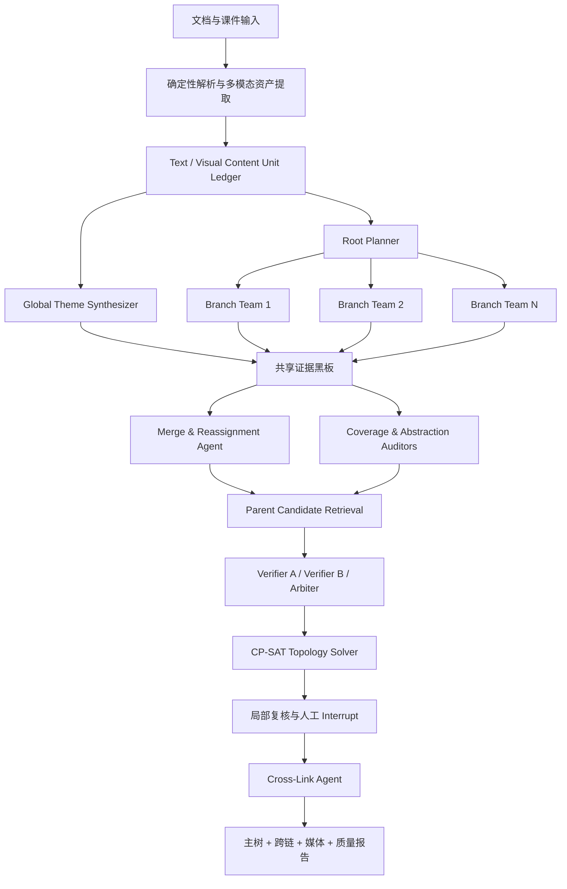

# 思维导图 Agent 框架设计

- 日期：2026-07-17
- 状态：已完成方案评审，等待规格文档复核
- 目标版本：课程与培训材料思维导图 Agent v1
- 适用规模：单份 20–150 页或幻灯片，约 30–150 个最终语义节点

## 1. 决策摘要

本项目采用 **C+ 架构**：

1. 以 LangGraph 主图作为 Supervisor。
2. 按一级主题并行派发可复用的递归 Branch Team 子图。
3. 所有 Agent 只向共享证据黑板提交候选、评分和决策记录，不直接写最终图。
4. 根节点与高层父节点通过自顶向下主题归纳生成；基础知识节点通过自底向上文本和视觉抽取得到。
5. 两路结果在中层对齐，允许重命名、拆分、删除或补建抽象父节点。
6. 主树由 OR-Tools CP-SAT 在全局约束下求解，NetworkX 负责图算法、校验和基线实现。
7. 每个非根节点只有一个主父节点；因果、依赖、顺序、对比和用途关系作为独立跨链。
8. 标准档使用生成模型加一个独立校验模型；高精档按风险增加第二校验器和争议仲裁模型。
9. 只把根选择、抽象父节点、竞争父边、视觉节点判断等少量高风险项交给人工。
10. PPT、PDF 和课件中的流程图、结构图、图表、表格、公式和带标注示意图是第一等知识源，可被裁剪为视觉知识单元并成为节点。

## 2. 背景与现状

当前仓库已经实现：

- 文档解析和结构感知切块。
- LangGraph 串行流水线。
- DeepSeek 与百炼 OpenAI-compatible Provider。
- 按 chunk 抽取候选节点和候选关系。
- 简单字符串归一、关系校验和 Cytoscape 展示。

当前核心流程近似：

```text
文档解析
  -> chunk
  -> 模型一次性生成节点和边
  -> 字符串归一与去重
  -> 通用关系图
```

该流程适合证明端到端链路，但不足以稳定生成思维导图：

- chunk 局部抽取看不到全文主题，容易漏掉根节点和高层父节点。
- 模型直接输出节点与边，错建节点和错连线会互相放大。
- 当前 Schema 没有中心主题、唯一主父节点、层级、结构节点或跨链概念。
- 当前构图逻辑按名称聚合，不处理语义同义、粒度冲突、跨分支归属和抽象父节点。
- 当前质量报告只统计孤立节点和证据覆盖，不能衡量错建、漏建、错分级或错连线。
- 课件中的图片、图表、公式和组合示意图尚未作为知识源处理。
- Cytoscape 当前使用 COSE 力导向布局，不能稳定呈现有根树。

本设计不是在现有 prompt 上增加几条规则，而是重建候选状态、Agent 责任边界和全局拓扑收口方式。

## 3. 产品范围

### 3.1 v1 目标

- 输入课程 PPTX、PDF、DOCX、TXT 或 Markdown。
- 自动生成一个中心主题明确、层级清晰、证据可追踪的思维导图。
- 同时处理文本与视觉知识。
- 平衡精确率和召回率：
  - 高置信结果进入主图。
  - 有价值但不确定的结果进入候选或人工复核队列。
- 支持标准档和高精档。
- 支持用户对少量争议项进行保留、删除、改父、合并、拆分、改名或重裁剪。

### 3.2 v1 非目标

- 不处理跨教材、跨课程或整个知识库的统一图谱。
- 不把主图设计成允许多父节点的一般知识图谱。
- 不保证从所有统计图中恢复精确原始数值；只有在解析证据充分时才输出结构化数据。
- 不要求一次支持所有学科的专用本体。
- 不为每门课程手工维护一套完整思维导图模板。
- 不在 v1 引入独立图数据库或分布式向量数据库。

## 4. 设计原则

### 4.1 证据优先，但证据形式分级

- 显式知识节点使用原文片段、表格单元、公式区域或图片裁剪作为直接证据。
- 归纳父节点和根节点允许名称不在原文中逐字出现，但必须由多个下层内容单元共同支持。
- 抽象节点不得引入材料未支持的新事实。

### 4.2 模型提出候选，代码决定成品

模型负责：

- 提出候选节点。
- 归纳主题和父节点。
- 分类父子、祖先、兄弟和跨链关系。
- 提供证据和判断理由。

代码与求解器负责：

- Schema 校验。
- 去重、候选召回和分数聚合。
- 唯一根、唯一父、无环和根可达。
- 最终节点激活、父边选择和图版本写入。

### 4.3 主树与跨链分离

- `tree_edge` 决定层级和布局。
- `cross_link` 表达依赖、因果、顺序、对比和用途。
- 跨链不改变深度，不参与主父节点求解。

### 4.4 双向建图

- 自顶向下：从全文主题、目录、学习目标和章节摘要生成根候选与一级主题。
- 自底向上：从文本和视觉内容提取基础知识节点，并归纳中层父节点。
- 中层对齐：两路结果互相验证和修正。

### 4.5 不确定性必须显式

系统必须区分：

- `accepted`
- `deferred`
- `rejected`
- `needs_review`
- `degraded`
- `failed`

不能用一个低置信度数值掩盖不同失败原因。

### 4.6 多模态内容一等公民

视觉内容不是节点附件的同义词：

- 它可以独立成为知识节点。
- 它可以成为文本节点的媒体证据。
- 它可以被拆成多个子区域。
- 它也可以被判定为装饰元素。

## 5. 图语义模型

### 5.1 主树

最终主图是有根有向树：

- 恰好一个根节点。
- 每个激活的非根节点恰好一个主父节点。
- 所有节点从根可达。
- 不允许环。

节点层级由父链计算，不由模型直接输出“第几级”。

### 5.2 跨链

v1 支持以下跨链：

- `depends_on`
- `causes`
- `precedes`
- `contrasts_with`
- `used_for`

`related_to` 不作为成品关系类型。无法说明具体语义的关系只能保留在候选区。

### 5.3 节点语义角色

建议角色集合：

- `root_topic`
- `branch_topic`
- `concept`
- `principle`
- `method`
- `process`
- `step`
- `formula`
- `example`
- `warning`
- `system`
- `visual_knowledge`
- `table`

角色用于父子兼容和呈现，不等同于层级。

### 5.4 节点来源

- `explicit`：原文或视觉中显式存在。
- `abstractive`：由多个下层内容归纳得到。
- `synthesized_root`：从全文主题或教学目标生成。
- `structural`：为表达一组子节点的共同类别而生成。

结构节点只有在至少覆盖多个子节点或内容单元、且提升层级直接性时才允许激活。

## 6. 总体架构



### 6.1 Main Supervisor

职责：

- 维护全局任务状态。
- 调度解析、根规划、Branch Team、合并、校验、求解和人工复核。
- 管理标准档与高精档。
- 在阶段边界写检查点。
- 只重跑失效分支或子树。

实现选择：继续使用 LangGraph `StateGraph`。

### 6.2 Global Theme Synthesizer

输入：

- 文档标题。
- 目录和标题路径。
- 学习目标。
- 开篇、总结和章节摘要。
- 全文反复出现的核心命题。
- 重要视觉内容摘要。

输出：

- 2–3 个根节点候选。
- 一级主题候选。
- 每个一级主题的预期覆盖范围。
- 根与一级主题的支持内容单元集合。

这些结果是结构假设，不直接成为最终图。

### 6.3 Root Planner

职责：

- 选择初始一级分支方案。
- 将章节和内容范围分配给 Branch Team。
- 设置分支覆盖预算和递归上限。
- 识别需要跨章节处理的主题。

### 6.4 Branch Team 子图

每个 Branch Team 是 per-invocation LangGraph subgraph，包含：

- `Branch Planner`
- `Node Scout`
- `Granularity Critic`
- `Abstraction Induction Agent`
- `Parent Retriever`
- `Local Verifier`

Branch Team 不共享可变内部状态，只通过黑板交换结果。

其中 `Local Verifier` 只做分支内的廉价预筛和明显错误过滤，可以由 M2 或轻量判别模型承担。M3/M4 属于全局独立校验器，在分支合并后重新读取最小必要证据并作最终分类；全局校验不能直接复用 Local Verifier 的结论作为最终票。

### 6.5 共享证据黑板

黑板是跨 Agent 的唯一协作界面，采用追加候选与版本化决策，而不是直接修改最终图。

黑板保存：

- 内容单元。
- 节点候选。
- 父边候选。
- 跨链候选。
- 模型票数。
- 证据。
- 决策记录。
- 人工复核项。
- 图版本。

v1 使用 SQLite 持久化。

### 6.6 Merge & Reassignment Agent

职责：

- 同义节点聚合。
- 名称规范化。
- 跨分支重复检测。
- 粒度冲突识别。
- 重新分配一级分支。
- 文本与视觉节点融合。

### 6.7 Coverage & Abstraction Auditors

Coverage Auditor 检查：

- 哪些重要文本单元未被节点覆盖。
- 哪些知识图片未成为节点或媒体证据。
- 哪些章节覆盖率不足。

Abstraction Auditor 检查：

- 根是否解释主要分支。
- 一级主题是否相互可区分。
- 抽象父节点是否过宽、过窄、混合主题或缺少支持。
- 是否存在不必要的中间层。

### 6.8 Topology Solver

OR-Tools CP-SAT 负责：

- 激活或拒绝可选抽象节点。
- 选择唯一根。
- 为每个非根节点选择一个主父节点。
- 满足硬约束。
- 在软约束和候选分数之间优化。

NetworkX 负责：

- 候选图操作。
- 连通性、环和祖先查询。
- 基线最大生成树或最大支撑树。
- 求解结果的二次校验。

## 7. 核心数据模型

以下是逻辑 Schema，不是最终实现代码。

### 7.1 ContentUnit

```yaml
ContentUnit:
  id: string
  document_id: string
  branch_hint: string | null
  importance: float
  source_location:
    page: int | null
    slide: int | null
    bbox: [float, float, float, float] | null
  status: uncovered | covered | merged | deferred | rejected
```

### 7.2 TextContentUnit

```yaml
TextContentUnit:
  kind: text
  text: string
  heading_path: [string]
  unit_role: definition | principle | step | formula | example | warning | other
  evidence_excerpt: string
```

### 7.3 VisualContentUnit

```yaml
VisualContentUnit:
  kind: visual
  asset_id: string
  crop_path: string
  full_page_asset_path: string
  visual_kind: flowchart | architecture | chart | annotated_image | table | formula | other
  ocr_text: string
  vlm_summary: string
  knowledge_claims: [string]
  entities: [string]
  relations: [object]
  nearby_text_ids: [string]
  perceptual_hash: string
  knowledge_score: float
  decorative_score: float
  parent_asset_id: string | null
```

### 7.4 NodeClaim

```yaml
NodeClaim:
  id: string
  label: string
  definition: string
  role: string
  origin: explicit | abstractive | synthesized_root | structural
  support_mode: span | aggregate | multimodal
  support_unit_ids: [string]
  media_asset_ids: [string]
  proposed_branch_id: string | null
  abstraction_level: float
  teaching_salience: float
  granularity_fit: float
  coverage_score: float
  cohesion_score: float
  novelty_risk: float
  duplication_risk: float
  activation_cost: float
  status: candidate | accepted | deferred | rejected | needs_review
```

### 7.5 ParentCandidate

```yaml
ParentCandidate:
  parent_id: string
  child_id: string
  section_prior: float
  semantic_score: float
  reranker_score: float
  verifier_votes: [object]
  evidence_support: float
  granularity_fit: float
  sibling_coherence: float
  skipped_level_penalty: float
  role_conflict_penalty: float
  classification: direct_parent | ancestor_only | sibling | cross_link | unrelated | uncertain
  combined_score: float
```

### 7.6 CrossLinkCandidate

```yaml
CrossLinkCandidate:
  source_id: string
  target_id: string
  relation: depends_on | causes | precedes | contrasts_with | used_for
  evidence_unit_ids: [string]
  direction_score: float
  verifier_votes: [object]
  status: candidate | accepted | deferred | rejected | needs_review
```

### 7.7 DecisionRecord

```yaml
DecisionRecord:
  id: string
  run_id: string
  subject_type: node | tree_edge | cross_link | visual_asset | root
  subject_id: string
  actor: code | model | human
  actor_version: string
  prompt_version: string | null
  decision: string
  reason_codes: [string]
  evidence_unit_ids: [string]
  timestamp: datetime
```

### 7.8 ReviewItem

```yaml
ReviewItem:
  id: string
  type: root_choice | abstract_parent | competing_parent | branch_move | merge_split | visual_decision | cross_link | uncovered_content
  risk_score: float
  subject_ids: [string]
  evidence_unit_ids: [string]
  alternatives: [object]
  model_votes: [object]
  local_subtree_preview: object
  status: pending | resolved
```

## 8. 完整工作流

### 阶段 1：确定性解析

- 解析文档结构。
- 保留标题路径、页码、幻灯片编号和对象坐标。
- 生成文本块。
- 提取原生图片、图表对象和媒体。
- 渲染整页或整张幻灯片，覆盖 SmartArt、矢量图和组合形状。

### 阶段 2：多模态 Content Unit Ledger

- 将文本拆成教学信息单元。
- 定位视觉区域。
- 识别知识图与装饰图。
- 为每个内容单元分配重要度和证据坐标。

### 阶段 3：全局摘要

- 按章节生成短摘要。
- 汇总目录、学习目标和重要视觉摘要。
- 不在此阶段创建最终节点。

### 阶段 4：根与一级主题候选

- Global Theme Synthesizer 生成根候选。
- Root Planner 生成一级主题和分支覆盖范围。
- 每个候选记录 aggregate support set。

### 阶段 5：派发 Branch Team

- 按一级主题或章节范围派发。
- 每个分支只获得必要上下文。
- 允许递归拆成子分支。

### 阶段 6：基础节点抽取

- Node Scout 从文本和视觉内容生成显式节点候选。
- Granularity Critic 执行建、并、拆、候选或拒绝判断。
- 所有被拒绝内容仍保留覆盖映射和原因。

### 阶段 7：中层抽象归纳

- 对高内聚节点簇生成候选父节点。
- 允许生成原文中没有同名短语的结构标签。
- 抽象节点必须记录支持子节点和内容单元。

### 阶段 8：多模态融合

- 相同知识的文本节点与视觉节点合并。
- 视觉独有知识保留为独立节点。
- 复合图在满足拆分条件时生成子裁剪和候选子节点。

### 阶段 9：全局合并与分支重分配

- 语义去重。
- 跨分支同义合并。
- 检查分支归属和粒度。
- 修正根与一级主题候选。

### 阶段 10：父节点候选召回

每个节点只比较 Top-k 候选父节点，候选来源包括：

- 章节标题路径和祖先主题。
- 同分支节点。
- 相邻分支节点。
- Embedding 语义近邻。
- Reranker 重排结果。
- Agent 提议的抽象父节点。

不进行全量 O(n²) 模型判别。

### 阶段 11：独立关系校验

校验器输出：

- `direct_parent`
- `ancestor_only`
- `sibling`
- `cross_link`
- `unrelated`
- `uncertain`

校验器只读取：

- 父子候选定义。
- 必要原文和视觉证据。
- 竞争父节点。

校验器不读取生成模型的隐藏推理或自我解释。

### 阶段 12：全局拓扑求解

- 选择根。
- 激活有价值的抽象节点。
- 为每个非根节点选择唯一主父节点。
- 输出合法有根树。

### 阶段 13：双向审计

- Coverage Auditor 检查底层漏项。
- Abstraction Auditor 检查根侧和高层父节点。
- 失败时只重跑对应分支、抽象节点或父边候选。

### 阶段 14：人工复核

- LangGraph 在高风险项处 interrupt。
- 用户只处理排序后的少量争议。
- 人工修改写入决策日志。

### 阶段 15：跨链生成

- 主树冻结后生成跨链。
- 每个节点默认最多保留 2 条高价值跨链。
- 低置信跨链进入候选区，不污染主图。

### 阶段 16：输出与展示

输出：

- 根节点。
- 节点。
- 主树边。
- 跨链。
- 文本和视觉证据。
- 质量报告。
- 决策日志。
- 人工复核项。
- 运行模式和降级信息。

## 9. 递归 Branch Team 设计

### 9.1 递归拆分条件

满足任一条件时允许继续拆分：

- 分支内容单元过多。
- 分支内部语义低内聚。
- 明显存在多个独立教学主题。
- 当前层级无法形成粒度一致的兄弟节点。

### 9.2 停止条件

满足任一条件时停止：

- 内容单元数量低于配置阈值。
- 分支语义足够内聚。
- 达到最大软深度。
- 继续拆分不会增加教学可理解性。

### 9.3 Branch Team 输出

- 局部节点候选。
- 抽象父节点候选。
- 父边候选。
- 未覆盖内容单元。
- 跨分支候选。
- 局部质量报告。

Branch Team 不提交最终树。

## 10. 建节点判定

### 10.1 节点资格门

每个显式节点候选经过四道门：

1. 证据门：可定位到原文、视觉区域或聚合支持集。
2. 教学价值门：有助于理解、记忆、操作或辨析。
3. 原子性门：表达一个可命名知识单元。
4. 区分度门：不是重复、同义改写或空泛标签。

### 10.2 结果状态

- `ACCEPT`
- `MERGE`
- `SPLIT`
- `DEFER`
- `REJECT`

### 10.3 节点评分

逻辑评分：

```text
node_score =
  evidence_support
  + teaching_salience
  + distinctness
  + granularity_fit
  + section_support
  + multimodal_support
  - genericness
  - duplication_risk
  - novelty_risk
```

具体权重通过开发集和校准集确定，不在代码中写死未经验证的常数。

### 10.4 结构节点

结构节点允许在输入中没有逐字标签，但必须：

- 至少覆盖多个子节点或多个内容单元。
- 提升直接父子关系。
- 不引入新事实。
- 通过抽象有效性校验。
- 在求解目标中承担额外复杂度成本。

## 11. 根与高层抽象

### 11.1 根候选来源

- 显式标题根。
- 全文主题根。
- 教学目标根。

系统生成 2–3 个候选，再选择唯一根。

### 11.2 根与一级主题评价

- 全文覆盖。
- 具体程度。
- 分支区分度。
- 教学可理解性。
- 非幻觉性。

### 11.3 抽象节点校验标签

- `valid_abstraction`
- `too_broad`
- `too_narrow`
- `mixed_theme`
- `redundant`
- `unsupported`

### 11.4 双向对齐

- 顶层 Skeleton 必须被底层节点簇支持。
- 底层节点簇可补建顶层没有提出的父节点。
- 不匹配的一级主题可以重命名、拆分或删除。
- 不为了视觉对称而发明层级。

## 12. 父节点和层级判定

### 12.1 模型不输出固定层级

模型只判断候选父子关系。最终深度由选中的父链计算。

### 12.2 父边逻辑评分

```text
parent_edge_score =
  section_prior
  + semantic_score
  + reranker_score
  + verifier_vote
  + evidence_support
  + granularity_fit
  + sibling_coherence
  - skipped_level_penalty
  - role_conflict_penalty
```

### 12.3 直接父节点判定

校验器必须区分：

- 子节点是否真的是父节点的直接下位主题。
- 父节点是否只是更远的祖先。
- 两者是否是兄弟。
- 两者是否只有跨链关系。
- 是否无关或证据不足。

## 13. CP-SAT 拓扑求解

### 13.1 决策变量

- `y_n`：候选节点是否激活。
- `x_p_c`：父边是否选择。
- `r_n`：候选根是否选中。
- `d_n`：节点深度。

### 13.2 硬约束

- 恰好一个根。
- 每个激活的非根节点恰好一个入树父边。
- 未激活节点不能连接主树。
- 所有激活节点从根可达。
- 不存在环。
- 抽象节点被激活时必须拥有有效支持集。
- 边端点必须存在。

### 13.3 软约束

- 默认深度范围 2–6。
- 兄弟节点粒度一致。
- 分支数量和叶子密度合理。
- 优先遵循章节结构。
- 优先遵循节点角色矩阵。
- 避免不必要的中间层。

### 13.4 优化目标

```text
maximize:
  edge_quality
  + content_coverage
  + cluster_cohesion
  + hierarchy_directness
  + section_consistency
  - abstraction_novelty_risk
  - extra_node_complexity
  - depth_penalty
  - role_conflict
```

### 13.5 无解处理

按固定顺序放松软约束：

1. 视觉平衡。
2. 分支容量。
3. 默认深度。
4. 章节先验。
5. 角色偏好。

不放松唯一根、唯一父、无环、根可达或证据支持。

## 14. 跨链设计

### 14.1 生成时机

主树求解并通过审计后再生成跨链。

### 14.2 候选召回

- 共同证据。
- 高语义相关。
- 不同分支但存在明确教学关系。
- 视觉图中显式箭头或对比关系。

### 14.3 校验要求

- 必须给出具体关系类型。
- 必须判断方向。
- 必须绑定证据。
- 必须过滤祖先路径已表达的冗余关系。

## 15. 多模态视觉知识

### 15.1 视觉提取

PPTX：

- 优先读取原生图片和对象坐标。
- 提取图表、标题、分组对象和媒体元信息。
- 对 SmartArt、矢量图和组合形状渲染整张幻灯片后裁剪。

PDF：

- 读取原生图片和页面对象。
- 使用版面模型定位图、表、公式和说明文字。
- 扫描件使用 OCR 与版面恢复。

### 15.2 视觉区域四种决策

- `STANDALONE_NODE`
- `ATTACH_AS_MEDIA`
- `DECOMPOSE`
- `IGNORE_DECORATION`

### 15.3 复合图拆分条件

只有同时满足以下条件才拆分：

- 子区域边界清晰。
- 标签或图形可读。
- 拆分后每个区域仍有独立教学意义。
- 整图仍被保留为父资产。

### 15.4 图文融合

- 图与附近文本表达同一知识：合并成 mixed 节点。
- 文本给定义、图片给结构或过程：保留两类证据。
- 视觉包含独有知识：独立节点。
- 感知哈希用于过滤重复 Logo、页眉和模板背景。

### 15.5 视觉呈现

- 节点使用固定尺寸缩略图。
- 高清裁剪在 Inspector 中查看。
- 节点保留简短文字标签。
- 视觉节点可位于任意语义层级，不固定为叶子。

## 16. 模型角色与运行档位

### 16.1 模型角色

| 角色 | 任务 | 调用策略 |
| --- | --- | --- |
| M1 Theme Synthesizer | 根、一级主题、抽象骨架 | 每份文档少量调用，使用强长上下文模型 |
| M2 Branch Extractor | Content Unit、显式节点、局部摘要 | 按分支并行，使用快速模型 |
| M3 Verifier A | 节点资格、抽象有效性、父边分类 | 标准档默认启用 |
| M4 Verifier B | 根侧抽象、跨分支、竞争父边 | 高精档或中高风险启用 |
| M5 Arbiter | 处理 M3/M4 明确分歧 | 少量争议调用 |

Branch Team 中的多个逻辑 Agent 不要求分别绑定独立物理模型。M1 可以承担全局主题和高层规划，M2 可以承担 Branch Planner、Node Scout、Granularity Critic 和 Local Verifier 的不同隔离调用；M3/M4/M5 保持校验上下文和模型家族独立。

### 16.2 独立性要求

- 生成与校验尽量使用不同模型家族。
- 校验模型不读取生成模型推理过程。
- Provider 可替换，不把业务逻辑绑定到单一模型。

推荐初始组合：

- Qwen 家族生成，DeepSeek 家族校验。
- 或 DeepSeek 家族生成，Qwen 家族校验。

### 16.3 标准档

- M1 + M2 + M3。
- 所有保留节点和 Top-k 父边执行一次独立校验。
- 只有硬规则冲突进入人工队列。

### 16.4 高精档

- 根、一级主题、归纳父节点默认双校验。
- 跨分支迁移和竞争父边默认双校验。
- M3/M4 分歧时调用 M5。
- M5 仍不确定时才进入人工队列。

### 16.5 风险分层

低风险：

- 显式节点。
- 同章节直接父边。
- 证据充分。

中风险：

- 归纳父节点。
- 层级跳跃。
- 多个竞争父节点。

高风险：

- 根候选。
- 一级主题。
- 跨分支迁移。
- 双模型分歧。
- 视觉区域语义不稳定。

## 17. 工具选择

### 17.1 编排

选择 LangGraph：

- 现有仓库已经使用。
- 适合显式状态和分支 subgraph。
- 支持检查点、暂停恢复和人工 interrupt。
- 不需要迁移现有 Provider。

### 17.2 Schema 与持久化

- Pydantic v2 严格 Schema。
- SQLite 作为 v1 黑板、检查点和决策日志。
- 所有 ID 稳定生成。

### 17.3 语义召回

- Embedding 用于聚类和父候选 Top-k。
- Qwen3-Rerank 或 GTE-Rerank 用于重排。
- Reranker 不能替代父子关系校验。
- v1 节点规模不需要独立向量数据库。

### 17.4 图算法

- NetworkX：候选图、祖先查询、环检测、连通性和基线。
- OR-Tools CP-SAT：正式拓扑求解。

### 17.5 文档与视觉

- 现有 PPTX、DOCX 和 PDF 解析器作为默认 Adapter。
- PP-StructureV3 用于中文复杂版面、表格、公式和图表。
- MinerU 或 Docling 作为复杂 PDF/PPTX 的可替换后端。
- Qwen3-VL 负责视觉分类、OCR、区域理解和知识命题。
- OpenCV 负责裁剪、几何变换、留白处理和感知哈希。

### 17.6 前端

- 保留 Cytoscape。
- 主树使用 ELK 或 breadth-first 布局。
- 跨链独立开关。
- Inspector 显示证据、高清图片、模型票数和决策历史。

## 18. 结构化输出与 Provider 适配

- 每个模型角色定义独立 Pydantic Schema。
- Provider JSON 模式只作为语法约束，不作为语义正确性保证。
- 无效 JSON：
  1. 本地解析和轻量修复。
  2. 一次结构修复重试。
  3. 切备用 Provider。
  4. 仍失败则标记 degraded 或 needs_review。
- 原始模型 confidence 不直接解释为概率。
- 最终分数来自模型票数、规则特征和校准结果。

## 19. 异常处理

### 19.1 文档解析失败

- 切换解析 Adapter。
- 只重跑失败页或幻灯片。
- 保留解析错误位置。

### 19.2 视觉裁剪或 OCR 失败

- 保留整页原图。
- 标记 `unparsed_visual`。
- 进入视觉复核。
- 不静默丢弃。

### 19.3 模型调用失败

- 指数退避。
- 结构修复。
- Provider fallback。
- 记录降级模式、失败模型和错误信息。

### 19.4 模型语义分歧

- Verifier A。
- Verifier B。
- Arbiter。
- 人工。

不使用简单 confidence 平均代替仲裁。

### 19.5 拓扑无解

- 输出最小冲突集合。
- 按既定顺序放松软约束。
- 不放松硬约束。

### 19.6 覆盖失败

- 定位未覆盖内容单元。
- 只唤醒对应 Branch Team 或 Theme Synthesizer。
- 局部补建后再次求解。

## 20. 人工复核

### 20.1 复核类型

- 根选择。
- 抽象父节点。
- 父节点竞争。
- 跨分支迁移。
- 节点合并或拆分。
- 视觉节点判断。
- 跨链确认。
- 未覆盖内容。

### 20.2 复核界面

每个复核项同时展示：

- 原文或视觉证据。
- 竞争候选。
- 模型票数。
- 规则冲突。
- 变更后的局部子树预览。

用户操作：

- 保留。
- 删除。
- 改父。
- 合并。
- 拆分。
- 改名。
- 重裁剪。

### 20.3 人工反馈

- 以事件形式写入决策日志。
- 用于阈值校准。
- 用于提示词回归。
- 用于训练父子分类器和视觉判断器。
- 后续全量运行不能静默覆盖人工决定。

## 21. 恢复、版本与局部失效

阶段检查点：

- 解析完成。
- 根骨架完成。
- 分支完成。
- 全局合并完成。
- 求解完成。
- 人工确认完成。

局部失效规则：

- 改父只使受影响子树和相关跨链失效。
- 节点合并只重算相关父边、子边和跨链。
- 重裁剪只重跑对应视觉单元和融合判断。
- 一个 Branch Team 失败不影响其他分支。

每次求解和人工修改产生新的图版本。

## 22. 输出契约

```yaml
MindMapResult:
  task_id: string
  run_id: string
  graph_version: int
  root_id: string
  nodes: [MindMapNode]
  tree_edges: [TreeEdge]
  cross_links: [CrossLink]
  assets: [VisualAsset]
  quality_report: QualityReport
  review_items: [ReviewItem]
  decision_records: [DecisionRecord]
  mode: standard | precision
  degraded_components: [string]
```

节点展示字段至少包括：

- 标签。
- 定义。
- 角色。
- 来源。
- 深度。
- 父节点。
- 文本证据。
- 视觉证据。
- 缩略图。
- 质量和风险信息。

## 23. 质量评测

### 23.1 多解金标

金标不强制唯一树，保存：

- 重要内容单元。
- 知识视觉区域和 bbox。
- 可接受节点和别名。
- 可接受直接父节点集合。
- 必须成立的祖先关系。
- 禁止关系。
- 必要和可选跨链。
- 根与一级主题评分量表。

### 23.2 数据集规模

- 开发集：12 份。
- 校准集：18 份。
- 盲测集：30 份。

校准集：

- 两名标注者独立完成。
- 根、一级主题和直接父边争议由第三人裁决。

### 23.3 节点指标

- 节点精确率。
- 重要内容加权覆盖率。
- 无证据节点率。
- 重复节点率。
- 粒度错误率。
- 抽象节点有效率。

### 23.4 层级指标

- 直接父节点准确率。
- 祖先关系 F1。
- 深度误差。
- 兄弟粒度一致性。
- 根与一级主题人工评分。

### 23.5 跨链指标

- 关系精确率。
- 关系召回率。
- 方向正确率。
- 证据支持率。
- 冗余边率。

### 23.6 视觉指标

- 知识图像检出召回率。
- 裁剪 IoU。
- 装饰图误报率。
- 图文融合准确率。
- 视觉命题证据支持率。

### 23.7 人工与运行指标

- 每份文档复核项数量。
- 首次自动接受率。
- 平均人工修改动作。
- 复核后残余错误率。
- 总耗时。
- 模型调用成本。
- 降级率。
- 同文档重复运行稳定性。

## 24. 第一版验收门槛

这些门槛是工程目标，完成开发集后允许校准；拓扑合法和证据追溯不允许下调。

| 指标 | 工程原型 | 小范围试用 |
| --- | ---: | ---: |
| 主树拓扑合法率 | 100% | 100% |
| 最终节点证据可追溯率 | 100% | 100% |
| 节点精确率 | ≥ 0.82 | ≥ 0.90 |
| 重要内容加权覆盖率 | ≥ 0.78 | ≥ 0.86 |
| 直接父节点准确率 | ≥ 0.72 | ≥ 0.84 |
| 祖先关系 F1 | ≥ 0.84 | ≥ 0.92 |
| 根 / 一级主题平均分 | ≥ 3.6 / 5 | ≥ 4.2 / 5 |
| 跨链精确率 | ≥ 0.82 | ≥ 0.90 |
| 知识图像检出召回率 | ≥ 0.72 | ≥ 0.86 |
| 装饰图误报率 | ≤ 0.10 | ≤ 0.05 |
| 人工复核决策占比 | ≤ 0.30 | ≤ 0.15 |

## 25. 测试策略

### 25.1 单元测试

- Pydantic Schema。
- 稳定 ID。
- 坐标和裁剪变换。
- 感知哈希去重。
- 父边候选过滤。
- 环、连通性和祖先查询。
- CP-SAT 硬约束。
- 局部失效范围。

### 25.2 组件评测

- 根候选生成。
- 节点筛选。
- 抽象节点校验。
- 父边分类。
- 视觉知识判断。
- 跨链校验。
- 多模态融合。

### 25.3 端到端金标

- 文本密集 PPT。
- 图像密集 PPT。
- PDF 讲义。
- 公式和表格课程。
- 扫描件。
- 复杂组合图。

### 25.4 对抗与稳定性

- 缺标题。
- 重复页眉。
- 大量装饰图。
- 低清 OCR。
- 语义相近兄弟节点。
- 多个合理父节点。
- 章节结构与语义结构冲突。
- 同文档重复运行。

### 25.5 消融实验

必须比较：

- 单模型直接生成整图 Baseline。
- 去掉自顶向下主题生成。
- 去掉自底向上抽象归纳。
- 去掉 Reranker。
- 去掉第二校验器。
- 去掉 CP-SAT。
- 去掉视觉通道。

## 26. 观测与审计

每次模型调用记录：

- `run_id`
- `branch_id`
- 模型与 Provider。
- prompt 版本。
- 输入内容单元 ID。
- 输出 Schema 版本。
- 延迟。
- token 与成本。
- 重试和降级信息。

每个最终节点和边必须可追溯到：

- 证据。
- 候选。
- 模型票数。
- 规则。
- 求解结果。
- 人工修改。

## 27. 安全与隐私

- API Key 只保留在服务端环境变量或安全配置中。
- 前端不得接收 Provider Key。
- 原始课件和裁剪资产按任务目录隔离。
- 日志不记录完整敏感文档正文，只记录内容单元 ID 和必要调试摘要。
- 用户删除任务时同步删除原始文件、裁剪资产、Embedding 和黑板记录。

## 28. 备选方案与取舍

### 28.1 方案 A：线性双模型流水线

优点：

- 对现有代码改动最小。
- 最快形成 MVP。

缺点：

- 前序错误容易传播。
- 根侧抽象和全局覆盖较弱。
- 后续加入多模态和拓扑求解时需要再次重构。

不采用为最终架构。

### 28.2 方案 B：证据黑板加全局求解

优点：

- 可解释性强。
- 标准档和高精档容易共用。
- 适合全局拓扑。

缺点：

- 对复杂长文档的并行分支理解不足。

其黑板与求解器作为 C+ 的基础设施保留。

### 28.3 方案 C：纯递归分支 Agent 团队

优点：

- 并行和精度上限高。
- 适合复杂教材。

缺点：

- 跨分支合并困难。
- Agent 容易各自提交不兼容的树。

最终选择 C+：递归团队作为外层组织方式，证据黑板与全局求解器作为统一底座。

## 29. 主要风险与缓解

### 29.1 根侧过度抽象

缓解：

- 多根候选。
- aggregate support set。
- 五维根评分。
- 独立校验。
- 求解复杂度成本。

### 29.2 Agent 数量导致成本和延迟失控

缓解：

- 角色不等于每次都调用独立模型。
- 快模型处理分支。
- 双校验和 Arbiter 按风险触发。
- Top-k 父候选。
- 缓存章节摘要和模型结果。

### 29.3 视觉内容被过度切割

缓解：

- 默认保留整图。
- 只有边界清晰且拆分后有独立教学意义才继续拆。
- 保留父资产和区域关系。

### 29.4 多种合理结构导致评测失真

缓解：

- 可接受父节点集合。
- 祖先约束。
- 根侧人工量表。
- 不只使用精确树编辑距离。

### 29.5 求解器无解

缓解：

- 明确硬约束与软约束。
- 输出最小冲突集合。
- 按固定顺序放松软约束。
- 候选不足时可以生成指向一级分支或根的临时保底边，但该边必须标记 `provisional` 并强制进入人工复核，不能静默作为正式父边发布。

### 29.6 Provider 能力变化

缓解：

- 统一 Provider Adapter。
- Schema 在本地校验。
- 模型角色通过配置映射。
- 评测集按模型与 prompt 版本回归。

## 30. 已锁定决策

- v1 聚焦课程与培训材料。
- 单次输入 20–150 页或幻灯片。
- 主树加跨链。
- 平衡精确率与召回率。
- 标准档和高精档同时存在。
- 人工只处理少量争议。
- 使用 C+ 架构。
- 使用双向抽象。
- 视觉内容作为第一等知识源。
- LangGraph 继续作为编排器。
- NetworkX 加 OR-Tools CP-SAT 作为拓扑工具。
- SQLite 作为 v1 黑板与决策存储。
- Cytoscape 保留，布局改为树形。
- 100% 拓扑合法和 100% 最终节点证据可追溯是硬验收条件。

## 31. 研究参考

### 直接相关思维导图研究

- [Hierarchical Multi-Agent Extractive Framework for Long-Document Mind Map Generation](https://www.cys.cic.ipn.mx/index.php/CyS/article/view/6482)
- [Text-to-MindMap reference implementation](https://github.com/Noorius/Text-to-MindMap)
- [A visualization framework for hierarchical structure enhanced mind mapping: Effects on presentation and learning performance](https://www.sciencedirect.com/science/article/pii/S2666920X26000141)
- [Coreference Graph Guidance for Mind-Map Generation](https://aclanthology.org/2021.findings-acl.199/)
- [TREEP: A Tree-Based Approach to Taxonomy Expansion with Pre-trained Language Models](https://openreview.net/forum?id=KJOs4gtdiT)
- [ResearchArena: Benchmarking LLM Agents on Complex Scientific Literature Search and Synthesis](https://arxiv.org/abs/2601.18738)

### Agent 编排

- [LangGraph overview](https://docs.langchain.com/oss/python/langgraph/overview)
- [LangGraph subgraphs](https://docs.langchain.com/oss/python/langgraph/use-subgraphs)
- [Microsoft Agent Framework overview](https://learn.microsoft.com/en-us/agent-framework/overview/)
- [OpenAI Agents SDK models and non-OpenAI providers](https://openai.github.io/openai-agents-python/models/)
- [Pydantic AI Graph](https://ai.pydantic.dev/graph/)
- [LlamaIndex Workflows](https://docs.llamaindex.ai/en/stable/module_guides/workflow/)

### 图与约束求解

- [NetworkX maximum spanning arborescence](https://networkx.org/documentation/stable/reference/algorithms/generated/networkx.algorithms.tree.branchings.maximum_spanning_arborescence.html)
- [OR-Tools CP-SAT solver](https://developers.google.com/optimization/cp/cp_solver)

### Embedding 与 Reranker

- [Qwen3 Embedding technical report](https://arxiv.org/abs/2506.05176)
- [Alibaba Cloud Model Studio text rerank API](https://help.aliyun.com/zh/model-studio/text-rerank-api)

### 文档与视觉解析

- [PP-StructureV3](https://www.paddleocr.ai/main/en/version3.x/algorithm/PP-StructureV3/PP-StructureV3.html)
- [Qwen3-VL](https://github.com/QwenLM/Qwen3-VL)
- [MinerU](https://github.com/opendatalab/MinerU)
- [Docling picture description](https://docling-project.github.io/docling/examples/pictures_description_api/)

### 图形呈现

- [Cytoscape.js layouts](https://js.cytoscape.org/#layouts)
- [Eclipse Layout Kernel](https://eclipse.dev/elk/reference.html)
